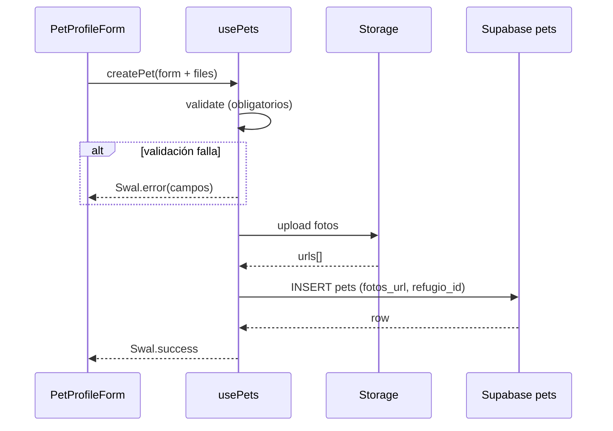

# Artefacto de propuesta — FEAT-001

| Campo | Valor |
|-------|-------|
| **ID** | FEAT-001 |
| **Título** | Crear perfil detallado de mascota en adopción |
| **Estado** | `archivado` |
| **Actor** | Refugio / Propietario |
| **Creado** | 2026-06-03 |
| **Actualizado** | 2026-06-03 |
| **Archivado** | 2026-06-03 |
| **Estándares** | `.openspec/standards.md` |

---

## 1. Historia de usuario

> **Como** Refugio/Propietario, **quiero** poder crear un perfil detallado para cada mascota disponible en adopción, incluyendo fotos, descripción, especie, raza, edad y temperamento, **para** atraer a posibles adoptantes.

### Alcance

- **Incluye:** tabla `pets` en Supabase, RLS, subida de fotos a Storage con URLs en `fotos_url`, formulario React validado, SweetAlert2 para errores, Custom Hook, integración en vista principal.
- **Excluye:** edición/eliminación avanzada, listado público en catálogo, solicitudes de adopción.

---

## 2. Decisiones de arquitectura

| # | Decisión | Justificación |
|---|----------|---------------|
| D1 | Tabla `refugios` vinculada a `auth.users`; `pets.refugio_id` → `refugios.id` | El dueño de datos es el refugio, no el usuario suelto. |
| D2 | Campo `fotos_url` como `jsonb` (array de strings URL) | Contrato simple; las URLs se generan tras subir a Storage `pet-photos`. |
| D3 | Custom Hook `usePets` (o `useCreatePet`) encapsula Supabase | Separación UI / datos según estándares del proyecto. |
| D4 | Componente `PetProfileForm` + validadores puros | Validación testeable; Swal solo para feedback al usuario. |
| D5 | Errores de validación y de API vía **SweetAlert2** (`icon: 'error'`) | UX consistente y visible. |
| D6 | UI con **Tailwind CSS** + iconos **lucide-react** | Alineado a `.openspec/standards.md`. |
| D7 | Integración en **`App.jsx`** (vista principal) | MVP sin dependencia obligatoria de router. |

### Flujo de datos



---

## 3. Modelo de datos Supabase

### 3.1 Tabla `refugios` (prerrequisito)

Cada usuario refugio tiene un registro; `refugio_id` en `pets` apunta aquí.

```sql
create table public.refugios (
  id uuid primary key default gen_random_uuid(),
  user_id uuid not null unique references auth.users (id) on delete cascade,
  nombre text not null check (char_length(trim(nombre)) >= 2),
  created_at timestamptz not null default now()
);
```

### 3.2 Definición de la tabla `pets`

| Columna (DB) | Tipo | Obligatorio | Descripción |
|--------------|------|-------------|-------------|
| `id` | `uuid` | PK | Identificador único (`gen_random_uuid()`). |
| `nombre` | `text` | sí | Nombre de la mascota (1–80 caracteres). |
| `especie` | `text` | sí | `perro`, `gato` u `otro`. |
| `raza` | `text` | sí | Raza o mestizo (1–100 caracteres). |
| `edad` | `text` | sí | Edad legible, ej. `"2 años, 4 meses"` (mín. 2 caracteres). |
| `temperamento` | `text` | sí | Rasgos de comportamiento (3–500 caracteres). |
| `descripcion` | `text` | sí | Perfil para adoptantes (20–2000 caracteres). |
| `fotos_url` | `jsonb` | sí | Array JSON de URLs públicas `["https://...", ...]` (1–5 elementos). |
| `refugio_id` | `uuid` | FK | Referencia a `refugios.id` (dueño del registro). |
| `created_at` | `timestamptz` | auto | Auditoría. |
| `updated_at` | `timestamptz` | auto | Auditoría. |

**Script SQL completo** (`supabase/migrations/001_pets.sql`):

```sql
-- FEAT-001: perfil de mascota en adopción

create table if not exists public.refugios (
  id uuid primary key default gen_random_uuid(),
  user_id uuid not null unique references auth.users (id) on delete cascade,
  nombre text not null check (char_length(trim(nombre)) >= 2),
  created_at timestamptz not null default now()
);

create table if not exists public.pets (
  id uuid primary key default gen_random_uuid(),
  nombre text not null
    check (char_length(trim(nombre)) between 1 and 80),
  especie text not null
    check (especie in ('perro', 'gato', 'otro')),
  raza text not null
    check (char_length(trim(raza)) between 1 and 100),
  edad text not null
    check (char_length(trim(edad)) >= 2),
  temperamento text not null
    check (char_length(trim(temperamento)) between 3 and 500),
  descripcion text not null
    check (char_length(trim(descripcion)) between 20 and 2000),
  fotos_url jsonb not null default '[]'::jsonb
    check (jsonb_typeof(fotos_url) = 'array'),
  refugio_id uuid not null references public.refugios (id) on delete cascade,
  created_at timestamptz not null default now(),
  updated_at timestamptz not null default now()
);

-- Al menos una foto al crear
alter table public.pets add constraint pets_fotos_url_min_one
  check (jsonb_array_length(fotos_url) >= 1);

-- Máximo cinco fotos
alter table public.pets add constraint pets_fotos_url_max_five
  check (jsonb_array_length(fotos_url) <= 5);

create index if not exists pets_refugio_id_idx on public.pets (refugio_id);
create index if not exists pets_especie_idx on public.pets (especie);

-- Trigger updated_at
create or replace function public.set_updated_at()
returns trigger language plpgsql as $$
begin
  new.updated_at = now();
  return new;
end;
$$;

create trigger pets_set_updated_at
  before update on public.pets
  for each row execute function public.set_updated_at();
```

### 3.3 Storage (fotos)

| Bucket | Lectura | Escritura |
|--------|---------|-----------|
| `pet-photos` | pública | solo usuario autenticado dueño del refugio |

**Ruta:** `{refugio_id}/{pet_id o temp}/{uuid}.ext` → URL pública guardada en `fotos_url`.

### 3.4 Mapeo dominio ↔ formulario React

| Campo formulario | Columna `pets` | Tipo en hook |
|------------------|----------------|--------------|
| `nombre` | `nombre` | `string` |
| `especie` | `especie` | `'perro' \| 'gato' \| 'otro'` |
| `raza` | `raza` | `string` |
| `edadAnios` + `edadMeses` | `edad` | se serializa a `string` |
| `temperamento` | `temperamento` | `string` |
| `descripcion` | `descripcion` | `string` |
| archivos `fotos[]` | `fotos_url` | `string[]` (URLs tras upload) |
| (sesión) | `refugio_id` | `uuid` del refugio del usuario |

---

## 4. Políticas RLS (Row Level Security)

**Principio:** cualquiera puede **leer**; solo el **refugio dueño** puede **insertar** y **editar** sus mascotas.

```sql
alter table public.refugios enable row level security;
alter table public.pets enable row level security;

-- refugios: el usuario ve su propio refugio
create policy "refugios_select_own"
  on public.refugios for select
  using (user_id = auth.uid());

create policy "refugios_insert_own"
  on public.refugios for insert
  with check (user_id = auth.uid());

create policy "refugios_update_own"
  on public.refugios for update
  using (user_id = auth.uid());

-- ─── pets ───────────────────────────────────────────────

-- LECTURA: cualquiera (anon + authenticated)
create policy "pets_select_public"
  on public.pets for select
  using (true);

-- INSERCIÓN: solo si refugio_id pertenece al usuario autenticado
create policy "pets_insert_owner_refugio"
  on public.pets for insert
  with check (
    exists (
      select 1 from public.refugios r
      where r.id = refugio_id
        and r.user_id = auth.uid()
    )
  );

-- ACTUALIZACIÓN: solo el refugio dueño del registro
create policy "pets_update_owner_refugio"
  on public.pets for update
  using (
    exists (
      select 1 from public.refugios r
      where r.id = pets.refugio_id
        and r.user_id = auth.uid()
    )
  )
  with check (
    exists (
      select 1 from public.refugios r
      where r.id = refugio_id
        and r.user_id = auth.uid()
    )
  );

-- DELETE (opcional en apply): mismo criterio que update
create policy "pets_delete_owner_refugio"
  on public.pets for delete
  using (
    exists (
      select 1 from public.refugios r
      where r.id = pets.refugio_id
        and r.user_id = auth.uid()
    )
  );
```

| Operación | Rol `anon` | Rol `authenticated` (dueño) | Rol `authenticated` (otro) |
|-----------|------------|-------------------------------|------------------------------|
| `SELECT` | permitido | permitido | permitido |
| `INSERT` | denegado | permitido si `refugio_id` es suyo | denegado (RLS) |
| `UPDATE` | denegado | permitido en sus filas | denegado |
| `DELETE` | denegado | permitido en sus filas | denegado |

### Reglas de negocio (servidor + cliente)

| ID | Regla |
|----|-------|
| RN-01 | `fotos_url` debe contener entre 1 y 5 URLs válidas al insertar. |
| RN-02 | `descripcion` ≥ 20 caracteres; `temperamento` ≥ 3. |
| RN-03 | `edad` no puede quedar vacía tras combinar años/meses en el formulario. |
| RN-04 | `refugio_id` se obtiene del refugio del usuario en sesión; no es editable en UI. |
| RN-05 | Usuario no autenticado no puede insertar (RLS + guard en hook). |

---

## 5. Contrato del componente React

### 5.1 `PetProfileForm`

**Ubicación:** `src/components/pets/PetProfileForm.jsx`

**Responsabilidad:** capturar datos del perfil, validar campos obligatorios en cliente, delegar persistencia al Custom Hook, mostrar errores con SweetAlert2.

#### Props

| Prop | Tipo | Requerido | Descripción |
|------|------|-----------|-------------|
| `onSuccess` | `(pet: PetRow) => void` | no | Callback tras crear exitosamente. |
| `className` | `string` | no | Clases Tailwind del contenedor. |

#### Estado interno

```ts
type FormState = {
  nombre: string;
  especie: '' | 'perro' | 'gato' | 'otro';
  raza: string;
  edadAnios: string;
  edadMeses: string;
  temperamento: string;
  descripcion: string;
  fotos: File[];
  errors: Partial<Record<FormField, string>>;
};

type FormField =
  | 'nombre' | 'especie' | 'raza' | 'edad'
  | 'temperamento' | 'descripcion' | 'fotos';
```

#### Campos obligatorios y validación

| Campo | Obligatorio | Regla | Mensaje Swal (título: "Campos incompletos") |
|-------|-------------|-------|-----------------------------------------------|
| `nombre` | sí | `trim().length >= 1` y ≤ 80 | "El nombre de la mascota es obligatorio." |
| `especie` | sí | distinto de `''` | "Selecciona la especie (perro, gato u otro)." |
| `raza` | sí | `trim().length >= 1` | "La raza es obligatoria." |
| `edad` | sí | años o meses > 0, o texto `edad` válido | "Indica la edad de la mascota." |
| `temperamento` | sí | `trim().length >= 3` | "Describe el temperamento (mínimo 3 caracteres)." |
| `descripcion` | sí | `trim().length >= 20` | "La descripción debe tener al menos 20 caracteres." |
| `fotos` | sí | 1–5 archivos; jpeg/png/webp; ≤ 5 MB c/u | "Agrega entre 1 y 5 fotos válidas (máx. 5 MB cada una)." |

**Función de validación:** `validatePetForm(state) → { valid: boolean, errors: Record<FormField, string> }`  
- Si `valid === false`: `Swal.fire({ icon: 'error', title: '...', html: listaErrores })` y **no** llamar al hook.  
- Errores inline opcionales bajo cada input (`text-red-600 text-sm`).

#### Comportamiento al enviar

1. `e.preventDefault()` en `onSubmit`.
2. Ejecutar `validatePetForm`.
3. Si falla → SweetAlert2 error (punto anterior).
4. Si pasa → `createPet(payload)` del hook `usePets`.
5. Durante envío: `isSubmitting === true`, botón deshabilitado, texto "Guardando…", icono `Loader2` (lucide) animado.
6. Éxito → `Swal.fire({ icon: 'success', title: '¡Mascota publicada!', text: '...', confirmButtonColor: '#81B29A' })`, reset formulario, `onSuccess?.(pet)`.
7. Error Supabase → `Swal.fire({ icon: 'error', title: 'No se pudo guardar', text: mensajeAmigable })`.

#### UI (Tailwind + Lucide)

| Elemento | Clases / icono |
|----------|----------------|
| Título | `font-heading text-2xl text-gray-900` — icono `PawPrint` |
| Labels | `text-sm font-medium text-gray-700` |
| Inputs | `border border-gray-300 rounded-lg focus:ring-2 focus:ring-primary focus:border-primary` |
| Botón submit | `bg-primary hover:opacity-90 text-white` — icono `Plus` o `Save` |
| Zona fotos | `border-2 border-dashed border-secondary/50` — iconos `ImagePlus`, `X` para quitar preview |
| Errores campo | `text-red-600 text-xs mt-1` — icono `AlertCircle` inline |

Tokens: `primary` = #E07A5F, `secondary` = #81B29A.

#### Accesibilidad mínima

- Cada `input`/`select`/`textarea` con `<label htmlFor="...">`.
- `aria-invalid="true"` cuando hay error en el campo.
- Botón submit `type="submit"`, `disabled={isSubmitting}`.

---

### 5.2 Custom Hook `usePets`

**Ubicación:** `src/hooks/usePets.js`

#### API del hook

```ts
function usePets(): {
  refugioId: string | null;
  isLoadingRefugio: boolean;
  isSubmitting: boolean;
  createPet: (input: CreatePetInput) => Promise<PetRow>;
  error: string | null;
}
```

#### `CreatePetInput`

```ts
type CreatePetInput = {
  nombre: string;
  especie: 'perro' | 'gato' | 'otro';
  raza: string;
  edadAnios: number;
  edadMeses: number;
  temperamento: string;
  descripcion: string;
  fotos: File[];
};
```

#### Responsabilidades del hook

1. Al montar: resolver `refugioId` (`select id from refugios where user_id = auth.uid()`).
2. Si no hay refugio: opcionalmente crear uno con nombre por defecto o exponer `refugioId: null` y error en UI.
3. `createPet`:
   - Subir `fotos` a Storage → `urls: string[]`.
   - Construir `edad` como `"${anios} años, ${meses} meses"` (ajustar si ambos 0 — rechazar antes).
   - `insert` en `pets` con `{ nombre, especie, raza, edad, temperamento, descripcion, fotos_url: urls, refugio_id }`.
   - Propagar errores al componente para Swal.

#### Tipo `PetRow` (respuesta)

```ts
type PetRow = {
  id: string;
  nombre: string;
  especie: string;
  raza: string;
  edad: string;
  temperamento: string;
  descripcion: string;
  fotos_url: string[];
  refugio_id: string;
  created_at: string;
};
```

---

### 5.3 Integración en vista principal

**Archivo:** `src/App.jsx`

- Sección o pestaña **"Registrar mascota"** visible si hay sesión de refugio.
- Renderiza `<PetProfileForm onSuccess={handlePetCreated} />`.
- Layout: contenedor `max-w-2xl mx-auto p-6`, encabezado de app con branding adopción.

---

## 6. Criterios de aceptación

| ID | Escenario | Resultado esperado |
|----|-----------|------------------|
| CA-01 | Formulario válido + refugio autenticado | INSERT en `pets` con `fotos_url` poblado; Swal success. |
| CA-02 | Campo obligatorio vacío | Swal error; sin llamada a Supabase. |
| CA-03 | 0 fotos o 6 fotos | Swal error de validación. |
| CA-04 | Usuario sin refugio propio intenta insert con `refugio_id` ajeno | RLS bloquea; Swal error de guardado. |
| CA-05 | Consulta anónima `select * from pets` | Permitida por política `pets_select_public`. |
| CA-06 | `npm run lint` en archivos nuevos | Sin errores. |

---

## 7. Tareas atómicas de implementación

Lista numerada para **`/apply`**. Cada tarea es independiente y verificable.

### Bloque A — Base de datos (Supabase)

1. **Crear script SQL** en `supabase/migrations/001_pets.sql` con tablas `refugios` y `pets` (§3.2), índices y constraints de `fotos_url`.
2. **Aplicar políticas RLS** en el mismo script o `002_pets_rls.sql` (§4): `SELECT` público; `INSERT`/`UPDATE`/`DELETE` solo dueño del `refugio_id`.
3. **Configurar bucket** `pet-photos` y políticas de Storage para subida autenticada y lectura pública.
4. **Documentar en README** cómo ejecutar migraciones y crear un usuario refugio de prueba vinculado a `refugios`.

### Bloque B — Custom Hook (capa de datos)

5. **Crear `src/hooks/usePets.js`**: obtener `refugioId` del usuario en sesión.
6. **Implementar `uploadPetPhotos(files, refugioId)`** en `src/services/petService.js` (o dentro del hook si se mantiene delgado el servicio).
7. **Implementar `createPet(input)`**: upload → armar `edad` → `insert` en `pets` con `fotos_url` y `refugio_id`.
8. **Manejar estados** `isLoadingRefugio`, `isSubmitting`, `error` y mapear códigos Supabase a mensajes en español.

### Bloque C — Componente UI (Tailwind + Lucide)

9. **Crear `src/lib/validators/petFormValidators.js`** con reglas §5.1 y mensajes de error.
10. **Crear `src/components/pets/PetProfileForm.jsx`**: todos los campos obligatorios, previews de imágenes, iconos Lucide (`PawPrint`, `ImagePlus`, `Loader2`, `AlertCircle`).
11. **Integrar SweetAlert2** para errores de validación (lista HTML) y éxito/error de API según §5.1.
12. **Aplicar estilos** con tokens `primary` / `secondary` y tipografías del estándar.

### Bloque D — Vista principal

13. **Integrar `PetProfileForm` en `src/App.jsx`**: sección principal o layout de adopción.
14. **Añadir guard de autenticación mínima** (login Supabase o mensaje si no hay sesión).
15. **Verificar manualmente** CA-01 a CA-06 y corregir desviaciones respecto a esta spec.

**Orden sugerido:** 1 → 2 → 3 → 4 → 5 → 6 → 7 → 8 → 9 → 10 → 11 → 12 → 13 → 14 → 15.

---

## 8. Definición de hecho (DoD)

- [ ] Script SQL y RLS aplicados en Supabase (incl. `004_grants.sql`).
- [x] Tareas 1–15 completadas en código.
- [x] Criterios CA-01 a CA-06 verificados en código (`/verify` 2026-06-03).
- [x] Spec archivada en `specs/archive/` (`/archive` 2026-06-03).

### Informe `/verify` (2026-06-03)

| Área | Estado | Notas |
|------|--------|-------|
| SQL `pets` + `refugios` | OK | Columnas y CHECK alineados a §3.2 |
| RLS | OK | `pets_select_public`; insert/update/delete por `refugio_id` |
| Grants anon SELECT | Corregido | `004_grants.sql` añadido |
| Validaciones formulario | OK | Mensajes Swal §5.1; límites max; especie enum; fotos 1–5 |
| `PetProfileForm` props | Corregido | Solo `onSuccess` + `className`; usa `usePets` interno |
| `PhotoUploader` | Corregido | Componente extraído |
| `CreatePetPage` | Corregido | Integración §5.3 |
| Rollback Storage | Corregido | Borra archivos si falla INSERT |
| Lint | OK | `npm run lint` |

---

## 9. Notas OpenSpec / Delta

- **Delta v2:** simplifica el modelo a una sola tabla `pets` con `fotos_url` y `refugio_id`; elimina `pet_photos` y `owner_id` de la versión anterior de esta propuesta.
- **Siguiente spec sugerida:** FEAT-002 — catálogo público de mascotas para adoptantes (solo lectura, filtros por especie).
