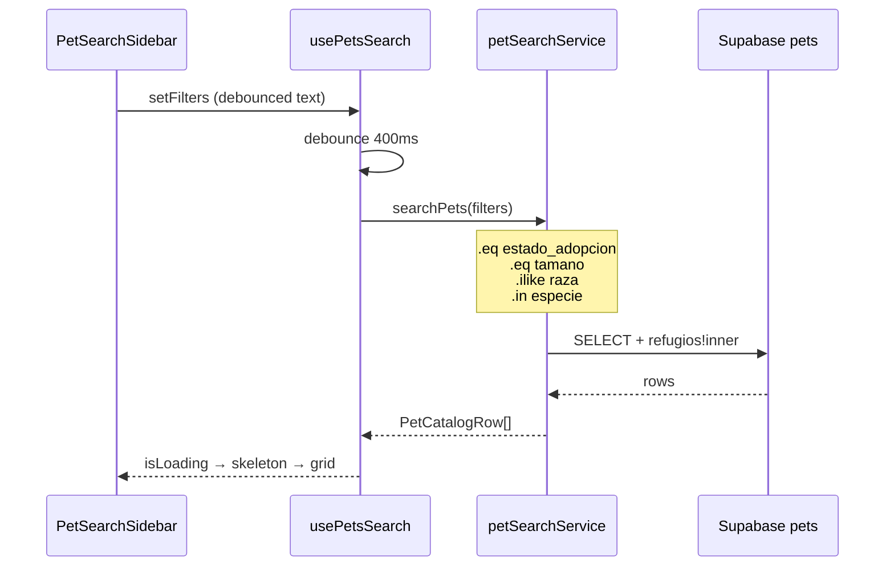

# Artefacto de propuesta — FEAT-002

| Campo | Valor |
|-------|-------|
| **ID** | FEAT-002 |
| **Título** | Búsqueda de mascotas para adoptantes |
| **Estado** | `archivado` |
| **Actor** | Adoptante potencial |
| **Depende de** | FEAT-001 (archivado), tablas `pets`, `refugios` |
| **Creado** | 2026-06-03 |
| **Actualizado** | 2026-06-03 |
| **Archivado** | 2026-06-03 |
| **Estándares** | `.openspec/standards.md` |

---

## 1. Historia de usuario

> **Como** Adoptante Potencial, **quiero** poder buscar mascotas por especie, raza, edad, tamaño, ubicación y compatibilidad (ej. con niños, otros animales), **para** encontrar un compañero adecuado.

### Alcance

- **Incluye:** extensión del schema e **índices de rendimiento**, RLS de solo lectura pública para `disponible`, catálogo con **Sidebar de filtros** + **Grid responsivo**, hook **`usePetsSearch`** con `.eq()` / `.ilike()` / `.in()`, **debounce** en búsqueda de texto, **loading skeleton**.
- **Excluye:** solicitud de adopción, favoritos, mapa, notificaciones.

### Delta respecto a FEAT-001

Extiende `pets` y `refugios`; actualiza formulario de registro con tamaño y compatibilidad; **reemplaza** la política RLS de lectura total por lectura pública solo de mascotas `disponible`.

---

## 2. Decisiones de arquitectura

| # | Decisión | Justificación |
|---|----------|---------------|
| D1 | Columnas estructuradas (`edad_anios`, `tamano`, booleans de compatibilidad) | Filtros SQL eficientes con índices parciales. |
| D2 | Ubicación en `refugios` (`ciudad`, `estado`) | Join embebido en consulta Supabase. |
| D3 | `estado_adopcion` default `disponible` | Catálogo y RLS alineados al mismo criterio. |
| D4 | **`usePetsSearch`** + `petSearchService.js` | Lógica de filtros fuera del JSX; nombre explícito del dominio. |
| D5 | Consultas con **PostgREST** (`.eq`, `.ilike`, `.in`, `.gte`, `.lte`) — sin RPC obligatoria | Contrato pedido; el cliente construye la query dinámicamente. |
| D6 | **Debounce 400 ms** en campos de texto (`raza`, `ciudad`, `estado`) | Evita saturar la API de Supabase al teclear. |
| D7 | Layout **Sidebar + Grid** responsivo | Sidebar fijo en `lg+`; drawer/colapsable en móvil. |
| D8 | **`PetGridSkeleton`** durante `isLoading` | UX de carga perceptible (CA dedicado). |
| D9 | Sin auth para buscar | RLS + grants `anon` en `pets` / join `refugios`. |
| D10 | Actualizar `PetProfileForm` en mismo `/apply` | Poblar campos indexados al registrar. |

### Flujo de datos



---

## 3. Contrato de datos (Supabase)

### 3.1 Extensión `refugios`

| Columna | Tipo | Descripción |
|---------|------|-------------|
| `ciudad` | `text` NOT NULL | Ciudad del refugio |
| `estado` | `text` NOT NULL | Estado/región |

### 3.2 Extensión `pets`

| Columna | Tipo | Indexada | Descripción |
|---------|------|----------|-------------|
| `edad_anios` | `int` | sí (compuesto) | 0–30 |
| `edad_meses` | `int` | — | 0–11 |
| `tamano` | `text` | **sí (dedicado)** | `pequeno`, `mediano`, `grande` |
| `compatible_ninos` | `boolean` | **sí (parcial)** | Default `false` |
| `compatible_perros` | `boolean` | **sí (parcial)** | Default `false` |
| `compatible_gatos` | `boolean` | **sí (parcial)** | Default `false` |
| `estado_adopcion` | `text` | **sí (parcial)** | `disponible`, `en_proceso`, `adoptado` |

### 3.3 Índices para búsquedas rápidas (`005_pet_search.sql`)

Objetivo: que filtros por **tamaño**, **compatibilidad** y **disponibilidad** usen índices B-tree / parciales en lugar de secuencial scan.

```sql
-- FEAT-002: columnas + índices de rendimiento

-- … (alter table refugios / pets, constraints — ver bloque completo en apply) …

-- ─── Índices generales ───────────────────────────────────
create index if not exists pets_especie_idx on public.pets (especie);
create index if not exists pets_raza_trgm_idx on public.pets using gin (raza gin_trgm_ops);
-- Requiere: create extension if not exists pg_trgm;

-- ─── Tamaño (filtro frecuente) ───────────────────────────
create index if not exists pets_tamano_idx on public.pets (tamano);

-- ─── Solo mascotas disponibles (catálogo público) ────────
create index if not exists pets_disponible_estado_idx
  on public.pets (estado_adopcion)
  where estado_adopcion = 'disponible';

create index if not exists pets_disponible_tamano_idx
  on public.pets (tamano)
  where estado_adopcion = 'disponible';

create index if not exists pets_disponible_edad_idx
  on public.pets (edad_anios)
  where estado_adopcion = 'disponible';

-- Índice compuesto: especie + tamaño + edad (consultas combinadas)
create index if not exists pets_disponible_search_combo_idx
  on public.pets (especie, tamano, edad_anios)
  where estado_adopcion = 'disponible';

-- ─── Compatibilidad (booleans) — índices parciales cuando true ─
create index if not exists pets_disponible_compat_ninos_idx
  on public.pets (compatible_ninos)
  where estado_adopcion = 'disponible' and compatible_ninos = true;

create index if not exists pets_disponible_compat_perros_idx
  on public.pets (compatible_perros)
  where estado_adopcion = 'disponible' and compatible_perros = true;

create index if not exists pets_disponible_compat_gatos_idx
  on public.pets (compatible_gatos)
  where estado_adopcion = 'disponible' and compatible_gatos = true;

-- Ubicación vía refugio
create index if not exists refugios_ciudad_idx on public.refugios (ciudad);
create index if not exists refugios_estado_idx on public.refugios (estado);
create index if not exists refugios_ciudad_estado_idx on public.refugios (ciudad, estado);
```

| Consulta típica | Índice que la apoya |
|-----------------|---------------------|
| `estado_adopcion = 'disponible'` | `pets_disponible_estado_idx` |
| `tamano = 'mediano'` | `pets_disponible_tamano_idx` |
| `compatible_ninos = true` | `pets_disponible_compat_ninos_idx` |
| `especie + tamano + edad` | `pets_disponible_search_combo_idx` |
| `raza ilike '%lab%'` | `pets_raza_trgm_idx` (opcional; si no hay pg_trgm, btree + ilike aceptable en MVP) |

### 3.4 Políticas RLS — lectura pública solo `disponible`

**Principio:** rol `anon` y `authenticated` pueden hacer **SELECT** únicamente sobre filas con `estado_adopcion = 'disponible'`. INSERT/UPDATE/DELETE sin cambios (solo dueño del refugio, FEAT-001).

**Migración** `supabase/migrations/006_pets_rls_disponible.sql`:

```sql
-- Reemplazar lectura pública total (FEAT-001) por lectura acotada

drop policy if exists "pets_select_public" on public.pets;

create policy "pets_select_disponible_public"
  on public.pets for select
  to anon, authenticated
  using (estado_adopcion = 'disponible');

-- Lectura de ubicación del refugio para join en catálogo (solo columnas no sensibles)
drop policy if exists "refugios_select_public_catalog" on public.refugios;
create policy "refugios_select_public_catalog"
  on public.refugios for select
  to anon, authenticated
  using (
    exists (
      select 1 from public.pets p
      where p.refugio_id = refugios.id
        and p.estado_adopcion = 'disponible'
    )
  );
```

| Operación | `anon` / adoptante | Dueño refugio |
|-----------|-------------------|---------------|
| `SELECT` pets `disponible` | permitido | permitido |
| `SELECT` pets `en_proceso` / `adoptado` | **denegado** | permitido si es su refugio (policy FEAT-001 update/delete context; añadir policy select own all statuses) |
| `INSERT` / `UPDATE` / `DELETE` | denegado | solo su `refugio_id` |

**Policy adicional para dueño** (ver todas sus mascotas al gestionar):

```sql
create policy "pets_select_owner_all_status"
  on public.pets for select
  to authenticated
  using (
    exists (
      select 1 from public.refugios r
      where r.id = pets.refugio_id and r.user_id = auth.uid()
    )
  );
```

> Las políticas SELECT se combinan con **OR** en PostgreSQL RLS: adoptante ve `disponible`; refugio ve además las suyas en cualquier estado.

### 3.5 Servicio: mapeo filtros → modificadores Supabase

**Archivo:** `src/services/petSearchService.js`

```js
// Pseudocódigo del contrato apply
let query = supabase
  .from('pets')
  .select(`
    id, nombre, especie, raza, edad, edad_anios, edad_meses, tamano,
    temperamento, descripcion, fotos_url,
    compatible_ninos, compatible_perros, compatible_gatos,
    created_at,
    refugios!inner ( nombre, ciudad, estado )
  `)
  .eq('estado_adopcion', 'disponible')   // siempre (refuerzo RLS)

if (filters.especie?.length) query = query.in('especie', filters.especie) // o .eq si uno solo
if (filters.tamano)           query = query.eq('tamano', filters.tamano)
if (filters.raza?.trim())     query = query.ilike('raza', `%${filters.raza.trim()}%`)
if (filters.edadMin != null)  query = query.gte('edad_anios', filters.edadMin)
if (filters.edadMax != null)  query = query.lte('edad_anios', filters.edadMax)
if (filters.compatibleNinos)  query = query.eq('compatible_ninos', true)
if (filters.compatiblePerros) query = query.eq('compatible_perros', true)
if (filters.compatibleGatos)  query = query.eq('compatible_gatos', true)
if (filters.ciudad?.trim())   query = query.ilike('refugios.ciudad', `%${filters.ciudad.trim()}%`)
if (filters.estado?.trim())   query = query.ilike('refugios.estado', `%${filters.estado.trim()}%`)

query = query.order('created_at', { ascending: false })
```

| Filtro UI | Modificador Supabase |
|-----------|---------------------|
| Especie (una) | `.eq('especie', value)` |
| Especie (varias) | `.in('especie', ['perro','gato'])` |
| Raza (texto) | `.ilike('raza', '%…%')` + **debounce** |
| Tamaño | `.eq('tamano', …)` |
| Edad rango | `.gte('edad_anios', min)` + `.lte('edad_anios', max)` |
| Compatibilidad | `.eq('compatible_*', true)` |
| Ciudad / Estado | `.ilike('refugios.ciudad', …)` / `.ilike('refugios.estado', …)` + **debounce** |

### 3.6 DTOs frontend

```ts
type PetSearchFilters = {
  especie: ('perro' | 'gato' | 'otro')[];  // vacío = todas; .in() si length > 0
  raza: string;
  edadPreset: '' | 'cachorro' | 'adulto' | 'senior';
  tamano: '' | 'pequeno' | 'mediano' | 'grande';
  ciudad: string;
  estado: string;
  compatibleNinos: boolean;
  compatiblePerros: boolean;
  compatibleGatos: boolean;
};

type PetCatalogRow = { /* igual que antes + normalización fotos_url */ };
```

### 3.7 Reglas de negocio

| ID | Regla |
|----|-------|
| RN-01 | Toda consulta de catálogo incluye `.eq('estado_adopcion', 'disponible')`. |
| RN-02 | Campos de texto (`raza`, `ciudad`, `estado`) disparan búsqueda solo tras **400 ms** sin cambios (debounce). |
| RN-03 | Filtros instantáneos (select, checkbox) pueden buscar sin debounce adicional. |
| RN-04 | Cancelar request anterior si llega un nuevo filtro (AbortController o flag `requestId`). |
| RN-05 | Máximo 1 request en vuelo por hook (evitar carreras). |

---

## 4. Contrato de componentes React

### 4.1 Layout: Sidebar + Grid principal

**Página:** `src/pages/BrowsePetsPage.jsx`

```
┌─────────────────────────────────────────────────────────┐
│  Header app                                              │
├──────────────┬──────────────────────────────────────────┤
│  Sidebar     │  Grid principal (PetResultsGrid)         │
│  (filtros)   │  ┌────┐ ┌────┐ ┌────┐                      │
│              │  │Card│ │Card│ │Card│  … responsivo       │
│  lg: 280px   │  └────┘ └────┘ └────┘                      │
│  móvil:      │  o PetGridSkeleton si isLoading           │
│  drawer      │                                           │
└──────────────┴──────────────────────────────────────────┘
```

| Breakpoint | Comportamiento |
|------------|----------------|
| `< lg` | Botón «Filtros» abre **drawer** / panel deslizable con `PetSearchSidebar` |
| `≥ lg` | Sidebar fijo a la izquierda (`w-72`), grid `grid-cols-1 md:grid-cols-2 xl:grid-cols-3` |

### 4.2 `PetSearchSidebar`

**Ubicación:** `src/components/search/PetSearchSidebar.jsx`

| Prop | Tipo | Descripción |
|------|------|-------------|
| `filters` | `PetSearchFilters` | Estado controlado |
| `onChange` | `(filters) => void` | Actualiza filtros |
| `onClear` | `() => void` | Resetea a `INITIAL_FILTERS` |
| `className` | `string` | opcional |

**Contenido:** mismos controles que §3 (especie multi o select, raza, edad preset, tamaño, ciudad, estado, checkboxes compatibilidad).

**Debounce (solo en hook, no en sidebar):** el sidebar llama `onChange` en cada keystroke; `usePetsSearch` deriva `debouncedRaza`, `debouncedCiudad`, `debouncedEstado` con `useDebouncedValue(value, 400)`.

**UI:** fondo `bg-white`, borde `border-gray-200`, iconos Lucide (`Filter`, `SlidersHorizontal`, `X`), CTA limpiar en `text-secondary`.

### 4.3 `PetResultsGrid` (grid principal)

**Ubicación:** `src/components/search/PetResultsGrid.jsx`

| Prop | Tipo | Descripción |
|------|------|-------------|
| `pets` | `PetCatalogRow[]` | Resultados |
| `isLoading` | `boolean` | Si true → renderiza `PetGridSkeleton` |
| `error` | `string \| null` | Banner de error |
| `isEmpty` | `boolean` | Estado vacío tras carga |

Grid: `grid gap-4 grid-cols-1 sm:grid-cols-2 xl:grid-cols-3`.

### 4.4 `PetGridSkeleton` (loading)

**Ubicación:** `src/components/search/PetGridSkeleton.jsx`

- Renderiza **6–9** placeholders con `animate-pulse`.
- Estructura espejo de `PetCard`: rectángulo imagen `aspect-[4/3]`, líneas de texto `bg-gray-200 rounded`.
- Se muestra cuando `usePetsSearch.isLoading === true`.

### 4.5 `PetCard`

**Ubicación:** `src/components/search/PetCard.jsx` — sin cambios conceptuales (foto, nombre, chips compatibilidad, ubicación).

### 4.6 Hook `usePetsSearch`

**Ubicación:** `src/hooks/usePetsSearch.js`

```ts
const DEBOUNCE_MS = 400;

function usePetsSearch(): {
  filters: PetSearchFilters;
  setFilters: (f: PetSearchFilters | ((prev) => PetSearchFilters)) => void;
  results: PetCatalogRow[];
  isLoading: boolean;
  error: string | null;
  clearFilters: () => void;
  refetch: () => Promise<void>;
}
```

**Responsabilidades:**

1. Estado `filters` (inmediato para UI del sidebar).
2. `debouncedText = { raza, ciudad, estado }` vía `useDebouncedValue` (400 ms).
3. `useEffect` que llama `petSearchService.searchPets(mergedFilters)` cuando cambian filtros debounced o filtros discretos.
4. `isLoading true` al iniciar request; `false` al terminar (éxito o error).
5. Ignorar respuestas obsoletas (stale) si el usuario sigue escribiendo.

**Utilidad:** `src/hooks/useDebouncedValue.js` — `export function useDebouncedValue(value, delayMs = 400)`.

### 4.7 Integración `App.jsx`

- Pestañas: **Explorar** (`BrowsePetsPage`) | **Registrar** (FEAT-001, autenticado).
- Contenedor explorar: `max-w-7xl mx-auto`.

### 4.8 Actualización registro (FEAT-001)

`PetProfileForm`: `tamano`, checkboxes compatibilidad; persistir `edad_anios`/`edad_meses`; `AuthPanel` o formulario refugio: `ciudad`, `estado`.

---

## 5. Criterios de aceptación

| ID | Escenario | Resultado esperado |
|----|-----------|------------------|
| CA-01 | Sin filtros | Todas las `disponible`; skeleton → grid |
| CA-02 | `.eq('especie','perro')` | Solo perros |
| CA-03 | `.ilike('raza','%lab%')` tras debounce | Coincidencias parciales |
| CA-04 | `.in('especie',['perro','gato'])` | Ambas especies |
| CA-05 | Preset Cachorro | `.gte/.lte` en `edad_anios` |
| CA-06 | `.eq('tamano','grande')` | Usa índice `tamano` |
| CA-07 | `.eq('compatible_ninos', true)` | Solo compatibles |
| CA-08 | Escribir raza rápido | ≤1 request cada 400 ms (debounce) |
| CA-09 | `anon` SELECT | Solo filas `disponible` (RLS) |
| CA-10 | Dueño ve sus mascotas `en_proceso` | Policy `pets_select_owner_all_status` |
| CA-11 | Vista móvil | Sidebar en drawer; grid 1 columna |
| CA-12 | `isLoading` | Muestra `PetGridSkeleton` |
| CA-13 | `npm run lint` | Sin errores |

---

## 6. Tareas atómicas (para `/apply`)

### Bloque A — Base de datos

1. Crear `005_pet_search.sql`: columnas `pets`/`refugios` + **todos los índices** §3.3 (incl. parciales compatibilidad y `tamano`).
2. Crear `006_pets_rls_disponible.sql`: policies §3.4 (`pets_select_disponible_public`, `refugios_select_public_catalog`, `pets_select_owner_all_status`).
3. Habilitar `pg_trgm` y índice GIN en `raza` (opcional; documentar si se omite).
4. Actualizar README: migraciones 005–006, índices y RLS.

### Bloque B — `usePetsSearch` y servicio Supabase

5. Crear `src/hooks/useDebouncedValue.js` (400 ms).
6. Crear `src/lib/constants/petSearchOptions.js` (presets edad → min/max).
7. Crear `src/services/petSearchService.js` aplicando `.eq()`, `.ilike()`, `.in()`, `.gte()`, `.lte()` según §3.5.
8. Crear **`src/hooks/usePetsSearch.js`**: filtros, debounce texto, loading, stale guard, `clearFilters`.
9. Actualizar `petService.js` / `PetProfileForm` / refugio con nuevos campos.

### Bloque C — UI responsiva + skeleton

10. Crear **`PetSearchSidebar.jsx`** (filtros múltiples).
11. Crear **`PetCard.jsx`**.
12. Crear **`PetGridSkeleton.jsx`** (loading placeholders).
13. Crear **`PetResultsGrid.jsx`** (grid principal + empty/error).
14. Crear **`BrowsePetsPage.jsx`** (layout Sidebar + Grid; drawer móvil).

### Bloque D — Integración

15. Integrar pestañas Explorar / Registrar en `App.jsx`.
16. Verificar CA-01 a CA-13.

**Orden:** 1 → 2 → 3 → 4 → 5 → 6 → 7 → 8 → 9 → 10 → 11 → 12 → 13 → 14 → 15 → 16.

---

## 7. Definición de hecho (DoD)

- [ ] Migraciones 005–008 aplicadas en Supabase.
- [x] Tareas 1–16 completadas en código.
- [x] CA-01 a CA-13 verificados en código (`/verify` 2026-06-03).
- [x] Spec archivada en `specs/archive/` (`/archive` 2026-06-03).
- [x] Fix RLS recursión documentado (`008_fix_rls_recursion.sql`).

### Informe `/verify` (2026-06-03)

| Área | Estado | Notas |
|------|--------|-------|
| SQL 005 índices `tamano` + compat parciales | OK | §3.3 completo |
| SQL 006 RLS `disponible` + owner + refugios catálogo | OK | Reemplaza `pets_select_public` |
| SQL 007 grant `refugios` anon | Corregido | Join embebido en búsqueda |
| `petSearchService` `.eq/.in/.ilike/.gte/.lte` | OK | RN-01 siempre `disponible` |
| Debounce 400 ms | OK | `useDebouncedValue` + DEBOUNCE_MS |
| AbortController | Corregido | RN-04 cancelación de requests |
| `PetSearchSidebar` + drawer móvil | OK | `BrowsePetsPage` |
| `PetResultsGrid` + `PetGridSkeleton` (9) | Corregido | Grid `md:grid-cols-2` |
| `usePetsSearch` | OK | stale guard + abort |
| `PetProfileForm` tamano + compat | OK | Validación `tamano` |
| `AuthPanel` ciudad/estado | OK | Registro refugio |
| Lint | OK | `npm run lint` sin errores |

---

## 8. Notas OpenSpec / Delta

- **Cambio RLS:** reemplaza `pets_select_public` (SELECT total) por SELECT solo `disponible` + SELECT dueño para gestión.
- **Sin RPC obligatoria:** búsqueda vía cliente Supabase y modificadores PostgREST.
- **Siguiente spec:** FEAT-003 — detalle de mascota y contacto con refugio.
