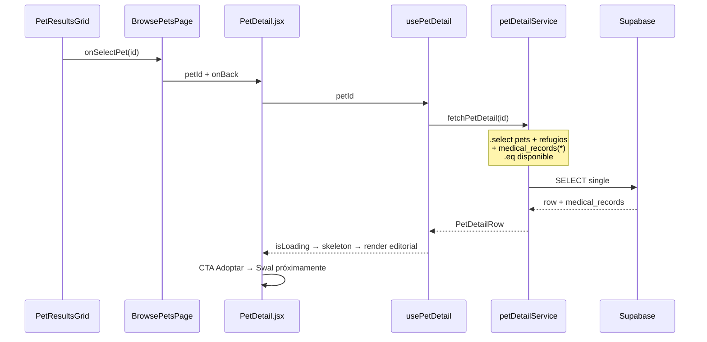

# Artefacto de propuesta — FEAT-003

| Campo | Valor |
|-------|-------|
| **ID** | FEAT-003 |
| **Título** | Perfil completo de mascota para adoptantes |
| **Estado** | `archivado` |
| **Actor** | Adoptante potencial |
| **Depende de** | FEAT-001 (archivado), FEAT-002 (archivado), tablas `pets`, `refugios`, RLS `disponible` |
| **Creado** | 2026-06-03 |
| **Actualizado** | 2026-06-03 |
| **Archivado** | 2026-06-03 |
| **Estándares** | `.openspec/standards.md` |

---

## 1. Historia de usuario

> **Como** Adoptante Potencial, **quiero** poder ver el perfil completo de una mascota, incluyendo su historial médico y requisitos especiales, **para** evaluar si es un compañero adecuado antes de solicitar la adopción.

### Alcance

- **Incluye:** tabla **`medical_records`** (1:1 con `pets`), RLS de solo lectura pública para mascotas `disponible`, extensión opcional `requisitos_especiales` en `pets`, servicio **`petDetailService`** con embed `medical_records(*)`, hook **`usePetDetail`**, vista editorial **`PetDetail.jsx`** (carrusel, badges, tarjeta médica, CTA Adoptar), navegación desde **`PetCard`**, actualización del formulario de registro (refugio), estados loading/error/404.
- **Excluye:** flujo completo de solicitud de adopción (FEAT-004), formulario de contacto, favoritos, edición inline, autenticación de adoptante.

### Delta respecto a FEAT-002

Nueva entidad **`medical_records`** relacionada con `pets`; el catálogo abre **`PetDetail.jsx`**; **`PetProfileForm`** crea el registro médico al publicar una mascota.

---

## 2. Decisiones de arquitectura

| # | Decisión | Justificación |
|---|----------|---------------|
| D1 | Tabla **`medical_records`** 1:1 con `pets` (`pet_id` UNIQUE) | Separa datos clínicos del perfil; JOIN embebido en PostgREST. |
| D2 | Campos médicos estructurados + `notas_medicas` libre | `vacunas`, `esterilizado`, `condiciones_especiales` cubren requisitos especiales y salud de forma legible. |
| D3 | Columna `requisitos_especiales` en `pets` (text, opcional) | Requisitos del **hogar adoptante** (patio, experiencia) distintos de condiciones médicas de la mascota. |
| D4 | **`petDetailService.js`** + **`usePetDetail(petId)`** con `.select('..., medical_records(...)')` | Un solo round-trip; normalización en servicio. |
| D5 | Navegación **por estado** en `BrowsePetsPage` (`detailPetId`) | MVP sin `react-router`; sin nueva dependencia. |
| D6 | Detalle solo para `estado_adopcion = 'disponible'` | Alineado a RLS público; no disponible → 404 amigable. |
| D7 | **`PetDetail.jsx`** — diseño editorial limpio | Tipografía generosa, columnas de lectura, jerarquía visual clara. |
| D8 | Carrusel **`PetPhotoCarousel`** con flechas **Lucide** (`ChevronLeft`, `ChevronRight`) | Navegación explícita entre fotos; accesible con teclado. |
| D9 | Tarjeta médica destacada en **Verde Salvia** `#81B29A` (`bg-secondary/10`, `border-secondary`) | Identidad visual del bloque de salud. |
| D10 | CTA **«Adoptar»** gigante **Naranja Terracota** `#E07A5F` (`bg-primary`) | Acción principal visible; click muestra Swal «Próximamente» hasta FEAT-004. |
| D11 | RLS **`medical_records`**: SELECT público solo si pet `disponible`; INSERT/UPDATE solo dueño refugio | Paridad con políticas de `pets`. |
| D12 | Función helper **`pet_is_disponible(uuid)`** SECURITY DEFINER para RLS | Evita recursión cruzada `pets` ↔ `medical_records` (patrón `008_fix_rls_recursion.sql`). |

### Flujo de datos



---

## 3. Contrato de datos (Supabase)

### 3.1 Tabla `medical_records` (`009_medical_records.sql`)

Relación **1:1** con `pets`: cada mascota tiene como máximo un registro médico.

| Columna | Tipo | Obligatorio | Descripción |
|---------|------|-------------|-------------|
| `id` | `uuid` | PK | `gen_random_uuid()` |
| `pet_id` | `uuid` | FK UNIQUE | `references public.pets(id) on delete cascade` |
| `vacunas` | `text` | sí | Vacunas aplicadas o estado («Al día», «Pendiente rabia», etc.) |
| `esterilizado` | `boolean` | sí | Default `false` |
| `condiciones_especiales` | `text` | no | Condiciones médicas o cuidados (diabetes, medicación, dieta) |
| `notas_medicas` | `text` | no | Notas libres del veterinario/refugio |
| `created_at` | `timestamptz` | auto | Auditoría |
| `updated_at` | `timestamptz` | auto | Auditoría |

**Script SQL:**

```sql
-- FEAT-003: registro médico por mascota

create table if not exists public.medical_records (
  id uuid primary key default gen_random_uuid(),
  pet_id uuid not null unique references public.pets (id) on delete cascade,
  vacunas text not null
    check (char_length(trim(vacunas)) >= 2),
  esterilizado boolean not null default false,
  condiciones_especiales text not null default ''
    check (char_length(condiciones_especiales) <= 1500),
  notas_medicas text not null default ''
    check (char_length(notas_medicas) <= 3000),
  created_at timestamptz not null default now(),
  updated_at timestamptz not null default now()
);

create index if not exists medical_records_pet_id_idx
  on public.medical_records (pet_id);

create trigger medical_records_set_updated_at
  before update on public.medical_records
  for each row execute function public.set_updated_at();

alter table public.medical_records enable row level security;
```

### 3.2 Extensión `pets` — requisitos del hogar (`009_medical_records.sql`, mismo archivo)

| Columna | Tipo | Obligatorio | Descripción |
|---------|------|-------------|-------------|
| `requisitos_especiales` | `text` | no | Requisitos para el adoptante (patio, sin niños, etc.) |

```sql
alter table public.pets
  add column if not exists requisitos_especiales text not null default '';

alter table public.pets drop constraint if exists pets_requisitos_especiales_length;
alter table public.pets add constraint pets_requisitos_especiales_length
  check (char_length(requisitos_especiales) <= 1500);
```

### 3.3 RLS `medical_records` (`010_medical_records_rls.sql`)

**Helper (evitar recursión):**

```sql
create or replace function public.pet_is_disponible(p_pet_id uuid)
returns boolean
language sql
stable
security definer
set search_path = public
as $$
  select exists (
    select 1 from public.pets p
    where p.id = p_pet_id and p.estado_adopcion = 'disponible'
  );
$$;

grant execute on function public.pet_is_disponible(uuid) to anon, authenticated;
```

**Políticas:**

| Policy | Rol | Operación | Condición |
|--------|-----|-----------|-----------|
| `medical_records_select_disponible_public` | `anon`, `authenticated` | SELECT | `pet_is_disponible(pet_id)` |
| `medical_records_select_owner` | `authenticated` | SELECT | Dueño del refugio de la mascota (cualquier estado) |
| `medical_records_insert_owner` | `authenticated` | INSERT | Dueño refugio de `pet_id` |
| `medical_records_update_owner` | `authenticated` | UPDATE | Dueño refugio de `pet_id` |
| `medical_records_delete_owner` | `authenticated` | DELETE | Dueño refugio de `pet_id` |

```sql
-- FEAT-003: RLS medical_records

create policy "medical_records_select_disponible_public"
  on public.medical_records for select
  to anon, authenticated
  using (public.pet_is_disponible(pet_id));

create policy "medical_records_select_owner"
  on public.medical_records for select
  to authenticated
  using (
    exists (
      select 1 from public.pets p
      join public.refugios r on r.id = p.refugio_id
      where p.id = medical_records.pet_id and r.user_id = auth.uid()
    )
  );

create policy "medical_records_insert_owner"
  on public.medical_records for insert
  to authenticated
  with check (
    exists (
      select 1 from public.pets p
      join public.refugios r on r.id = p.refugio_id
      where p.id = pet_id and r.user_id = auth.uid()
    )
  );

create policy "medical_records_update_owner"
  on public.medical_records for update
  to authenticated
  using (
    exists (
      select 1 from public.pets p
      join public.refugios r on r.id = p.refugio_id
      where p.id = medical_records.pet_id and r.user_id = auth.uid()
    )
  );

create policy "medical_records_delete_owner"
  on public.medical_records for delete
  to authenticated
  using (
    exists (
      select 1 from public.pets p
      join public.refugios r on r.id = p.refugio_id
      where p.id = medical_records.pet_id and r.user_id = auth.uid()
    )
  );

grant select on public.medical_records to anon, authenticated;
grant insert, update, delete on public.medical_records to authenticated;
```

> Las políticas SELECT se combinan con **OR**: adoptante ve registros de pets `disponible`; refugio ve los suyos en cualquier estado.

### 3.4 Servicio: consulta detalle con JOIN embebido

**Archivo:** `src/services/petDetailService.js`

```js
const SELECT_DETAIL = `
  id, nombre, especie, raza, edad, edad_anios, edad_meses, tamano,
  temperamento, descripcion, fotos_url, requisitos_especiales,
  compatible_ninos, compatible_perros, compatible_gatos,
  estado_adopcion, refugio_id, created_at,
  refugios!inner ( nombre, ciudad, estado ),
  medical_records (
    id, vacunas, esterilizado, condiciones_especiales, notas_medicas
  )
`

// Pseudocódigo
const { data, error } = await supabase
  .from('pets')
  .select(SELECT_DETAIL)
  .eq('id', petId)
  .eq('estado_adopcion', 'disponible')
  .maybeSingle()

// PostgREST devuelve medical_records como objeto (1:1) o array de 1 elemento — normalizar en normalizeDetailRow
```

| Campo respuesta | Origen |
|-----------------|--------|
| Todos los de `PetCatalogRow` | FEAT-002 |
| `requisitos_especiales` | `pets.requisitos_especiales` |
| `medicalRecord` | `medical_records` embebido (nullable si legacy sin registro) |

**Normalización:**

```js
function normalizeMedicalRecord(raw) {
  const row = Array.isArray(raw) ? raw[0] : raw
  if (!row) return null
  return {
    id: row.id,
    vacunas: row.vacunas ?? '',
    esterilizado: Boolean(row.esterilizado),
    condiciones_especiales: row.condiciones_especiales ?? '',
    notas_medicas: row.notas_medicas ?? '',
  }
}
```

### 3.5 DTO frontend

```ts
type MedicalRecord = {
  id: string;
  vacunas: string;
  esterilizado: boolean;
  condiciones_especiales: string;
  notas_medicas: string;
};

type PetDetailRow = PetCatalogRow & {
  requisitos_especiales: string;
  medicalRecord: MedicalRecord | null;
};
```

### 3.6 Reglas de negocio

| ID | Regla |
|----|-------|
| RN-01 | `fetchPetDetail` siempre filtra `.eq('estado_adopcion', 'disponible')`. |
| RN-02 | Sin fila pet → UI **«Mascota no disponible»** (404 amigable). |
| RN-03 | Pet sin `medical_records` → tarjeta médica muestra «Sin registro médico disponible». |
| RN-04 | `condiciones_especiales` vacío → «Sin condiciones especiales registradas». |
| RN-05 | `requisitos_especiales` vacío en `pets` → «Sin requisitos especiales para el hogar». |
| RN-06 | Al **crear** mascota: INSERT `pets` + INSERT `medical_records` (mismo flujo refugio). |
| RN-07 | `vacunas` obligatorio (≥ 2 caracteres); `esterilizado` boolean explícito en formulario. |
| RN-08 | Carrusel: índice circular; flechas ocultas si solo 1 foto. |
| RN-09 | CTA «Adoptar» visible siempre en detalle; acción = Swal informativo hasta FEAT-004. |
| RN-10 | Volver al catálogo conserva filtros de `usePetsSearch`. |

### 3.7 Actualización registro (FEAT-001 extendido)

**`petService.createPet`** — tras INSERT en `pets`:

```js
await supabase.from('medical_records').insert({
  pet_id: newPet.id,
  vacunas: input.vacunas.trim(),
  esterilizado: input.esterilizado,
  condiciones_especiales: input.condiciones_especiales?.trim() ?? '',
  notas_medicas: input.notas_medicas?.trim() ?? '',
})
```

**Validación (`petFormValidators.js`):**

| Campo | Obligatorio | Regla | Mensaje |
|-------|-------------|-------|---------|
| `vacunas` | sí | `trim().length >= 2` | "Indica el estado de vacunación." |
| `esterilizado` | sí | boolean | — |
| `condiciones_especiales` | no | `<= 1500` | "Las condiciones no pueden superar 1500 caracteres." |
| `notas_medicas` | no | `<= 3000` | "Las notas no pueden superar 3000 caracteres." |
| `requisitos_especiales` | no | `<= 1500` | "Los requisitos no pueden superar 1500 caracteres." |

---

## 4. Contrato de componentes React

### 4.1 Navegación catálogo ↔ detalle

**Página contenedora:** `src/pages/BrowsePetsPage.jsx`

```
Estado local: detailPetId: string | null

detailPetId === null:
  ┌──────────────┬──────────────────────────┐
  │ Sidebar      │ PetResultsGrid + PetCard │
  └──────────────┴──────────────────────────┘

detailPetId !== null:
  ┌─────────────────────────────────────────┐
  │ PetDetail.jsx                           │
  │   petId={detailPetId}                   │
  │   onBack={() => setDetailPetId(null)}   │
  └─────────────────────────────────────────┘
```

### 4.2 `PetDetail.jsx` — diseño editorial

**Ubicación:** `src/components/pets/PetDetail.jsx`

| Prop | Tipo | Descripción |
|------|------|-------------|
| `petId` | `string` | UUID de la mascota |
| `onBack` | `() => void` | Volver al catálogo |

**Principios visuales:**

- Contenedor `max-w-3xl mx-auto px-4 py-8 md:py-12` — columna de lectura centrada.
- Fondo página blanco / gradiente sutil heredado de `App`.
- Títulos `font-heading` (Nunito); cuerpo `font-sans` (Inter).
- Espaciado generoso entre bloques (`space-y-10`).

**Wireframe:**

```
┌─────────────────────────────────────────────────────────────┐
│  ← Volver al catálogo          (text-gray-600, ArrowLeft)   │
├─────────────────────────────────────────────────────────────┤
│  ┌─────────────────────────────────────────────────────┐    │
│  │  PetPhotoCarousel                                    │    │
│  │  [ ◀ ChevronLeft ]    imagen principal    [ ▶ ]     │    │
│  │  indicadores · · ○ · ·                               │    │
│  └─────────────────────────────────────────────────────┘    │
│                                                             │
│  NOMBRE DE LA MASCOTA          (text-3xl md:text-4xl)        │
│  Perro · Labrador · 2 años                                  │
│                                                             │
│  ┌─ Características (badges Tailwind) ─────────────────┐   │
│  │ [Pequeño] [Aguascalientes] [✓ Niños] [✓ Perros]     │   │
│  └──────────────────────────────────────────────────────┘   │
│                                                             │
│  Sobre mí                                                   │
│  ─────────                                                  │
│  Párrafo descripcion (prose, leading-relaxed)               │
│                                                             │
│  Temperamento                                               │
│  ────────────                                               │
│  Párrafo temperamento                                       │
│                                                             │
│  ┌─ Tarjeta médica (Verde Salvia #81B29A) ─────────────┐   │
│  │  bg-secondary/10 border-2 border-secondary rounded-2xl│   │
│  │  Stethoscope + "Información médica"                   │   │
│  │  • Vacunas: …                                         │   │
│  │  • Esterilizado: Sí / No                              │   │
│  │  • Condiciones especiales: …                         │   │
│  │  • Notas médicas: …                                   │   │
│  └───────────────────────────────────────────────────────┘   │
│                                                             │
│  Requisitos para el hogar (AlertTriangle, si aplica)        │
│                                                             │
│  Refugio · Ciudad, Estado                                   │
│                                                             │
│  ┌─────────────────────────────────────────────────────┐   │
│  │           ADOPTAR                                    │   │
│  │  w-full py-5 text-xl font-heading rounded-2xl       │   │
│  │  bg-primary (#E07A5F) text-white shadow-lg          │   │
│  │  hover:bg-primary/90 active:scale-[0.99]            │   │
│  └─────────────────────────────────────────────────────┘   │
└─────────────────────────────────────────────────────────────┘
```

**Tokens Tailwind obligatorios:**

| Elemento | Clases |
|----------|--------|
| Tarjeta médica | `bg-secondary/10 border-2 border-secondary text-gray-800` |
| Badge característica | `inline-flex items-center gap-1 px-3 py-1 rounded-full text-sm bg-gray-100 text-gray-700` |
| Badge compatibilidad | `bg-secondary/15 text-secondary` |
| CTA Adoptar | `w-full py-5 text-xl font-heading rounded-2xl bg-primary text-white shadow-lg hover:bg-primary/90 transition` |

**Comportamiento CTA «Adoptar»:**

```js
Swal.fire({
  icon: 'info',
  title: 'Próximamente',
  text: 'La solicitud de adopción estará disponible muy pronto.',
  confirmButtonColor: '#E07A5F',
})
```

### 4.3 `PetPhotoCarousel`

**Ubicación:** `src/components/pets/PetPhotoCarousel.jsx`

| Prop | Tipo |
|------|------|
| `photos` | `string[]` |
| `alt` | `string` |

- Flechas: **`ChevronLeft`**, **`ChevronRight`** (`lucide-react`), botones circulares `bg-white/90 shadow` sobre la imagen.
- Imagen: `aspect-[4/3] rounded-2xl object-cover w-full`.
- Indicadores puntos bajo la imagen; click salta a índice.
- Teclado: flechas ← → cuando el carrusel tiene foco (`tabIndex={0}`).
- RN-08: una sola foto → sin flechas ni puntos.

### 4.4 `PetCharacteristicBadges`

**Ubicación:** `src/components/pets/PetCharacteristicBadges.jsx`

| Prop | Tipo |
|------|------|
| `pet` | `PetDetailRow` |

Renderiza badges: `tamano`, ubicación (`MapPin`), `compatible_ninos/perros/gatos` con iconos Lucide (`Baby`, `Dog`, `Cat`, `Ruler`).

### 4.5 `PetMedicalCard`

**Ubicación:** `src/components/pets/PetMedicalCard.jsx`

| Prop | Tipo |
|------|------|
| `record` | `MedicalRecord \| null` |

Tarjeta destacada Verde Salvia; icono `Stethoscope`; filas etiqueta/valor para vacunas, esterilizado, condiciones, notas.

### 4.6 `PetDetailSkeleton`

**Ubicación:** `src/components/pets/PetDetailSkeleton.jsx`

- Espejo del layout editorial: rectángulo carrusel + líneas de texto `animate-pulse`.

### 4.7 `PetCard` / `PetResultsGrid` (actualización)

Igual que § anterior: `onSelect` / `onSelectPet`, botón «Ver perfil completo».

### 4.8 Hook `usePetDetail`

**Ubicación:** `src/hooks/usePetDetail.js`

```ts
function usePetDetail(petId: string | null): {
  pet: PetDetailRow | null;
  isLoading: boolean;
  error: string | null;
  notFound: boolean;
  refetch: () => Promise<void>;
}
```

- Invoca `petDetailService.fetchPetDetail` con embed `medical_records(...)`.
- `AbortController` al cambiar `petId`.

### 4.9 Integración `App.jsx`

Sin cambios estructurales: pestaña **Explorar** → `BrowsePetsPage` → `PetDetail.jsx` cuando hay `detailPetId`.

---

## 5. Criterios de aceptación

| ID | Escenario | Resultado esperado |
|----|-----------|-------------------|
| CA-01 | Click «Ver perfil» en catálogo | Renderiza `PetDetail.jsx` con datos completos |
| CA-02 | Carga detalle | `PetDetailSkeleton` → layout editorial |
| CA-03 | Pet con `medical_records` | Tarjeta Verde Salvia muestra vacunas, esterilizado, condiciones, notas |
| CA-04 | Pet legacy sin registro médico | Tarjeta con «Sin registro médico disponible» |
| CA-05 | Carrusel 3+ fotos | Flechas Lucide cambian imagen; indicadores sincronizados |
| CA-06 | Una sola foto | Sin flechas ni puntos |
| CA-07 | Badges características | Tamaño, ubicación, compatibilidad visibles |
| CA-08 | CTA «Adoptar» | Botón grande `#E07A5F`; click → Swal «Próximamente» |
| CA-09 | UUID inválido / no disponible | 404 amigable + volver |
| CA-10 | «Volver al catálogo» | Grid con filtros intactos |
| CA-11 | Registro refugio sin vacunas | Validación bloquea + Swal |
| CA-12 | Registro completo | INSERT `pets` + INSERT `medical_records` |
| CA-13 | `anon` SELECT `medical_records` | Solo si pet `disponible` (RLS) |
| CA-14 | `npm run lint` | Sin errores |

---

## 6. Tareas atómicas (para `/apply`)

### Bloque A — Base de datos (tabla médica)

1. Crear **`supabase/migrations/009_medical_records.sql`**: tabla `medical_records`, índice `pet_id`, trigger `updated_at`, columna `pets.requisitos_especiales`.
2. Crear **`supabase/migrations/010_medical_records_rls.sql`**: función `pet_is_disponible`, políticas SELECT público + owner CRUD, grants.
3. Documentar en README migraciones 009–010.

### Bloque B — Servicio y hooks (JOIN embebido)

4. Crear **`src/services/petDetailService.js`** con `SELECT` que incluya **`medical_records (...)`** y `normalizeDetailRow` / `normalizeMedicalRecord`.
5. Crear **`src/hooks/usePetDetail.js`**: loading, error, notFound, AbortController.

### Bloque C — Interfaz detallada (`PetDetail.jsx`)

6. Crear **`src/components/pets/PetPhotoCarousel.jsx`** (flechas `ChevronLeft` / `ChevronRight`, indicadores, teclado).
7. Crear **`src/components/pets/PetCharacteristicBadges.jsx`** (badges Tailwind).
8. Crear **`src/components/pets/PetMedicalCard.jsx`** (tarjeta `#81B29A`).
9. Crear **`src/components/pets/PetDetailSkeleton.jsx`** (layout editorial).
10. Crear **`src/components/pets/PetDetail.jsx`**: composición editorial, secciones texto, CTA **Adoptar** `#E07A5F`, integración `usePetDetail`.

### Bloque D — Catálogo y navegación

11. Actualizar **`PetCard.jsx`**: `onSelect`, accesibilidad.
12. Actualizar **`PetResultsGrid.jsx`**: `onSelectPet`.
13. Actualizar **`BrowsePetsPage.jsx`**: `detailPetId`, render `PetDetail.jsx`.

### Bloque E — Registro refugio (alimentar `medical_records`)

14. Actualizar **`petFormValidators.js`**: `vacunas`, `esterilizado`, `condiciones_especiales`, `notas_medicas`, `requisitos_especiales`.
15. Actualizar **`PetProfileForm.jsx`**: sección «Información médica» + «Requisitos del hogar».
16. Actualizar **`petService.js`** / **`usePets.js`**: INSERT en `medical_records` tras crear pet.

### Bloque F — Verificación

17. Verificar CA-01 a CA-14.

**Orden:** 1 → 2 → 3 → 4 → 5 → 6 → 7 → 8 → 9 → 10 → 11 → 12 → 13 → 14 → 15 → 16 → 17.

---

## 7. Definición de hecho (DoD)

- [ ] Migraciones 009–010 aplicadas en Supabase.
- [x] Tareas 1–17 completadas en código.
- [x] CA-01 a CA-14 verificados en código (`/verify` 2026-06-03).
- [x] Spec archivada en `specs/archive/` (`/archive` 2026-06-03).

### Informe `/verify` (2026-06-03)

| Área | Estado | Notas |
|------|--------|-------|
| SQL 009 `medical_records` + `requisitos_especiales` | OK | Checks vacunas, límites 1500/3000 |
| SQL 010 RLS + `pet_is_disponible` | OK | 5 políticas + grants |
| `petDetailService` embed + normalización | OK | RN-01 filtro `disponible` |
| `usePetDetail` AbortController | OK | loading, error, notFound, refetch |
| `PetDetail` + subcomponentes | OK | Carrusel, badges, tarjeta médica, CTA |
| `BrowsePetsPage` `detailPetId` | OK | RN-10 filtros intactos al volver |
| `petFormValidators` campos médicos | OK | vacunas, esterilizado, límites |
| `PetProfileForm` secciones médica + hogar | OK | INSERT vía `createPet` |
| Lint / build | OK | `eslint` + `vite build` sin errores |

---

## 8. Notas OpenSpec / Delta

- **Modelo médico normalizado:** reemplaza columnas planas `historial_medico` en `pets` por tabla `medical_records` + `requisitos_especiales` en `pets` para requisitos del hogar.
- **JOIN Supabase:** embed `medical_records(...)` en un solo `.select()` desde `pets`; no RPC obligatoria.
- **RLS:** función `pet_is_disponible` evita recursión con políticas de `pets` (mismo patrón que `008_fix_rls_recursion.sql`).
- **CTA Adoptar:** UI completa en FEAT-003; lógica de solicitud en **FEAT-004**.
- **Siguiente spec:** FEAT-004 — solicitud de adopción.
