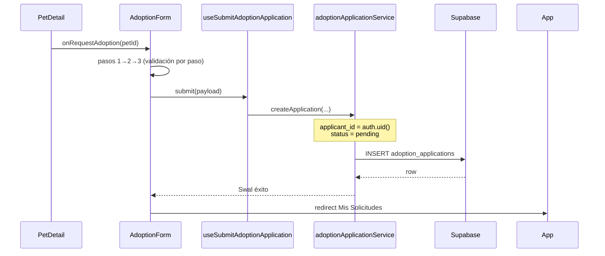

# Artefacto de propuesta — FEAT-004

| Campo | Valor |
|-------|-------|
| **ID** | FEAT-004 |
| **Título** | Solicitud de adopción para adoptantes |
| **Estado** | `archivado` |
| **Actor** | Adoptante potencial (applicant) |
| **Depende de** | FEAT-001–003 (archivados), tablas `pets`, `refugios`, función `pet_is_disponible` |
| **Creado** | 2026-06-03 |
| **Actualizado** | 2026-06-03 |
| **Archivado** | 2026-06-03 |
| **Estándares** | `.openspec/standards.md` |

---

## 1. Historia de usuario

> **Como** Adoptante Potencial, **quiero** poder enviar una solicitud de adopción, proporcionando información sobre mi hogar y mi experiencia con mascotas, **para** iniciar el proceso.

### Alcance

- **Incluye:** tabla **`applicants`** (perfil adoptante ligado a `auth.users`), tabla **`adoption_applications`** con enum **`status`** (`pending` / `approved` / `rejected`), RLS estricto por rol (applicant vs refugio), servicios y hooks Supabase, formulario multi-paso **`AdoptionForm.jsx`** con estado complejo, validación por paso, modal SweetAlert2 de éxito, dashboard **`MyApplicationsPage`** («Mis Solicitudes»), flujo desde CTA **«Adoptar»** en **`PetDetail.jsx`**, registro/login de adoptante.
- **Excluye:** UI refugio para aprobar/rechazar en bandeja dedicada (FEAT-005 puede consumir UPDATE RLS ya definido), cambio automático de `pets.estado_adopcion`, notificaciones email, chat, edición de solicitud enviada.

### Delta respecto a FEAT-003

- Sustituye Swal «Próximamente» por flujo autenticado de solicitud.
- Introduce modelo **`adoption_applications`** + **`applicant_id`** (ya no formulario anónimo con email suelto).
- Añade pestaña/vista **«Mis Solicitudes»** en `App.jsx`.

---

## 2. Decisiones de arquitectura

| # | Decisión | Justificación |
|---|----------|---------------|
| D1 | Tabla **`adoption_applications`** N:1 con `pets` y `applicants` | Contrato pedido; trazabilidad por adoptante autenticado. |
| D2 | Enum PostgreSQL **`adoption_application_status`** | `pending`, `approved`, `rejected` — valores fijos y type-safe. |
| D3 | **`applicant_id` = `auth.uid()`** en INSERT | RLS simple: el adoptante solo ve y crea lo suyo. |
| D4 | Tabla **`applicants`** 1:1 con `auth.users` | Perfil mínimo al registrarse como adoptante (distinto de `refugios`). |
| D5 | RLS **estricto**: applicant → INSERT + SELECT propias; refugio → SELECT + UPDATE de sus `pet_id` | Aislamiento total entre actores. |
| D6 | **`AdoptionForm`** multi-paso (3 pasos) + validación incremental | Reduce carga cognitiva; valida solo el paso activo. |
| D7 | Estado del wizard en **`useAdoptionFormState`** (reducer o `useState` anidado) | «Gestión de estado complejo» pedida en tareas. |
| D8 | Éxito → **Swal** + redirección a **«Mis Solicitudes»** | Cierre claro del flujo; el usuario ve su solicitud `pending`. |
| D9 | **`pet_is_disponible(pet_id)`** en `WITH CHECK` del INSERT | Solo mascotas `disponible`; reutiliza helper existente. |
| D10 | Índice único parcial: una aplicación **`pending`** por `(pet_id, applicant_id)` | Evita duplicados activos. |
| D11 | Navegación MVP sin router: `App.activeTab` incluye `'my-applications'` | Coherente con FEAT-002/003. |
| D12 | CTA «Adoptar» exige sesión applicant; si no hay sesión → prompt login adoptante | RLS requiere `authenticated` + `applicant_id`. |

### Flujo de datos



---

## 3. Contrato de datos (Supabase)

### 3.1 Enum `adoption_application_status` (`011_adoption_applications.sql`)

```sql
create type public.adoption_application_status as enum (
  'pending',
  'approved',
  'rejected'
);
```

| Valor | Quién lo asigna | Descripción |
|-------|------------------|-------------|
| `pending` | Applicant al INSERT (default) | Solicitud enviada, en espera |
| `approved` | Refugio (UPDATE, FEAT-005) | Aceptada |
| `rejected` | Refugio (UPDATE) | Rechazada |

### 3.2 Tabla `applicants` (mismo archivo `011`)

Perfil del adoptante; **no** crea fila en `refugios`.

| Columna | Tipo | Obligatorio | Descripción |
|---------|------|-------------|-------------|
| `id` | `uuid` | PK | `references auth.users(id) on delete cascade` |
| `nombre` | `text` | sí | Nombre para mostrar |
| `telefono` | `text` | no | Contacto (validado en app si se captura) |
| `created_at` | `timestamptz` | auto | Auditoría |

```sql
create table if not exists public.applicants (
  id uuid primary key references auth.users (id) on delete cascade,
  nombre text not null
    check (char_length(trim(nombre)) >= 2),
  telefono text not null default ''
    check (char_length(regexp_replace(telefono, '\D', '', 'g')) = 0
      or char_length(regexp_replace(telefono, '\D', '', 'g')) >= 8),
  created_at timestamptz not null default now()
);

alter table public.applicants enable row level security;
```

**RLS `applicants` (incluir en `012`):**

| Policy | Operación | Condición |
|--------|-----------|-----------|
| `applicants_select_own` | SELECT | `id = auth.uid()` |
| `applicants_insert_own` | INSERT | `id = auth.uid()` |
| `applicants_update_own` | UPDATE | `id = auth.uid()` |

### 3.3 Tabla `adoption_applications` (`011`)

| Columna | Tipo | Obligatorio | Descripción |
|---------|------|-------------|-------------|
| `id` | `uuid` | PK | `gen_random_uuid()` |
| `pet_id` | `uuid` | FK | `references public.pets(id) on delete cascade` |
| `applicant_id` | `uuid` | FK | `references public.applicants(id) on delete cascade` |
| `status` | `adoption_application_status` | sí | Default `'pending'` |
| `tipo_vivienda` | `text` | sí | `casa`, `departamento`, `otro` |
| `tiene_patio` | `boolean` | sí | Default `false` |
| `otras_mascotas` | `text` | no | Animales actuales en el hogar (default `''`) |
| `experiencia_previa` | `text` | sí | Experiencia previa con mascotas |
| `horas_solo` | `integer` | sí | Horas al día que la mascota estaría sola (0–24) |
| `created_at` | `timestamptz` | auto | Auditoría |
| `updated_at` | `timestamptz` | auto | Auditoría |

```sql
-- FEAT-004: solicitudes de adopción (applicaciones)

create table if not exists public.adoption_applications (
  id uuid primary key default gen_random_uuid(),
  pet_id uuid not null references public.pets (id) on delete cascade,
  applicant_id uuid not null references public.applicants (id) on delete cascade,
  status public.adoption_application_status not null default 'pending',
  tipo_vivienda text not null
    check (tipo_vivienda in ('casa', 'departamento', 'otro')),
  tiene_patio boolean not null default false,
  otras_mascotas text not null default ''
    check (char_length(otras_mascotas) <= 500),
  experiencia_previa text not null
    check (char_length(trim(experiencia_previa)) >= 20),
  horas_solo integer not null
    check (horas_solo >= 0 and horas_solo <= 24),
  created_at timestamptz not null default now(),
  updated_at timestamptz not null default now()
);

create index if not exists adoption_applications_pet_id_idx
  on public.adoption_applications (pet_id);

create index if not exists adoption_applications_applicant_id_idx
  on public.adoption_applications (applicant_id);

create index if not exists adoption_applications_status_idx
  on public.adoption_applications (status);

create unique index if not exists adoption_applications_one_pending_per_applicant_pet
  on public.adoption_applications (pet_id, applicant_id)
  where status = 'pending';

create trigger adoption_applications_set_updated_at
  before update on public.adoption_applications
  for each row execute function public.set_updated_at();

alter table public.adoption_applications enable row level security;
```

### 3.4 RLS estricto (`012_adoption_applications_rls.sql`)

**Helper refugio dueño de la mascota (evitar subquery recursiva repetida):**

```sql
create or replace function public.is_pet_owned_by_auth_refugio(p_pet_id uuid)
returns boolean
language sql
stable
security definer
set search_path = public
as $$
  select exists (
    select 1 from public.pets p
    join public.refugios r on r.id = p.refugio_id
    where p.id = p_pet_id and r.user_id = auth.uid()
  );
$$;

grant execute on function public.is_pet_owned_by_auth_refugio(uuid) to authenticated;
```

**Políticas `adoption_applications`:**

| Policy | Rol | Operación | Condición |
|--------|-----|-----------|-----------|
| `adoption_applications_insert_applicant` | `authenticated` | INSERT | `applicant_id = auth.uid()` AND `status = 'pending'` AND `pet_is_disponible(pet_id)` |
| `adoption_applications_select_applicant` | `authenticated` | SELECT | `applicant_id = auth.uid()` |
| `adoption_applications_select_refugio` | `authenticated` | SELECT | `is_pet_owned_by_auth_refugio(pet_id)` |
| `adoption_applications_update_refugio` | `authenticated` | UPDATE | `is_pet_owned_by_auth_refugio(pet_id)` |

```sql
-- FEAT-004: RLS adoption_applications + applicants

-- applicants
create policy "applicants_select_own"
  on public.applicants for select to authenticated
  using (id = auth.uid());

create policy "applicants_insert_own"
  on public.applicants for insert to authenticated
  with check (id = auth.uid());

create policy "applicants_update_own"
  on public.applicants for update to authenticated
  using (id = auth.uid());

-- adoption_applications — adoptante: solo INSERT y SELECT propias
create policy "adoption_applications_insert_applicant"
  on public.adoption_applications for insert
  to authenticated
  with check (
    applicant_id = auth.uid()
    and status = 'pending'
    and public.pet_is_disponible(pet_id)
  );

create policy "adoption_applications_select_applicant"
  on public.adoption_applications for select
  to authenticated
  using (applicant_id = auth.uid());

-- refugio: solo SELECT y UPDATE de solicitudes de sus mascotas
create policy "adoption_applications_select_refugio"
  on public.adoption_applications for select
  to authenticated
  using (public.is_pet_owned_by_auth_refugio(pet_id));

create policy "adoption_applications_update_refugio"
  on public.adoption_applications for update
  to authenticated
  using (public.is_pet_owned_by_auth_refugio(pet_id));

grant select, insert on public.applicants to authenticated;
grant select, insert on public.adoption_applications to authenticated;
grant update on public.adoption_applications to authenticated;
```

> **Sin políticas para `anon`:** el adoptante debe autenticarse. Las políticas SELECT del applicant y del refugio se combinan con **OR** para usuarios que sean ambos (caso raro); en FEAT-004 el flujo adoptante usa cuenta sin `refugios`.

**Restricciones RLS implícitas:**

| Actor | INSERT | SELECT | UPDATE |
|-------|--------|--------|--------|
| Applicant (`applicants.id = auth.uid()`) | ✅ propias, `pending`, pet disponible | ✅ solo `applicant_id = auth.uid()` | ❌ |
| Refugio (`refugios.user_id = auth.uid()`) | ❌ | ✅ solicitudes de sus `pet_id` | ✅ `status` → `approved` / `rejected` (FEAT-005) |
| `anon` | ❌ | ❌ | ❌ |

### 3.5 Servicios

**`src/services/adoptionApplicationService.js`**

| Función | Descripción |
|---------|-------------|
| `createApplication(input)` | INSERT con `applicant_id` implícito vía RLS; `status: 'pending'` |
| `fetchMyApplications()` | SELECT propias con embed `pets(...)` + `refugios(...)` |
| `ensureApplicantProfile({ nombre, telefono })` | UPSERT en `applicants` tras registro |

```js
// createApplication — pseudocódigo
await supabase.from('adoption_applications').insert({
  pet_id: input.petId,
  applicant_id: session.user.id, // debe coincidir con auth.uid()
  tipo_vivienda: input.tipo_vivienda,
  tiene_patio: input.tiene_patio,
  otras_mascotas: input.otras_mascotas?.trim() ?? '',
  experiencia_previa: input.experiencia_previa.trim(),
  horas_solo: input.horas_solo,
  status: 'pending',
})
```

| Código error | Mensaje UI |
|--------------|------------|
| `23505` | «Ya tienes una solicitud pendiente para esta mascota.» |
| `42501` / RLS | «Debes iniciar sesión como adoptante para solicitar.» |
| `23503` (FK applicant) | «Completa tu perfil de adoptante antes de continuar.» |

### 3.6 DTO frontend

```ts
type AdoptionApplicationStatus = 'pending' | 'approved' | 'rejected';

type AdoptionApplicationInput = {
  petId: string;
  tipo_vivienda: 'casa' | 'departamento' | 'otro';
  tiene_patio: boolean;
  otras_mascotas?: string;
  experiencia_previa: string;
  horas_solo: number;
};

type AdoptionApplicationRow = {
  id: string;
  pet_id: string;
  applicant_id: string;
  status: AdoptionApplicationStatus;
  tipo_vivienda: string;
  tiene_patio: boolean;
  otras_mascotas: string;
  experiencia_previa: string;
  horas_solo: number;
  created_at: string;
  pet?: { nombre: string; fotos_url: string[]; especie: string };
};
```

### 3.7 Reglas de negocio

| ID | Regla |
|----|-------|
| RN-01 | INSERT solo con `status = 'pending'` y `pet_is_disponible(pet_id)`. |
| RN-02 | Una solicitud `pending` por `(pet_id, applicant_id)`. |
| RN-03 | Applicant **no** puede UPDATE ni SELECT ajenas. |
| RN-04 | Refugio **no** puede INSERT solicitudes. |
| RN-05 | Tras INSERT exitoso: Swal éxito → navegar a **Mis Solicitudes**. |
| RN-06 | `pets.estado_adopcion` no cambia en FEAT-004 (FEAT-005). |
| RN-07 | Usuario sin fila `applicants` debe crearla antes del primer INSERT. |
| RN-08 | `horas_solo` entero 0–24 inclusive. |

### 3.8 Validación por paso (`adoptionFormValidators.js`)

**Paso 1 — Tu hogar**

| Campo | Obligatorio | Regla | Mensaje |
|-------|-------------|-------|---------|
| `tipo_vivienda` | sí | enum | "Selecciona el tipo de vivienda." |
| `tiene_patio` | sí | boolean | — |
| `horas_solo` | sí | entero 0–24 | "Indica entre 0 y 24 horas." |

**Paso 2 — Experiencia**

| Campo | Obligatorio | Regla | Mensaje |
|-------|-------------|-------|---------|
| `experiencia_previa` | sí | `trim().length >= 20` | "Describe tu experiencia (mín. 20 caracteres)." |
| `otras_mascotas` | no | `<= 500` | "Máximo 500 caracteres." |

**Paso 3 — Revisión**

- Solo lectura + botón **Enviar solicitud**; revalida pasos 1 y 2.

---

## 4. Contrato de componentes React

### 4.1 `AdoptionForm.jsx` — formulario multi-paso

**Ubicación:** `src/components/adoption/AdoptionForm.jsx`

| Prop | Tipo | Descripción |
|------|------|-------------|
| `petId` | `string` | Mascota objetivo |
| `petSummary` | `object` | `nombre`, `foto`, `refugio_nombre` |
| `onSuccess` | `() => void` | Redirige a Mis Solicitudes |
| `onCancel` | `() => void` | Volver al detalle |

**Pasos (wizard):**

```
[1. Tu hogar] → [2. Experiencia] → [3. Revisión y envío]
     ●──────────────○──────────────────○
```

| Paso | Contenido | Icono Lucide |
|------|-----------|--------------|
| 1 | `tipo_vivienda` (select), `tiene_patio` (checkbox), `horas_solo` (number) | `Home` |
| 2 | `experiencia_previa` (textarea), `otras_mascotas` (textarea opcional) | `PawPrint` |
| 3 | Resumen de pasos 1–2 + datos mascota; botón **Enviar solicitud** | `ClipboardCheck` |

**Gestión de estado (`useAdoptionFormState.js`):**

```ts
type AdoptionFormState = {
  step: 1 | 2 | 3;
  tipo_vivienda: string;
  tiene_patio: boolean;
  horas_solo: string;
  experiencia_previa: string;
  otras_mascotas: string;
  errors: Record<string, string>;
  isSubmitting: boolean;
};

// Acciones: SET_FIELD, NEXT_STEP, PREV_STEP, SET_ERRORS, SUBMIT_START, SUBMIT_END
```

- **Siguiente:** valida solo campos del paso actual; si `valid`, `step++`.
- **Anterior:** `step--` sin perder datos.
- **Enviar (paso 3):** valida todo → `createApplication` → Swal → `onSuccess()`.

**Modal de éxito (SweetAlert2):**

```js
await Swal.fire({
  icon: 'success',
  title: '¡Solicitud enviada!',
  text: 'Puedes seguir el estado en Mis Solicitudes.',
  confirmButtonText: 'Ver mis solicitudes',
  confirmButtonColor: '#81B29A',
})
onSuccess() // redirige al dashboard
```

**Tokens UI:**

| Elemento | Clases |
|----------|--------|
| Indicador paso activo | `bg-primary text-white` |
| Indicador paso pendiente | `bg-gray-200 text-gray-600` |
| Botón primario | `bg-primary text-white rounded-lg px-4 py-2.5` |
| Botón secundario | `border border-gray-300 text-gray-700 rounded-lg` |

### 4.2 `AdoptionApplicationPage.jsx`

Contenedor del wizard: resumen mascota + `AdoptionForm`. Se abre desde `BrowsePetsPage` cuando `applicationPetId !== null`.

### 4.3 `MyApplicationsPage.jsx` — «Mis Solicitudes»

**Ubicación:** `src/pages/MyApplicationsPage.jsx`

- Lista tarjetas con: foto mascota, nombre, refugio, **`status`** badge (`pending` → amarillo, `approved` → verde salvia, `rejected` → gris/rojo).
- Hook **`useMyApplications`**: `fetchMyApplications()` al montar.
- Empty state: «Aún no has enviado solicitudes» + CTA «Explorar mascotas».
- Loading: skeleton simple.

**Navegación `App.jsx`:**

```js
// Pestañas: 'explore' | 'register' | 'my-applications'
{activeTab === 'my-applications' && <MyApplicationsPage onExplore={() => setActiveTab('explore')} />}
```

Tras éxito del formulario: `setActiveTab('my-applications')`.

### 4.4 Auth adoptante

**`ApplicantAuthPanel.jsx`** (o modo en `AuthPanel`):

- Registro: `signUp` + INSERT `applicants` (`id`, `nombre`, `telefono`).
- **No** crear `refugios` en este flujo.
- Login estándar; tras login verificar/crear fila `applicants`.

CTA **Adoptar** en `PetDetail`:

```js
if (!session) { /* Swal o modal: inicia sesión como adoptante */ return }
if (!isApplicant) { /* crear perfil applicant */ return }
onRequestAdoption(petId)
```

### 4.5 Integración catálogo

`BrowsePetsPage` estados:

```
applicationPetId !== null → AdoptionApplicationPage
detailPetId !== null      → PetDetail
else                      → catálogo
```

`PetDetail`: `onRequestAdoption(petId)` reemplaza Swal «Próximamente».

---

## 5. Criterios de aceptación

| ID | Escenario | Resultado esperado |
|----|-----------|-------------------|
| CA-01 | Adoptante autenticado, click «Adoptar» | Abre wizard multi-paso |
| CA-02 | Paso 1 incompleto → «Siguiente» | Errores inline; no avanza |
| CA-03 | Envío válido paso 3 | INSERT `pending`; Swal éxito |
| CA-04 | Tras éxito | Redirección a **Mis Solicitudes** con la nueva fila |
| CA-05 | Applicant SELECT | Solo ve sus `adoption_applications` (RLS) |
| CA-06 | Applicant intenta ver solicitud ajena | Sin filas (RLS) |
| CA-07 | Refugio SELECT | Ve solicitudes de sus mascotas |
| CA-08 | Refugio INSERT | Denegado por RLS |
| CA-09 | Segunda solicitud `pending` misma mascota | Bloqueado (23505 + UI) |
| CA-10 | Sin sesión, click «Adoptar» | Prompt login adoptante |
| CA-11 | `npm run lint` | Sin errores |

---

## 6. Tareas atómicas (para `/apply`)

### Bloque A — SQL: enum, tablas y RLS

1. Crear **`supabase/migrations/011_adoption_applications.sql`**: enum `adoption_application_status`, tablas `applicants` y `adoption_applications`, índices, trigger `updated_at`, índice único parcial `pending`.
2. Crear **`supabase/migrations/012_adoption_applications_rls.sql`**: función `is_pet_owned_by_auth_refugio`, políticas estrictas applicant/refugio, grants.
3. Documentar migraciones 011–012 en README.

### Bloque B — Servicios, hooks y validación

4. Crear **`src/lib/validators/adoptionFormValidators.js`** (validación por paso §3.8).
5. Crear **`src/services/adoptionApplicationService.js`** (`createApplication`, `fetchMyApplications`, `ensureApplicantProfile`).
6. Crear **`src/hooks/useAdoptionFormState.js`** (reducer / estado complejo del wizard).
7. Crear **`src/hooks/useSubmitAdoptionApplication.js`** y **`src/hooks/useMyApplications.js`**.

### Bloque C — UI: wizard, dashboard y auth

8. Crear **`src/components/adoption/AdoptionForm.jsx`**: multi-step, validación incremental, integración Supabase.
9. Crear **`src/pages/AdoptionApplicationPage.jsx`** (resumen mascota + `AdoptionForm`).
10. Crear **`src/pages/MyApplicationsPage.jsx`** (dashboard «Mis Solicitudes»).
11. Crear **`src/components/auth/ApplicantAuthPanel.jsx`** (registro/login adoptante + `applicants`).
12. Actualizar **`PetDetail.jsx`**, **`BrowsePetsPage.jsx`**, **`App.jsx`**: flujo Adoptar, pestaña Mis Solicitudes, redirect post-éxito.

### Bloque D — Verificación

13. Verificar CA-01 a CA-11.

**Orden:** 1 → 2 → 3 → 4 → 5 → 6 → 7 → 8 → 9 → 10 → 11 → 12 → 13.

---

## 7. Definición de hecho (DoD)

- [ ] Migraciones 011–013 aplicadas en Supabase.
- [x] Tareas 1–13 completadas en código.
- [x] CA-01 a CA-11 verificados en código (`/verify` 2026-06-03).
- [x] Spec archivada en `specs/archive/` (`/archive` 2026-06-03).

### Informe `/verify` (2026-06-03)

| Área | Estado | Notas |
|------|--------|-------|
| SQL 011 enum + tablas | OK | `applicants`, `adoption_applications` |
| SQL 012 RLS estricto | Corregido | `GRANT UPDATE` en `applicants` |
| SQL 013 embed SELECT | Corregido | `pets`/`refugios` en Mis Solicitudes |
| `adoptionFormValidators` por paso | OK | Pasos 1–3 |
| `AdoptionForm` wizard + Swal | OK | Redirect Mis Solicitudes |
| `ApplicantAuthPanel` + profile setup | OK | Sin `refugios` en registro adoptante |
| `BrowsePetsPage` / `PetDetail` / `App` | OK | Flujo Adoptar completo |
| Lint / build | OK | Sin errores |

---

## 8. Notas OpenSpec / Delta

- **Renombre de modelo:** `adoption_requests` (borrador anterior) → **`adoption_applications`** con `status` enum en inglés según contrato pedido.
- **Auth obligatoria:** el adoptante es un **applicant** con fila en `applicants`; RLS amarra `applicant_id = auth.uid()`.
- **RLS estricto:** sin INSERT/SELECT cruzados entre roles; refugio no crea solicitudes.
- **UX:** wizard 3 pasos evita formulario monolítico; **Mis Solicitudes** cierra el loop post-envío.
- **Siguiente spec:** FEAT-005 — bandeja refugio (aprobar/rechazar) y `pets.estado_adopcion`.
