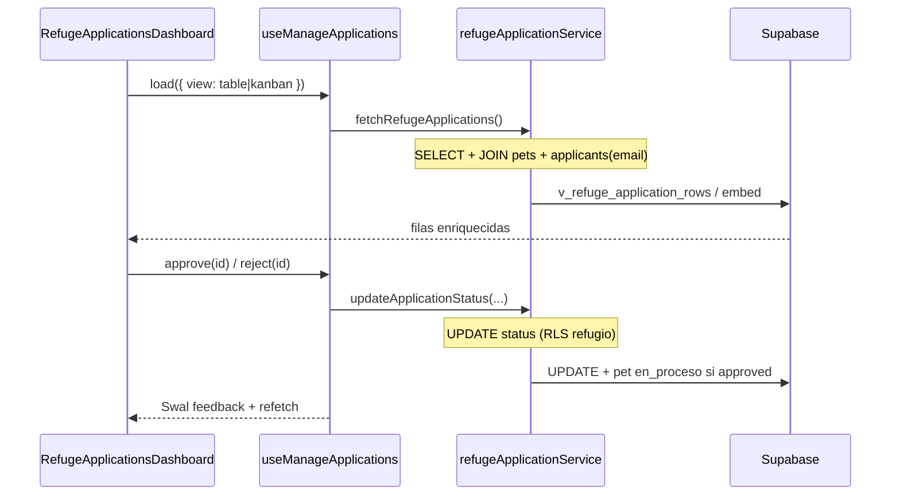

# Artefacto de propuesta — FEAT-005

| Campo | Valor |
|-------|-------|
| **ID** | FEAT-005 |
| **Título** | Gestión de solicitudes de adopción para refugios |
| **Estado** | `propuesta` |
| **Actor** | Refugio / Propietario |
| **Depende de** | FEAT-001–004 (archivados), tablas `adoption_applications`, `applicants`, `pets`, `auth.users`, RLS refugio UPDATE |
| **Creado** | 2026-06-03 |
| **Actualizado** | 2026-06-03 |
| **Estándares** | `.openspec/standards.md` |

---

## 1. Historia de usuario

> **Como** Refugio/Propietario, **quiero** poder gestionar las solicitudes de adopción, revisarlas, aceptarlas o rechazarlas, y comunicarme con los solicitantes, **para** coordinar el proceso de adopción de forma organizada.

### Alcance

- **Incluye:** vista SQL / consulta con **JOIN** `adoption_applications` ↔ **`pets`** ↔ **solicitante** (`applicants` + `email` de `auth.users`), RLS **UPDATE** del campo **`status`** para el refugio dueño, dashboard **`RefugeApplicationsDashboard`** (tabla + vista Kanban), hook **`useManageApplications`**, modales SweetAlert2 con **CheckCircle** / **XCircle**, hilo **`adoption_messages`**, retroalimentación UI (toasts Swal + estados loading/error), pestaña refugio en `App.jsx`.
- **Excluye:** notificaciones push/email automáticas, videollamadas, contratos PDF, WebSockets, pagos.

### Delta respecto a FEAT-004

- Consume y **refuerza** RLS **`adoption_applications_update_refugio`** (solo `status` + metadatos de decisión).
- Dashboard operativo exclusivo refugio (tabla/Kanban).
- Comunicación: `adoption_messages` + contacto `tel:` / `mailto:`.

---

## 2. Decisiones de arquitectura

| # | Decisión | Justificación |
|---|----------|---------------|
| D1 | **`applicants.email`** denormalizado desde `auth.users` | PostgREST no expone JOIN directo a `auth.users`; el refugio ve email del solicitante en el dashboard. |
| D2 | Vista SQL **`v_refuge_application_rows`** (JOIN explícito) | Documenta el contrato BD; el servicio puede usar la vista o el embed equivalente. |
| D3 | Consulta lista: embed **`pets!inner`** + **`applicants!inner`** | Un round-trip con datos mascota + solicitante (equivalente al JOIN pedido). |
| D4 | RLS UPDATE refugio **acotado a `status`** (+ `mensaje_decision`, `decided_at`) | Trigger `guard_application_status_update` impide mutar otros campos. |
| D5 | Hook unificado **`useManageApplications`** | Lista, filtros, `approve` / `reject`, mensajes y feedback en un solo contrato. |
| D6 | Dashboard **tabla** (default) + toggle **Kanban** por columnas `pending` / `approved` / `rejected` | UX operativa; mismo dataset, distinta presentación. |
| D7 | **Aceptar** / **Rechazar** → Swal confirmación obligatoria | Evita clics accidentales; íconos Lucide **CheckCircle**, **XCircle**. |
| D8 | Aprobar → `status = approved` + `pets.estado_adopcion = en_proceso` | Sale del catálogo público FEAT-002. |
| D9 | Al aprobar, auto-rechazar otras `pending` del mismo `pet_id` | RN-07. |
| D10 | Retroalimentación: Swal éxito/error + recarga optimista vía `useManageApplications` | UI de feedback explícita tras cada mutación. |

### Flujo de datos



---

## 3. Contrato de datos (Supabase)

### 3.1 Extensión `applicants` — email del solicitante (`014`)

| Columna | Tipo | Descripción |
|---------|------|-------------|
| `email` | `text` | Copia de `auth.users.email` al registrar/actualizar perfil adoptante |

```sql
alter table public.applicants
  add column if not exists email text not null default ''
    check (char_length(trim(email)) >= 5 and position('@' in trim(email)) > 1);
```

> Sincronizar en **`ensureApplicantProfile`** (FEAT-004) y registro **`ApplicantAuthPanel`**.

### 3.2 Extensión `adoption_applications` (`014`)

| Columna | Tipo | Descripción |
|---------|------|-------------|
| `mensaje_decision` | `text` | Mensaje al aprobar/rechazar (máx. 1500) |
| `decided_at` | `timestamptz` | Null si `pending` |

```sql
alter table public.adoption_applications
  add column if not exists mensaje_decision text not null default ''
    check (char_length(mensaje_decision) <= 1500);

alter table public.adoption_applications
  add column if not exists decided_at timestamptz;

alter table public.adoption_applications drop constraint if exists adoption_applications_decided_when_not_pending;
alter table public.adoption_applications add constraint adoption_applications_decided_when_not_pending
  check (
    (status = 'pending' and decided_at is null)
    or (status <> 'pending' and decided_at is not null)
  );
```

### 3.3 Vista JOIN — solicitud + mascota + usuario (`014`)

Equivalente SQL al JOIN pedido (`adoption_applications` + `pets` + solicitante/`users`):

```sql
create or replace view public.v_refuge_application_rows
with (security_invoker = true) as
select
  a.id,
  a.pet_id,
  a.applicant_id,
  a.status,
  a.mensaje_decision,
  a.decided_at,
  a.tipo_vivienda,
  a.tiene_patio,
  a.otras_mascotas,
  a.experiencia_previa,
  a.horas_solo,
  a.created_at,
  p.nombre as pet_nombre,
  p.especie as pet_especie,
  p.raza as pet_raza,
  p.fotos_url as pet_fotos_url,
  p.estado_adopcion as pet_estado_adopcion,
  p.refugio_id,
  u.nombre as applicant_nombre,
  u.telefono as applicant_telefono,
  u.email as applicant_email
from public.adoption_applications a
inner join public.pets p on p.id = a.pet_id
inner join public.applicants u on u.id = a.applicant_id;
-- u.id ≡ auth.users.id (FK applicants → auth.users)
```

| Origen JOIN | Rol |
|-------------|-----|
| `adoption_applications` | Solicitud |
| `pets` | Mascota solicitada |
| `applicants` (`u`) | Perfil solicitante (= fila pública de **`auth.users`**) |

**Consulta PostgREST equivalente (servicio):**

```js
const SELECT_MANAGE_APPLICATIONS = `
  id, pet_id, applicant_id, status, mensaje_decision, decided_at,
  tipo_vivienda, tiene_patio, otras_mascotas, experiencia_previa, horas_solo, created_at,
  pets!inner (
    id, nombre, especie, raza, fotos_url, estado_adopcion, refugio_id
  ),
  applicants!inner (
    id, nombre, telefono, email
  )
`
// RLS en tablas base filtra solo solicitudes del refugio autenticado
```

### 3.4 Tabla `adoption_messages` (`014`)

```sql
create table if not exists public.adoption_messages (
  id uuid primary key default gen_random_uuid(),
  application_id uuid not null references public.adoption_applications (id) on delete cascade,
  sender_role text not null check (sender_role in ('refugio', 'applicant')),
  sender_id uuid not null references auth.users (id) on delete cascade,
  body text not null check (char_length(trim(body)) >= 2 and char_length(body) <= 2000),
  created_at timestamptz not null default now()
);

create index if not exists adoption_messages_application_id_idx
  on public.adoption_messages (application_id, created_at);

alter table public.adoption_messages enable row level security;
```

### 3.5 RLS — UPDATE `status` por refugio dueño (`015`)

**Principio:** el refugio propietario de la mascota (`pets.refugio_id → refugios.user_id = auth.uid()`) puede **UPDATE** la solicitud, limitado al cambio de **`status`** (y campos de decisión asociados).

**Política SELECT refugio** (ya existe FEAT-004): `adoption_applications_select_refugio`.

**Política UPDATE refugio — campo `status`:**

```sql
drop policy if exists "adoption_applications_update_refugio" on public.adoption_applications;
create policy "adoption_applications_update_refugio"
  on public.adoption_applications for update
  to authenticated
  using (
    public.is_pet_owned_by_auth_refugio(pet_id)
    and status = 'pending'  -- solo decidir solicitudes pendientes
  )
  with check (
    public.is_pet_owned_by_auth_refugio(pet_id)
    and status in ('approved', 'rejected')
  );
```

**Trigger — inmutabilidad de campos no-status:**

```sql
create or replace function public.guard_application_status_update()
returns trigger language plpgsql as $$
begin
  if not public.is_pet_owned_by_auth_refugio(old.pet_id) then
    return new;
  end if;
  -- Refugio solo puede mutar status + decisión + timestamps de decisión
  if new.pet_id is distinct from old.pet_id
    or new.applicant_id is distinct from old.applicant_id
    or new.tipo_vivienda is distinct from old.tipo_vivienda
    or new.tiene_patio is distinct from old.tiene_patio
    or new.otras_mascotas is distinct from old.otras_mascotas
    or new.experiencia_previa is distinct from old.experiencia_previa
    or new.horas_solo is distinct from old.horas_solo
    or new.created_at is distinct from old.created_at
  then
    raise exception 'Solo se permite actualizar status y datos de decisión.';
  end if;
  return new;
end;
$$;

drop trigger if exists adoption_applications_guard_status_update on public.adoption_applications;
create trigger adoption_applications_guard_status_update
  before update on public.adoption_applications
  for each row execute function public.guard_application_status_update();
```

| Actor | UPDATE `status` | Condición |
|-------|-----------------|-----------|
| Refugio dueño del `pet_id` | ✅ `pending` → `approved` \| `rejected` | RLS + trigger |
| Adoptante | ❌ | Sin política UPDATE |
| Refugio ajeno | ❌ | RLS deniega |

**Applicants SELECT refugio + mensajes:** (sin cambios respecto a borrador; ver §3.5 completo en migración `015`).

```sql
create policy "applicants_select_refugio_via_application"
  on public.applicants for select to authenticated
  using (
    exists (
      select 1 from public.adoption_applications a
      where a.applicant_id = applicants.id
        and public.is_pet_owned_by_auth_refugio(a.pet_id)
    )
  );
```

Funciones auxiliares: `user_can_access_application`, políticas `adoption_messages_*`, `grant` correspondientes (ver migración `015`).

### 3.6 Servicio `refugeApplicationService.js`

| Función | Descripción |
|---------|-------------|
| `fetchRefugeApplications()` | JOIN embed `pets` + `applicants`; normaliza `RefugeApplicationRow` |
| `updateApplicationStatus(id, 'approved' \| 'rejected', mensaje?)` | UPDATE **`status`** + `mensaje_decision` + `decided_at`; side-effects pet |
| `approveApplication(id, mensaje?)` | Alias → `approved` + `en_proceso` + auto-rechazo otras pending |
| `rejectApplication(id, mensaje?)` | Alias → `rejected` |
| `sendApplicationMessage(applicationId, body)` | INSERT mensaje refugio |
| `fetchApplicationMessages(applicationId)` | SELECT hilo |

**UPDATE status (pseudocódigo):**

```js
await supabase.from('adoption_applications').update({
  status: 'approved', // o 'rejected'
  mensaje_decision: mensaje?.trim() ?? '',
  decided_at: new Date().toISOString(),
}).eq('id', applicationId).eq('status', 'pending')
```

### 3.7 DTO frontend

```ts
type RefugeApplicationRow = {
  id: string;
  status: 'pending' | 'approved' | 'rejected';
  created_at: string;
  mensaje_decision: string;
  decided_at: string | null;
  // Solicitud
  tipo_vivienda: string;
  tiene_patio: boolean;
  horas_solo: number;
  experiencia_previa: string;
  otras_mascotas: string;
  // JOIN pets
  pet_id: string;
  pet_nombre: string;
  pet_especie: string;
  pet_foto: string | null;
  pet_estado_adopcion: string;
  // JOIN applicants (= users)
  applicant_id: string;
  applicant_nombre: string;
  applicant_telefono: string;
  applicant_email: string;
};
```

### 3.8 Reglas de negocio

| ID | Regla |
|----|-------|
| RN-01 | Dashboard solo visible si `usePets().refugioId` existe. |
| RN-02 | UPDATE **`status`** solo refugio dueño; solo desde `pending`. |
| RN-03 | Aprobar → `approved` + pet `en_proceso`. |
| RN-04 | Rechazar → `rejected`; pet permanece `disponible` si no hay otra aprobada. |
| RN-05 | Confirmación Swal obligatoria antes de mutar `status`. |
| RN-06 | Tras éxito: Swal feedback + `refetch` del hook. |
| RN-07 | Al aprobar, rechazar automáticamente otras `pending` del mismo `pet_id`. |
| RN-08 | Adoptante ve `mensaje_decision` en Mis Solicitudes (extensión FEAT-004). |

### 3.9 Validación (`refugeDecisionValidators.js`)

| Campo | Regla | Mensaje |
|-------|-------|---------|
| `mensaje_decision` | opcional, `<= 1500` | "El mensaje no puede superar 1500 caracteres." |
| `message_body` | `trim().length >= 2`, `<= 2000` | "Escribe un mensaje de al menos 2 caracteres." |

---

## 4. Contrato de componentes React

### 4.1 `RefugeApplicationsDashboard.jsx` — dashboard refugio

**Ubicación:** `src/components/refuge/RefugeApplicationsDashboard.jsx`

Dashboard **exclusivo refugios** (no visible para adoptantes anónimos).

| Modo | Descripción |
|------|-------------|
| **Tabla** (default) | Columnas: Mascota, Solicitante, Email, Teléfono, Fecha, Estado, Acciones |
| **Kanban** | 3 columnas: Pendientes / Aprobadas / Rechazadas; tarjetas arrastrables opcional (MVP: columnas estáticas) |

**Toggle vista:** botones `LayoutList` / `Columns3` (Lucide).

**Acciones por fila (solo `pending`):**

| Botón | Ícono | Clase | Acción |
|-------|-------|-------|--------|
| Aceptar | `CheckCircle` | `text-secondary hover:bg-secondary/10` | Swal confirm → `approveApplication` |
| Rechazar | `XCircle` | `text-primary hover:bg-primary/10` | Swal confirm → `rejectApplication` |

**Modales SweetAlert2 (anti-clic accidental):**

```js
// Aceptar
const { isConfirmed } = await Swal.fire({
  icon: 'question',
  title: '¿Aceptar solicitud?',
  html: '<p class="text-sm text-gray-600">La mascota pasará a <strong>en proceso</strong>.</p>',
  showCancelButton: true,
  confirmButtonText: '<span class="inline-flex items-center gap-1">Aceptar</span>',
  cancelButtonText: 'Cancelar',
  confirmButtonColor: '#81B29A',
  cancelButtonColor: '#6b7280',
})

// Rechazar
await Swal.fire({
  icon: 'warning',
  title: '¿Rechazar solicitud?',
  input: 'textarea',
  inputPlaceholder: 'Mensaje opcional para el adoptante…',
  showCancelButton: true,
  confirmButtonText: 'Rechazar',
  confirmButtonColor: '#E07A5F',
})
```

**Retroalimentación post-acción:**

```js
await Swal.fire({
  icon: 'success',
  title: 'Solicitud actualizada',
  text: 'El adoptante verá el cambio en Mis Solicitudes.',
  confirmButtonColor: '#81B29A',
})
```

**Tokens:** `font-heading` títulos, `bg-primary` / `bg-secondary`, tabla `rounded-xl border border-gray-100 shadow-sm`.

### 4.2 Hook `useManageApplications`

**Ubicación:** `src/hooks/useManageApplications.js`

```ts
function useManageApplications(refugioId: string | null): {
  applications: RefugeApplicationRow[];
  isLoading: boolean;
  error: string | null;
  viewMode: 'table' | 'kanban';
  setViewMode: (mode: 'table' | 'kanban') => void;
  refetch: () => Promise<void>;
  approve: (id: string, mensaje?: string) => Promise<void>;
  reject: (id: string, mensaje?: string) => Promise<void>;
  sendMessage: (applicationId: string, body: string) => Promise<void>;
  isMutating: boolean;
}
```

- Carga inicial + `refetch` tras cada `approve` / `reject`.
- Envuelve **`refugeApplicationService`** + validadores + Swal feedback.
- Expone estados **`isMutating`** para deshabilitar botones durante UPDATE.

### 4.3 `ShelterApplicationsPage.jsx`

Contenedor: auth refugio, título «Solicitudes recibidas», badge contador `pending`, renderiza **`RefugeApplicationsDashboard`**.

### 4.4 Componentes auxiliares

| Componente | Rol |
|------------|-----|
| `ApplicationTable.jsx` | Vista tabla del dashboard |
| `ApplicationKanban.jsx` | Vista Kanban (3 columnas por `status`) |
| `ApplicationDetailDrawer.jsx` | Detalle + hilo mensajes al click en fila |
| `ApplicationMessageThread.jsx` | Burbujas refugio/adoptante |

### 4.5 Integración `App.jsx`

Pestaña **«Solicitudes recibidas»** visible solo si `refugioId` (sesión refugio). Contador pending desde `useManageApplications`.

### 4.6 Extensión adoptante

`MyApplicationsPage.jsx`: mostrar `mensaje_decision` + hilo mensajes (FEAT-004 extendido).

---

## 5. Criterios de aceptación

| ID | Escenario | Resultado esperado |
|----|-----------|-------------------|
| CA-01 | Refugio abre dashboard | Tabla con JOIN mascota + solicitante (nombre, email, tel) |
| CA-02 | Toggle Kanban | Tres columnas por `status` |
| CA-03 | Click Aceptar sin confirmar | Swal bloquea; no UPDATE |
| CA-04 | Confirmar Aceptar | `status = approved`, pet `en_proceso`, Swal éxito |
| CA-05 | Confirmar Rechazar | `status = rejected`, Swal éxito |
| CA-06 | Botones usan CheckCircle / XCircle | Íconos Lucide visibles |
| CA-07 | RLS: refugio UPDATE status ajeno | Denegado |
| CA-08 | Adoptante no puede UPDATE status | Denegado |
| CA-09 | Mensajes en hilo | INSERT/SELECT participantes |
| CA-10 | `npm run lint` | Sin errores |

---

## 6. Tareas atómicas (para `/apply`)

### Bloque A — SQL (JOIN + RLS status)

1. **`014_refuge_application_mgmt.sql`**: `applicants.email`, columnas decisión, `adoption_messages`, vista **`v_refuge_application_rows`**.
2. **`015_refuge_application_mgmt_rls.sql`**: UPDATE **`status`** refugio, trigger `guard_application_status_update`, applicants/messages RLS, grants.
3. Documentar migraciones 014–015 en README; extender **`ensureApplicantProfile`** con `email`.

### Bloque B — Servicio, validación y hook

4. **`refugeDecisionValidators.js`**
5. **`refugeApplicationService.js`**: consulta JOIN embed, **`updateApplicationStatus`**, `approveApplication`, `rejectApplication`, mensajes.
6. Crear **`useManageApplications.js`**: carga, mutaciones, Swal feedback, `viewMode` tabla/kanban.

### Bloque C — Dashboard refugio + retroalimentación UI

7. **`ApplicationTable.jsx`** + **`ApplicationKanban.jsx`**
8. **`RefugeApplicationsDashboard.jsx`**: composición, botones **CheckCircle** / **XCircle**, modales Swal.
9. **`ApplicationDetailDrawer.jsx`** + **`ApplicationMessageThread.jsx`**
10. **`ShelterApplicationsPage.jsx`** + **`App.jsx`** (pestaña refugio + contador pending)

### Bloque D — Adoptante + verificación

11. Extender **`MyApplicationsPage.jsx`** (mensaje decisión + hilo).
12. Verificar CA-01 a CA-10.

**Orden:** 1 → 2 → 3 → 4 → 5 → 6 → 7 → 8 → 9 → 10 → 11 → 12.

---

## 7. Definición de hecho (DoD)

- [ ] Migraciones 014–015 aplicadas en Supabase.
- [ ] Tareas 1–12 completadas en código.
- [ ] CA-01 a CA-10 verificados (`/verify`).
- [ ] Spec archivada en `specs/archive/` (`/archive`).

---

## 8. Notas OpenSpec / Delta

- **`auth.users` vía `applicants`:** el JOIN de solicitante usa `applicants` (PK = `auth.users.id`) + columna `email` denormalizada; la vista SQL documenta el contrato pedido.
- **UPDATE acotado a `status`:** RLS + trigger garantizan que el refugio no altere campos de la solicitud original.
- **Dashboard dual:** tabla operativa + Kanban por estado; mismo hook **`useManageApplications`**.
- **Anti-clic accidental:** SweetAlert2 obligatorio en Aceptar/Rechazar con íconos **CheckCircle** / **XCircle**.
