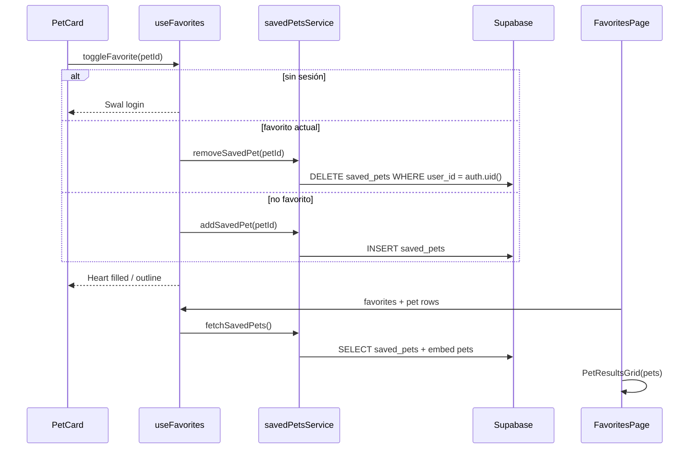

# Artefacto de propuesta — FEAT-006

| Campo | Valor |
|-------|-------|
| **ID** | FEAT-006 |
| **Título** | Favoritos de mascotas para adoptantes |
| **Estado** | `archivado` |
| **Actor** | Adoptante potencial |
| **Depende de** | FEAT-001–003 (archivados), FEAT-004 (`auth.users`, catálogo `pets`), RLS `pets`/`pet_is_disponible` |
| **Creado** | 2026-06-03 |
| **Actualizado** | 2026-06-03 |
| **Archivado** | 2026-06-03 |
| **Estándares** | `.openspec/standards.md` |

---

## 1. Historia de usuario

> **Como** Adoptante Potencial, **quiero** poder guardar mascotas como «favoritas» para acceder a ellas fácilmente más tarde y comparar opciones, **para** decidir con calma cuál solicitar en adopción.

### Alcance

- **Incluye:** tabla transaccional **`saved_pets`** (`id`, `user_id`, `pet_id`, `created_at`), RLS estricto (solo filas propias), servicio **`savedPetsService.js`**, hook **`useFavorites`**, ícono **Heart** dinámico en **`PetCard`** (relleno / contorno), vista **«Mis Favoritos»** reutilizando **`PetResultsGrid`**, pestaña en `App.jsx`, Swal sin sesión, política auxiliar en `pets` para leer mascotas guardadas no `disponible`, modo comparar opcional (MVP+).
- **Excluye:** favoritos en localStorage, listas compartidas, notificaciones, sincronización con `adoption_applications`.

### Delta respecto a FEAT-004 / FEAT-005

- Nuevo modelo **`saved_pets`** independiente de solicitudes de adopción.
- Reutiliza **`PetCard`** + **`PetResultsGrid`** del catálogo (FEAT-002).
- No modifica flujos de refugio (FEAT-005).

---

## 2. Decisiones de arquitectura

| # | Decisión | Justificación |
|---|----------|---------------|
| D1 | Tabla **`saved_pets`** transaccional | Nombre explícito del dominio; columnas mínimas pedidas. |
| D2 | **`user_id` = `auth.uid()`** en todas las operaciones | Aislamiento total por usuario autenticado. |
| D3 | RLS: solo **SELECT, INSERT, DELETE** propios | Sin UPDATE (toggle = DELETE + INSERT). |
| D4 | UNIQUE `(user_id, pet_id)` | Un guardado por mascota; toggle idempotente. |
| D5 | Hook **`useFavorites`** centraliza estado y mutaciones | Contrato UI único para `PetCard` y página. |
| D6 | **Heart** en `PetCard`: `fill-current` si favorito, contorno si no | Requisito UI explícito; `stopPropagation` en la card. |
| D7 | **Mis Favoritos** renderiza **`PetResultsGrid`** | Reutilización del grid existente; mismas tarjetas. |
| D8 | INSERT con `pet_is_disponible` en `WITH CHECK` | Solo se guardan mascotas publicadas en catálogo. |
| D9 | Política **`pets_select_saved_by_user`** | Permite listar favoritos aunque la mascota ya no esté `disponible`. |
| D10 | Sin sesión → Swal «Inicia sesión» | RLS exige rol `authenticated`. |

### Flujo de datos



---

## 3. Contrato de datos (Supabase)

### 3.1 Base de datos — tabla transaccional `saved_pets` (`016`)

Tabla puente entre usuario autenticado y mascota. Registra **cuándo** se guardó cada favorito.

| Columna | Tipo | Null | Descripción |
|---------|------|------|-------------|
| `id` | `uuid` | PK | Identificador del registro (`gen_random_uuid()`) |
| `user_id` | `uuid` | NOT NULL | FK → `auth.users(id)` ON DELETE CASCADE |
| `pet_id` | `uuid` | NOT NULL | FK → `public.pets(id)` ON DELETE CASCADE |
| `created_at` | `timestamptz` | NOT NULL | Marca temporal del guardado (`default now()`) |

```sql
-- FEAT-006: favoritos (saved_pets)

create table if not exists public.saved_pets (
  id uuid primary key default gen_random_uuid(),
  user_id uuid not null references auth.users (id) on delete cascade,
  pet_id uuid not null references public.pets (id) on delete cascade,
  created_at timestamptz not null default now(),
  constraint saved_pets_user_pet_unique unique (user_id, pet_id)
);

create index if not exists saved_pets_user_id_created_at_idx
  on public.saved_pets (user_id, created_at desc);

create index if not exists saved_pets_pet_id_idx
  on public.saved_pets (pet_id);

alter table public.saved_pets enable row level security;

comment on table public.saved_pets is
  'Mascotas guardadas como favoritas por usuario autenticado (FEAT-006)';
```

**Vista documental (opcional, mismo contrato que embed PostgREST):**

```sql
create or replace view public.v_user_saved_pets
with (security_invoker = true) as
select
  s.id as saved_id,
  s.user_id,
  s.pet_id,
  s.created_at as saved_at,
  p.nombre,
  p.especie,
  p.raza,
  p.edad,
  p.edad_anios,
  p.edad_meses,
  p.tamano,
  p.fotos_url,
  p.compatible_ninos,
  p.compatible_perros,
  p.compatible_gatos,
  p.estado_adopcion,
  p.refugio_id,
  r.nombre as refugio_nombre,
  r.ciudad,
  r.estado as refugio_estado
from public.saved_pets s
inner join public.pets p on p.id = s.pet_id
inner join public.refugios r on r.id = p.refugio_id;

grant select on public.v_user_saved_pets to authenticated;
```

### 3.2 Políticas RLS — restricción estricta por `auth.uid()` (`017`)

**Principio:** un usuario autenticado **solo** puede **INSERTAR**, **LEER** y **ELIMINAR** filas de `saved_pets` donde `user_id = auth.uid()`. No hay política UPDATE ni acceso cross-user.

| Operación | Política | `USING` / `WITH CHECK` |
|-----------|----------|-------------------------|
| **SELECT (leer)** | `saved_pets_select_own` | `user_id = auth.uid()` |
| **INSERT (insertar)** | `saved_pets_insert_own` | `WITH CHECK (user_id = auth.uid() AND pet_is_disponible(pet_id))` |
| **DELETE (eliminar)** | `saved_pets_delete_own` | `user_id = auth.uid()` |
| **UPDATE** | — | **Denegado** (sin política) |

```sql
-- FEAT-006: RLS saved_pets (estricto por auth.uid())

drop policy if exists "saved_pets_select_own" on public.saved_pets;
create policy "saved_pets_select_own"
  on public.saved_pets for select
  to authenticated
  using (user_id = auth.uid());

drop policy if exists "saved_pets_insert_own" on public.saved_pets;
create policy "saved_pets_insert_own"
  on public.saved_pets for insert
  to authenticated
  with check (
    user_id = auth.uid()
    and public.pet_is_disponible(pet_id)
  );

drop policy if exists "saved_pets_delete_own" on public.saved_pets;
create policy "saved_pets_delete_own"
  on public.saved_pets for delete
  to authenticated
  using (user_id = auth.uid());

grant select, insert, delete on public.saved_pets to authenticated;
```

**Matriz de acceso:**

| Actor | SELECT | INSERT | DELETE | UPDATE |
|-------|--------|--------|--------|--------|
| Usuario autenticado (propias filas) | ✅ | ✅* | ✅ | ❌ |
| Usuario autenticado (filas ajenas) | ❌ | ❌ | ❌ | ❌ |
| Anónimo | ❌ | ❌ | ❌ | ❌ |

\* INSERT además exige mascota `disponible` vía `pet_is_disponible`.

**Lectura de `pets` asociados a favoritos guardados:**

```sql
drop policy if exists "pets_select_saved_by_user" on public.pets;
create policy "pets_select_saved_by_user"
  on public.pets for select
  to authenticated
  using (
    exists (
      select 1 from public.saved_pets s
      where s.pet_id = pets.id and s.user_id = auth.uid()
    )
  );
```

**Embed refugios y registros médicos (`018`):** políticas `refugios_select_saved_by_user` y `medical_records_select_saved_by_user`.

### 3.3 Consultas PostgREST (servicio)

**IDs para toggle en catálogo:**

```js
// from('saved_pets').select('pet_id').eq('user_id', session.user.id)
```

**Lista enriquecida para Mis Favoritos:**

```js
const SELECT_SAVED_PETS = `
  id, pet_id, created_at,
  pets!inner (
    id, nombre, especie, raza, edad, edad_anios, edad_meses, tamano,
    fotos_url,
    compatible_ninos, compatible_perros, compatible_gatos,
    estado_adopcion, refugio_id,
    refugios!inner ( nombre, ciudad, estado )
  )
`
// .order('created_at', { ascending: false })
```

### 3.4 Servicio `savedPetsService.js`

| Función | SQL | Descripción |
|---------|-----|-------------|
| `fetchSavedPetIds()` | SELECT `pet_id` | Set de favoritos del usuario |
| `fetchSavedPets()` | SELECT + embed `pets` | Filas para `PetResultsGrid` |
| `addSavedPet(petId)` | INSERT | `user_id` desde sesión |
| `removeSavedPet(petId)` | DELETE | `.eq('user_id', uid).eq('pet_id', petId)` |
| `toggleSavedPet(petId, isSaved)` | INSERT o DELETE | Usado por el hook |

### 3.5 Reglas de negocio

| ID | Regla |
|----|-------|
| RN-01 | Toda operación en `saved_pets` exige `user_id = auth.uid()`. |
| RN-02 | Toggle favorito exige sesión autenticada. |
| RN-03 | INSERT solo si `pet_is_disponible(pet_id)` en el momento del guardado. |
| RN-04 | UNIQUE `(user_id, pet_id)` — un favorito por mascota. |
| RN-05 | Quitar favorito = DELETE; la fila desaparece de `saved_pets`. |
| RN-06 | Mis Favoritos ordenado por `created_at` DESC. |
| RN-07 | Pestaña «Mis Favoritos» visible solo con sesión activa. |

---

## 4. Contrato UI (React)

### 4.1 `PetCard.jsx` — corazón dinámico (modificación obligatoria)

**Ubicación:** `src/components/search/PetCard.jsx`

| Prop nueva | Tipo | Descripción |
|------------|------|-------------|
| `isFavorite` | `boolean` | Si `pet_id` está en favoritos del usuario |
| `onToggleFavorite` | `(petId: string) => void` | Callback desde `useFavorites` |
| `favoriteDisabled` | `boolean` | Durante mutación (`isMutating`) |

**Comportamiento del ícono `Heart` (Lucide):**

| Estado | Clases Tailwind sugeridas | Apariencia |
|--------|---------------------------|------------|
| **Favorito** | `fill-current text-primary` | Corazón **relleno** terracota |
| **No favorito** | `text-gray-400 hover:text-primary` sin `fill` | Corazón **contorno** |

**Ubicación en la card:** esquina superior derecha del contenedor de foto (`absolute top-2 right-2`), botón `type="button"`.

**Interacción:**

```jsx
<button
  type="button"
  onClick={(e) => {
    e.stopPropagation()
    onToggleFavorite?.(pet.id)
  }}
  aria-pressed={isFavorite}
  aria-label={isFavorite ? 'Quitar de favoritos' : 'Añadir a favoritos'}
  className="p-1.5 rounded-full bg-white/90 shadow-sm ..."
>
  <Heart
    className={`w-5 h-5 ${isFavorite ? 'fill-current text-primary' : 'text-gray-500'}`}
    aria-hidden
  />
</button>
```

- El clic en el corazón **no** abre el detalle de la mascota (`stopPropagation`).
- El resto de la card mantiene el comportamiento actual (abrir perfil).

### 4.2 `PetResultsGrid.jsx` — extensión para favoritos

**Ubicación:** `src/components/search/PetResultsGrid.jsx`

Props opcionales para propagar favoritos a cada `PetCard`:

| Prop | Tipo |
|------|------|
| `isFavorite` | `(petId: string) => boolean` |
| `onToggleFavorite` | `(petId: string) => void` |
| `favoriteDisabled` | `boolean` |

Si no se pasan, `PetCard` oculta el corazón; si se pasa `onToggleFavorite`, el hook muestra Swal cuando no hay sesión.

### 4.3 Vista «Mis Favoritos» — `FavoritesPage.jsx`

**Ubicación:** `src/pages/FavoritesPage.jsx`

| Elemento | Descripción |
|----------|-------------|
| Título | `font-heading` — **Mis Favoritos** |
| Contenido principal | **`PetResultsGrid`** con el array de mascotas normalizadas desde `useFavorites` |
| Empty state | Mensaje + CTA «Explorar mascotas» |
| Loading / error | Reutiliza estados del grid (`PetGridSkeleton`, banner error) |

**Flujo:**

1. `useFavorites(userId)` carga `saved_pets` + embed `pets`.
2. Normaliza al mismo shape que el catálogo (`normalizeCatalogRow` o helper compartido).
3. Pasa `pets` a `PetResultsGrid` con `isFavorite` y `onToggleFavorite`.

**Integración `App.jsx`:**

- Nueva pestaña **«Mis Favoritos»** (`Heart` Lucide) si `session?.user`.
- `activeTab === 'favorites'` → render `<FavoritesPage userId={...} onExplore={...} />`.
- Badge opcional con `favoritesCount` desde el hook.

### 4.4 Hook `useFavorites`

**Ubicación:** `src/hooks/useFavorites.js`

```ts
function useFavorites(userId: string | null): {
  savedPetIds: Set<string>;
  savedPets: object[];           // filas listas para PetResultsGrid
  isLoading: boolean;
  error: string | null;
  isMutating: boolean;
  isFavorite: (petId: string) => boolean;
  toggleFavorite: (petId: string) => Promise<void>;
  refetch: () => Promise<void>;
  count: number;
}
```

| Método | Comportamiento |
|--------|----------------|
| `isFavorite(petId)` | `savedPetIds.has(petId)` |
| `toggleFavorite(petId)` | Si `!userId` → Swal login; si favorito → DELETE; si no → INSERT; luego `refetch` |
| `refetch` | Recarga IDs + lista completa |

### 4.5 Integración catálogo

| Archivo | Cambio |
|---------|--------|
| `BrowsePetsPage.jsx` | Instanciar `useFavorites(userId)`; pasar props a `PetResultsGrid` / `PetDetail` |
| `PetDetail.jsx` | Opcional: mismo `Heart` (misma lógica que `PetCard`) |
| `App.jsx` | Pestaña + ruta tab `favorites` |

### 4.6 Retroalimentación (SweetAlert2)

```js
await Swal.fire({
  icon: 'info',
  title: 'Inicia sesión',
  text: 'Crea una cuenta o inicia sesión para guardar favoritos.',
  confirmButtonColor: '#E07A5F',
})
```

---

## 5. Criterios de aceptación

| ID | Escenario | Resultado esperado |
|----|-----------|-------------------|
| CA-01 | Usuario autenticado pulsa Heart en `PetCard` | INSERT en `saved_pets`; corazón **relleno** |
| CA-02 | Pulsa Heart de nuevo | DELETE; corazón **contorno** |
| CA-03 | Usuario anónimo pulsa Heart | Swal login; sin fila en BD |
| CA-04 | Abre «Mis Favoritos» | `PetResultsGrid` con mascotas guardadas |
| CA-05 | RLS: usuario B intenta leer favoritos de A | 0 filas / denegado |
| CA-06 | INSERT con `user_id` ≠ `auth.uid()` | RLS deniega |
| CA-07 | Clic en corazón no abre detalle | `stopPropagation` efectivo |
| CA-08 | Mascota guardada pasa a `en_proceso` | Sigue visible en Mis Favoritos |
| CA-09 | `npm run lint` | Sin errores |
| CA-10 | Migraciones 016–018 aplicadas | Tabla + políticas activas |

---

## 6. Tareas atómicas (para `/apply`)

Orden de implementación acordado con la propuesta enriquecida:

### Tarea 1 — Script SQL `saved_pets`

**Archivo:** `supabase/migrations/016_saved_pets.sql`

- Crear tabla **`saved_pets`** con columnas: `id`, `user_id`, `pet_id`, `created_at`.
- Índices, UNIQUE `(user_id, pet_id)`, `enable row level security`.
- Vista opcional `v_user_saved_pets`.

### Tarea 2 — Script SQL RLS `saved_pets`

**Archivo:** `supabase/migrations/017_saved_pets_rls.sql`

- Políticas **`saved_pets_select_own`**, **`saved_pets_insert_own`**, **`saved_pets_delete_own`** (solo `user_id = auth.uid()`).
- Política **`pets_select_saved_by_user`**.
- `grant select, insert, delete on public.saved_pets to authenticated`.
- Documentar 016–018 en `README.md`.

### Tarea 3 — Hook `useFavorites`

**Archivo:** `src/hooks/useFavorites.js`

- Servicio `src/services/savedPetsService.js` (consultas INSERT/SELECT/DELETE).
- Estado: `Set` de `pet_id`, lista enriquecida, `toggleFavorite`, Swal sin sesión.

### Tarea 4 — Actualizar `PetCard` (toggle de estado)

**Archivo:** `src/components/search/PetCard.jsx`

- Añadir botón **`Heart`** dinámico (relleno / contorno).
- Props `isFavorite`, `onToggleFavorite`, `favoriteDisabled`.
- `stopPropagation` en el botón.

**Archivo:** `src/components/search/PetResultsGrid.jsx` — propagar props a cada card.

**Archivo:** `src/pages/BrowsePetsPage.jsx` — conectar `useFavorites`.

### Tarea 5 — Página Mis Favoritos

**Archivo:** `src/pages/FavoritesPage.jsx`

- Vista **«Mis Favoritos»** que reutiliza **`PetResultsGrid`**.
- Empty state y navegación a explorar.

**Archivo:** `src/App.jsx` — pestaña «Mis Favoritos» + badge contador.

### Tarea 6 — Verificación

- Ejecutar `npm run lint`.
- Validar CA-01 a CA-10.

**Orden:** 1 → 2 → 3 → 4 → 5 → 6.

---

## 7. Definición de hecho (DoD)

- [x] Tabla `saved_pets` creada con las cuatro columnas contractuales.
- [x] RLS: SELECT, INSERT y DELETE restringidos a `user_id = auth.uid()`.
- [x] `PetCard` muestra Heart relleno/contorno y alterna estado vía `useFavorites`.
- [x] `FavoritesPage` lista favoritos con `PetResultsGrid`.
- [x] Migraciones 016–018 aplicadas en Supabase (o documentadas en README).
- [x] CA-01 a CA-10 verificados (`/verify`).
- [x] Spec archivada en `specs/archive/` (`/archive`).

---

## 8. Notas OpenSpec / Delta

- **Nombre `saved_pets`:** sustituye el borrador inicial `pet_favorites`; mismo rol transaccional.
- **Sin UPDATE:** alternar favorito = DELETE + INSERT (o solo DELETE al quitar).
- **Grid reutilizado:** no duplicar layout; `PetResultsGrid` es el contrato visual de listado.
- **Hook `useFavorites`:** nombre público pedido; delega persistencia a `savedPetsService`.
- **Comparación de mascotas:** fuera del bloque mínimo de tareas; puede añadirse en iteración posterior.
