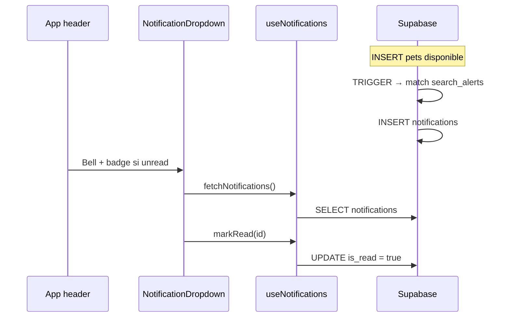

# Artefacto de propuesta — FEAT-007

| Campo | Valor |
|-------|-------|
| **ID** | FEAT-007 |
| **Título** | Alertas de búsqueda y notificaciones in-app para adoptantes |
| **Estado** | `archivado` |
| **Actor** | Adoptante potencial |
| **Depende de** | FEAT-002 (filtros catálogo), FEAT-004 (`auth.users`), FEAT-006 archivado; tablas `pets`, `refugios` |
| **Creado** | 2026-06-03 |
| **Actualizado** | 2026-06-03 |
| **Archivado** | 2026-06-03 |
| **Estándares** | `.openspec/standards.md` |

> **Nota:** La funcionalidad de notificaciones por criterios de búsqueda vive en **FEAT-007**.  
> **FEAT-006** (`feat-006-favoritos-adoptante.md`) está **archivada** en `specs/archive/` y cubre solo favoritos (`saved_pets`).

---

## 1. Historia de usuario

> **Como** Adoptante Potencial, **quiero** recibir notificaciones cuando nuevas mascotas que coinciden con mis criterios de búsqueda estén disponibles para adopción, **para** enterarme sin tener que revisar el catálogo manualmente cada día.

### Alcance

- **Incluye:** tablas **`search_alerts`** (`id`, `user_id`, `criteria_json`) y **`notifications`** (`id`, `user_id`, `message`, `is_read`, `created_at`), RLS (leer y marcar `is_read` solo propias), **trigger PostgreSQL** al insertar/activar mascota `disponible`, función **`pet_matches_criteria_json`**, servicio **`notificationService.js`**, hook **`useNotifications`**, componente **`NotificationDropdown`** (campana + badge rojo + panel), guardar alerta desde filtros FEAT-002, validación de criterios.
- **Excluye:** Edge Function obligatoria (MVP usa **trigger** en BD), email, push móvil, SMS, WebSockets, notificaciones a refugios, alertas sin autenticación.

### Delta respecto a FEAT-002 / FEAT-006

- **`criteria_json`** = mismo shape que `INITIAL_PET_SEARCH_FILTERS` / `petSearchService`.
- FEAT-002 excluía notificaciones; esta feature las entrega **in-app** vía tabla `notifications`.
- Complementa favoritos (FEAT-006): alertas proactivas vs. marcadores manuales.

---

## 2. Decisiones de arquitectura

| # | Decisión | Justificación |
|---|----------|---------------|
| D1 | **`search_alerts.criteria_json`** (`jsonb`) | Contrato pedido; paridad con sidebar FEAT-002. |
| D2 | **`notifications.message`** texto pre-renderizado | Contrato pedido; UI simple en dropdown. |
| D3 | **`notifications.is_read`** boolean | Contrato pedido; RLS acotado a marcar leída. |
| D4 | **Trigger** en `pets` (preferido sobre Edge Function en MVP) | Sin despliegue extra; mismo resultado al INSERT mascota. |
| D5 | Matching SQL **`pet_matches_criteria_json`** | Ejecutable desde trigger; equivalente a `buildSearchQuery`. |
| D6 | **`NotificationDropdown`** en barra de navegación | Campana + badge `bg-red-500` + lista desplegable. |
| D7 | **`user_id` = `auth.uid()`** en todas las operaciones de usuario | Aislamiento por adoptante. |
| D8 | Al menos **un criterio activo** en `criteria_json` | Evita alertas que matchean todo el catálogo. |
| D9 | Límite **5** filas en `search_alerts` por usuario | Evita abuso. |
| D10 | Edge Function | **Opcional** post-MVP; documentada como alternativa al trigger. |

### Flujo de datos



---

## 3. Contrato de datos (Supabase)

### 3.1 Base de datos — tabla `search_alerts` (`019`)

Almacena los **criterios de búsqueda** guardados por el adoptante.

| Columna | Tipo | Descripción |
|---------|------|-------------|
| `id` | `uuid` PK | `gen_random_uuid()` |
| `user_id` | `uuid` NOT NULL | FK → `auth.users(id)` ON DELETE CASCADE |
| `criteria_json` | `jsonb` NOT NULL | Filtros FEAT-002 (ver §3.2) |

```sql
-- FEAT-007: alertas de búsqueda

create table if not exists public.search_alerts (
  id uuid primary key default gen_random_uuid(),
  user_id uuid not null references auth.users (id) on delete cascade,
  criteria_json jsonb not null default '{}'::jsonb
);

create index if not exists search_alerts_user_id_idx
  on public.search_alerts (user_id);

alter table public.search_alerts enable row level security;

comment on table public.search_alerts is
  'Criterios de búsqueda guardados por adoptante (FEAT-007)';
```

**Extensión recomendada (no obligatoria en MVP):** `created_at timestamptz default now()` para auditoría.

### 3.2 Esquema `criteria_json`

Mismo shape que `INITIAL_PET_SEARCH_FILTERS` (`src/lib/constants/petSearchOptions.js`):

```ts
type SearchCriteriaJson = {
  especie: string[];
  raza: string;
  edadPreset: '' | 'cachorro' | 'adulto' | 'senior';
  tamano: '' | 'pequeno' | 'mediano' | 'grande';
  ciudad: string;
  estado: string;
  compatibleNinos: boolean;
  compatiblePerros: boolean;
  compatibleGatos: boolean;
};
```

### 3.3 Base de datos — tabla `notifications` (`019`)

Bandeja **in-app** de avisos generados automáticamente.

| Columna | Tipo | Descripción |
|---------|------|-------------|
| `id` | `uuid` PK | `gen_random_uuid()` |
| `user_id` | `uuid` NOT NULL | Destinatario → `auth.users(id)` |
| `message` | `text` NOT NULL | Texto legible («Nueva mascota: Luna (perro)…») |
| `is_read` | `boolean` NOT NULL | Default `false` |
| `created_at` | `timestamptz` NOT NULL | Default `now()` |

```sql
create table if not exists public.notifications (
  id uuid primary key default gen_random_uuid(),
  user_id uuid not null references auth.users (id) on delete cascade,
  message text not null
    check (char_length(trim(message)) >= 5 and char_length(message) <= 500),
  is_read boolean not null default false,
  created_at timestamptz not null default now()
);

create index if not exists notifications_user_unread_idx
  on public.notifications (user_id, is_read, created_at desc);

alter table public.notifications enable row level security;

comment on table public.notifications is
  'Notificaciones in-app para adoptantes (FEAT-007)';
```

### 3.4 Matching y generación — trigger PostgreSQL (`019`)

**Función de matching** (paridad con `petSearchService.buildSearchQuery`):

```sql
create or replace function public.pet_matches_criteria_json(
  p_pet_id uuid,
  p_criteria jsonb
) returns boolean
language plpgsql stable security definer set search_path = public;
-- Implementación: misma lógica que pet_matches_search_filters (especie, raza, edad, tamano, compatibilidad, ciudad, estado)
-- Solo retorna true si pets.estado_adopcion = 'disponible'
```

**Generación de `notifications` al publicar mascota:**

```sql
create or replace function public.notify_users_for_new_pet(p_pet_id uuid)
returns void
language plpgsql security definer set search_path = public as $$
declare
  v_pet record;
  v_refugio_user_id uuid;
begin
  select p.nombre, p.especie, r.user_id
  into v_pet, v_refugio_user_id
  from public.pets p
  join public.refugios r on r.id = p.refugio_id
  where p.id = p_pet_id and p.estado_adopcion = 'disponible';

  if not found then return; end if;

  insert into public.notifications (user_id, message, is_read)
  select
    a.user_id,
  format(
    'Nueva mascota disponible: %s (%s) coincide con tus criterios de búsqueda.',
    v_pet.nombre,
    v_pet.especie
  ),
    false
  from public.search_alerts a
  where a.user_id is distinct from v_refugio_user_id
    and public.pet_matches_criteria_json(p_pet_id, a.criteria_json);
end;
$$;

create or replace function public.trg_pets_notify_search_alerts()
returns trigger language plpgsql security definer set search_path = public as $$
begin
  if NEW.estado_adopcion = 'disponible'
    and (TG_OP = 'INSERT' or OLD.estado_adopcion is distinct from 'disponible')
  then
    perform public.notify_users_for_new_pet(NEW.id);
  end if;
  return NEW;
end;
$$;

drop trigger if exists pets_notify_search_alerts on public.pets;
create trigger pets_notify_search_alerts
  after insert or update of estado_adopcion on public.pets
  for each row execute function public.trg_pets_notify_search_alerts();
```

**Alternativa Edge Function (documentada, no MVP):**

| Opción | Cuándo usar |
|--------|-------------|
| **Trigger (elegido)** | MVP; cero infra extra; transaccional con INSERT `pets`. |
| **Edge Function `on-pet-published`** | Si más adelante se necesita email, webhooks o lógica Node compleja. |

### 3.5 Políticas RLS (`020`)

#### `search_alerts` — CRUD solo propias

| Operación | Política | Condición |
|-----------|----------|-----------|
| SELECT | `search_alerts_select_own` | `user_id = auth.uid()` |
| INSERT | `search_alerts_insert_own` | `WITH CHECK (user_id = auth.uid())` |
| DELETE | `search_alerts_delete_own` | `user_id = auth.uid()` |

```sql
drop policy if exists "search_alerts_select_own" on public.search_alerts;
create policy "search_alerts_select_own"
  on public.search_alerts for select to authenticated
  using (user_id = auth.uid());

drop policy if exists "search_alerts_insert_own" on public.search_alerts;
create policy "search_alerts_insert_own"
  on public.search_alerts for insert to authenticated
  with check (user_id = auth.uid());

drop policy if exists "search_alerts_delete_own" on public.search_alerts;
create policy "search_alerts_delete_own"
  on public.search_alerts for delete to authenticated
  using (user_id = auth.uid());

grant select, insert, delete on public.search_alerts to authenticated;
```

#### `notifications` — leer y marcar `is_read` solo propias

**Principio pedido:** el usuario autenticado **solo** puede **LEER** y **ACTUALIZAR `is_read`** de sus filas. Sin INSERT/DELETE desde cliente (solo trigger).

| Operación | Política | Condición |
|-----------|----------|-----------|
| **SELECT (leer)** | `notifications_select_own` | `user_id = auth.uid()` |
| **UPDATE `is_read`** | `notifications_update_read_own` | `user_id = auth.uid()` |
| INSERT | — | Solo trigger `security definer` |
| DELETE | — | Denegado en MVP |

```sql
drop policy if exists "notifications_select_own" on public.notifications;
create policy "notifications_select_own"
  on public.notifications for select to authenticated
  using (user_id = auth.uid());

drop policy if exists "notifications_update_read_own" on public.notifications;
create policy "notifications_update_read_own"
  on public.notifications for update to authenticated
  using (user_id = auth.uid())
  with check (user_id = auth.uid());

grant select, update on public.notifications to authenticated;
```

**Trigger de inmutabilidad (opcional):** impedir que el cliente cambie `message` o `user_id` en UPDATE — solo `is_read`.

### 3.6 Servicios y hooks

**`searchAlertService.js`**

| Función | Descripción |
|---------|-------------|
| `fetchSearchAlerts()` | SELECT `search_alerts` propias |
| `createSearchAlert(criteria_json)` | INSERT |
| `deleteSearchAlert(id)` | DELETE |

**`notificationService.js`**

| Función | Descripción |
|---------|-------------|
| `fetchNotifications()` | SELECT orden `created_at DESC` |
| `countUnread()` | COUNT `is_read = false` |
| `markAsRead(id)` | UPDATE `is_read = true` |
| `markAllAsRead()` | UPDATE masivo |

**`useNotifications(userId)`**

```ts
{
  notifications: { id, message, is_read, created_at }[];
  unreadCount: number;
  isLoading: boolean;
  markAsRead: (id: string) => Promise<void>;
  markAllAsRead: () => Promise<void>;
  refetch: () => Promise<void>;
}
```

### 3.7 Reglas de negocio

| ID | Regla |
|----|-------|
| RN-01 | Guardar alerta exige sesión. |
| RN-02 | `criteria_json` con al menos un criterio activo. |
| RN-03 | Máximo 5 filas en `search_alerts` por usuario. |
| RN-04 | Solo mascotas `disponible` generan notificación. |
| RN-05 | No notificar al dueño del refugio que publicó la mascota. |
| RN-06 | `is_read` solo mutable por el destinatario (RLS). |
| RN-07 | Badge visible si `unreadCount > 0`. |

### 3.8 Validación (`searchAlertValidators.js`)

| Campo | Regla | Mensaje |
|-------|-------|---------|
| `criteria_json` | ≥ 1 criterio activo | "Define al menos un criterio para la alerta." |
| límite alertas | máx. 5 | "Puedes tener hasta 5 alertas de búsqueda." |

---

## 4. Contrato UI (React)

### 4.1 `NotificationDropdown.jsx` — campana + badge + panel (obligatorio)

**Ubicación:** `src/components/notifications/NotificationDropdown.jsx`

| Elemento | Especificación |
|----------|----------------|
| **Ícono** | `Bell` de **Lucide** en la barra de navegación (`App.jsx` header). |
| **Badge** | Círculo **`bg-red-500`** (Tailwind) con contador si `unreadCount > 0`; texto blanco, `text-xs`, posición `absolute -top-1 -right-1`. |
| **Panel** | **Dropdown** al clic: lista de `notifications` (`message`, fecha relativa, estado leído). |
| **Interacción** | Clic en ítem → `markAsRead(id)`; botón «Marcar todas como leídas». |
| **Cerrar** | Clic fuera o segundo clic en campana. |
| **Tokens** | `font-heading` en título del panel; fondo `bg-white`, borde `border-gray-100`, `shadow-lg`. |

**Estructura JSX (referencia):**

```jsx
<div className="relative">
  <button type="button" aria-label="Notificaciones" className="relative p-2 ...">
    <Bell className="w-5 h-5 text-gray-700" />
    {unreadCount > 0 && (
      <span className="absolute -top-1 -right-1 min-w-[1.125rem] h-[1.125rem] px-1 rounded-full bg-red-500 text-white text-xs font-semibold flex items-center justify-center">
        {unreadCount > 9 ? '9+' : unreadCount}
      </span>
    )}
  </button>
  {open && (
    <div className="absolute right-0 mt-2 w-80 max-h-96 overflow-y-auto rounded-xl border border-gray-100 bg-white shadow-lg z-30">
      {/* lista notifications */}
    </div>
  )}
</div>
```

### 4.2 Guardar alerta desde catálogo

- **`SearchAlertSaveButton`** en `PetSearchSidebar`: persiste `criteria_json` actual en `search_alerts`.
- Swal éxito (`#81B29A`) / login (`#E07A5F`) si no hay sesión.

### 4.3 Integración `App.jsx`

- `NotificationDropdown` en **header** junto a pestañas (visible si `session?.user`).
- `useNotifications(userId)` a nivel `App` para compartir `unreadCount`.

---

## 5. Criterios de aceptación

| ID | Escenario | Resultado esperado |
|----|-----------|-------------------|
| CA-01 | Guardar `search_alerts` con criterios | INSERT con `criteria_json` |
| CA-02 | Publicar mascota que coincide | INSERT en `notifications` vía trigger |
| CA-03 | Campana con no leídas | Badge **`bg-red-500`** visible |
| CA-04 | Abrir dropdown | Lista de `message` + fechas |
| CA-05 | Marcar como leída | `is_read = true`; badge baja |
| CA-06 | RLS: usuario B lee notificaciones de A | Denegado |
| CA-07 | Usuario B actualiza `is_read` de A | Denegado |
| CA-08 | Usuario anónimo | Sin campana / Swal al guardar alerta |
| CA-09 | `npm run lint` | Sin errores |
| CA-10 | Migraciones 019–020 aplicadas | Tablas + RLS + trigger activos |

---

## 6. Tareas atómicas (para `/apply`)

Orden alineado al enriquecimiento pedido:

### Tarea 1 — Scripts SQL tablas

**Archivo:** `supabase/migrations/019_search_alerts_notifications.sql`

- Crear **`search_alerts`** (`id`, `user_id`, `criteria_json`).
- Crear **`notifications`** (`id`, `user_id`, `message`, `is_read`, `created_at`).
- Índices y `enable row level security`.

### Tarea 2 — Scripts SQL RLS + trigger

**Archivo:** `supabase/migrations/020_search_alerts_notifications_rls.sql`

- RLS `search_alerts_*` (propias).
- RLS **`notifications_select_own`** + **`notifications_update_read_own`**.
- Función **`pet_matches_criteria_json`**.
- Función **`notify_users_for_new_pet`** + **trigger** en `pets` (genera fila en `notifications` al coincidir con `search_alerts`).
- Documentar en `README.md` (019–020).

> **Edge Function:** no requerida en MVP; el **trigger** cumple el contrato. Documentar carpeta `supabase/functions/on-pet-published` como iteración futura opcional.

### Tarea 3 — Servicio, validación y hook

4. **`searchAlertValidators.js`** + **`searchFilterUtils.js`**
5. **`searchAlertService.js`** + **`notificationService.js`**
6. **`useNotifications.js`** (+ `useSearchAlerts` si se gestionan alertas en UI)

### Tarea 4 — Componente `NotificationDropdown`

7. Crear **`src/components/notifications/NotificationDropdown.jsx`**:
   - Campana Lucide.
   - Badge rojo `bg-red-500` si hay no leídas.
   - Panel dropdown con lista y marcar leídas.
8. Integrar en **`App.jsx`** header.
9. **`SearchAlertSaveButton`** en **`PetSearchSidebar`** / **`BrowsePetsPage`**.

### Tarea 5 — Verificación

10. Verificar CA-01 a CA-10; `npm run lint`.

**Orden:** 1 → 2 → 3 → 4 → 5 → 6 → 7 → 8 → 9 → 10.

---

## 7. Definición de hecho (DoD)

- [x] Tablas `search_alerts` y `notifications` con columnas contractuales.
- [x] RLS: leer y actualizar `is_read` solo notificaciones propias.
- [x] Trigger genera `notifications` al publicar mascota coincidente.
- [x] `NotificationDropdown` con campana, badge `bg-red-500` y panel.
- [ ] Migraciones 019–020 aplicadas en Supabase (ejecutar en proyecto remoto).
- [x] CA-01 a CA-10 verificados (`/verify`).
- [x] Spec archivada en `specs/archive/` (`/archive`).

---

## 8. Notas OpenSpec / Delta

- **Modelo simplificado:** `notifications.message` + `is_read` en lugar de tabla puente con `pet_id`/`alert_id`; navegación a mascota vía explorar catálogo en iteración posterior.
- **`criteria_json`:** nombre de columna pedido; equivalente a `filters` en borrador anterior.
- **Trigger vs Edge Function:** MVP = trigger; Edge Function solo si se añade email o lógica externa.
- **Paridad FEAT-002:** cambios en `petSearchService` deben reflejarse en `pet_matches_criteria_json`.
