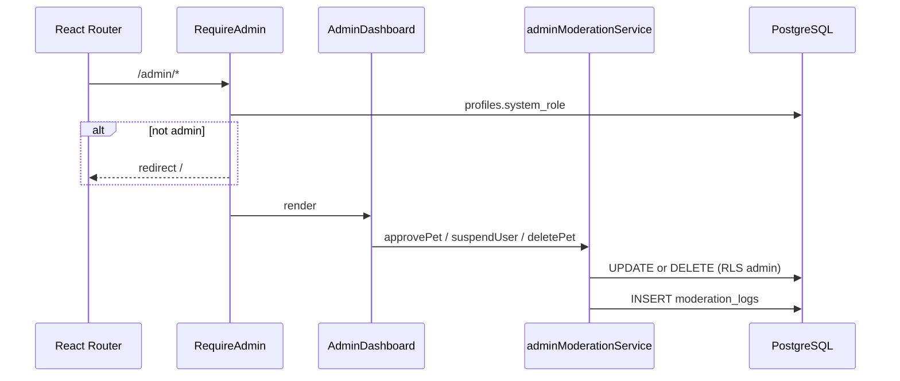

# Artefacto de propuesta — FEAT-009

| Campo | Valor |
|-------|-------|
| **ID** | FEAT-009 |
| **Título** | Moderación administrativa de mascotas y usuarios |
| **Estado** | `implementado` |
| **Actor** | Administrador de plataforma |
| **Depende de** | FEAT-001 (`pets`, `refugios`), FEAT-002 (catálogo), FEAT-004 (`applicants`), FEAT-008 archivado (`messages`); `auth.users` |
| **Creado** | 2026-06-04 |
| **Actualizado** | 2026-06-04 |
| **Estándares** | `.openspec/standards.md` |

> **Nota:** FEAT-009 introduce la tabla unificada **`profiles`** con **`system_role`** (`user` \| `shelter` \| `admin`), **`moderation_status`** en **`pets`**, políticas RLS globales para administradores (UPDATE/DELETE amplios), **`moderation_logs`**, **React Router** con rutas privadas `/admin/*`, componente **`AdminDashboard`** y wrapper **`RequireAdmin`** (HOC).

---

## 1. Historia de usuario

> **Como** Administrador, **quiero** poder moderar los perfiles de mascotas y los usuarios **para** asegurar la calidad de la información y la seguridad de la plataforma.

### Alcance

- **Incluye:** enum **`system_role`**, tabla **`profiles`** (`id`, `system_role`, `display_name`, `email`, `account_status`, auditoría), enum **`pet_moderation_status`** + columna **`pets.moderation_status`**, función **`current_user_is_admin()`** basada en `profiles.system_role = 'admin'`, políticas RLS **globales** (admin → UPDATE/DELETE en `pets`, `profiles`, `refugios`, `applicants`), catálogo solo mascotas **`approved`**, tabla **`moderation_logs`**, vistas admin, **`react-router-dom`**, rutas privadas **`/admin`**, **`AdminDashboard`**, tablas con acciones **Suspender** (`Shield`), **Aprobar** (`CheckCircle`), **Eliminar** (`Trash`), **SweetAlert2** en acciones destructivas, HOC **`RequireAdmin`**, servicios/hooks/validadores.
- **Excluye:** auto-promoción a `admin` desde la UI, moderación por IA, denuncias públicas, ban en Supabase Auth dashboard, moderación de mensajes del chat, métricas/analytics.

### Delta respecto al sistema actual

| Aspecto | Hoy | FEAT-009 |
|---------|-----|----------|
| Perfil de usuario | Disperso (`refugios`, `applicants`) | **`profiles`** + **`system_role`** |
| Rol admin | No existe | `profiles.system_role = 'admin'` |
| Calidad mascotas | Solo `estado_adopcion` | **`moderation_status`** (`pending` / `approved` / `suspended`) |
| Panel admin | No existe | **`AdminDashboard`** en rutas `/admin/*` protegidas |
| RLS admin | No existe | UPDATE + DELETE global si `system_role = 'admin'` |

---

## 2. Decisiones de arquitectura

| # | Decisión | Justificación |
|---|----------|---------------|
| D1 | Tabla **`profiles`** 1:1 con `auth.users` | Contrato pedido; rol y estado de cuenta centralizados. |
| D2 | Enum **`system_role`**: `user`, `shelter`, `admin` | Contrato pedido; RLS legible sin listas blancas paralelas. |
| D3 | **`pets.moderation_status`** como enum PostgreSQL | Contrato pedido; tipado fuerte y políticas de catálogo claras. |
| D4 | **`current_user_is_admin()`** lee `profiles` | Una fuente de verdad para políticas RLS globales. |
| D5 | Admin: políticas **UPDATE** y **DELETE** en `pets` y tablas de usuario | Contrato pedido; refugio/adoptante vía `profiles`, `refugios`, `applicants`. |
| D6 | Catálogo: `estado_adopcion = 'disponible'` **y** `moderation_status = 'approved'` | Solo perfiles de mascota aprobados son públicos. |
| D7 | **`react-router-dom`** + **`RequireAdmin`** (HOC/wrapper) | Rutas privadas explícitas; defensa en UI + RLS en servidor. |
| D8 | **`AdminDashboard`** con tablas y acciones Lucide + Swal | Contrato UI pedido; feedback destructivo consistente. |
| D9 | **Suspender** = `account_status = 'suspended'` en `profiles` (y sincronía en dominio) | Bloqueo operativo sin borrar Auth. |
| D10 | **Aprobar** mascota = `moderation_status = 'approved'` | Visible en catálogo si además está `disponible`. |
| D11 | **Eliminar** = `DELETE` en fila + log `*_delete` | Contrato pedido; confirmación Swal obligatoria. |
| D12 | Trigger al signup: INSERT `profiles` con `system_role = 'user'` | Perfil siempre presente para RLS. |
| D13 | Al crear `refugios`: UPDATE `profiles.system_role = 'shelter'` | Refugio mantiene rol de dominio coherente. |
| D14 | Alta de `admin` solo vía SQL (`UPDATE profiles SET system_role = 'admin'`) | Sin UI de elevación de privilegios. |

### Flujo de datos



---

## 3. Contrato de datos (Supabase)

### 3.1 Enums (`024`)

```sql
-- FEAT-009: roles y moderación

do $$ begin
  create type public.system_role as enum ('user', 'shelter', 'admin');
exception when duplicate_object then null;
end $$;

do $$ begin
  create type public.pet_moderation_status as enum (
    'pending',
    'approved',
    'suspended'
  );
exception when duplicate_object then null;
end $$;

do $$ begin
  create type public.profile_account_status as enum ('active', 'suspended');
exception when duplicate_object then null;
end $$;
```

| Enum | Valores | Uso |
|------|---------|-----|
| `system_role` | `user`, `shelter`, `admin` | Columna `profiles.system_role` |
| `pet_moderation_status` | `pending`, `approved`, `suspended` | Columna `pets.moderation_status` |
| `profile_account_status` | `active`, `suspended` | Columna `profiles.account_status` |

### 3.2 Tabla `profiles` (`024`)

Tabla **unificada de perfiles de usuario** (contrato pedido).

| Columna | Tipo | Descripción |
|---------|------|-------------|
| `id` | `uuid` PK | FK → `auth.users(id)` ON DELETE CASCADE |
| `system_role` | `system_role` NOT NULL | Default `'user'`; `'shelter'` si opera refugio; `'admin'` solo por SQL |
| `display_name` | `text` NOT NULL | Nombre visible (≥ 2 caracteres) |
| `email` | `text` | Copia de `auth.users.email` |
| `account_status` | `profile_account_status` NOT NULL | Default `'active'`; `'suspended'` bloquea altas |
| `suspension_reason` | `text` | Obligatorio si `suspended` (10–500 caracteres) |
| `suspended_at` | `timestamptz` | Última suspensión |
| `suspended_by` | `uuid` | FK → `auth.users` (admin) |
| `created_at` | `timestamptz` NOT NULL | Default `now()` |
| `updated_at` | `timestamptz` NOT NULL | Default `now()` |

```sql
create table if not exists public.profiles (
  id uuid primary key references auth.users (id) on delete cascade,
  system_role public.system_role not null default 'user',
  display_name text not null
    check (char_length(trim(display_name)) >= 2),
  email text,
  account_status public.profile_account_status not null default 'active',
  suspension_reason text,
  suspended_at timestamptz,
  suspended_by uuid references auth.users (id) on delete set null,
  created_at timestamptz not null default now(),
  updated_at timestamptz not null default now(),
  constraint profiles_suspension_reason_when_suspended check (
    account_status <> 'suspended'
    or (
      suspension_reason is not null
      and char_length(trim(suspension_reason)) between 10 and 500
    )
  )
);

create index if not exists profiles_system_role_idx
  on public.profiles (system_role);

create index if not exists profiles_account_status_idx
  on public.profiles (account_status);

alter table public.profiles enable row level security;

drop trigger if exists profiles_set_updated_at on public.profiles;
create trigger profiles_set_updated_at
  before update on public.profiles
  for each row execute function public.set_updated_at();

comment on table public.profiles is
  'Perfil unificado de usuario con system_role (FEAT-009)';
```

**Backfill** (misma migración `024`):

```sql
-- Adoptantes existentes
insert into public.profiles (id, system_role, display_name, email)
select a.id, 'user'::public.system_role, a.nombre, a.email
from public.applicants a
on conflict (id) do nothing;

-- Refugios: priorizar rol shelter
insert into public.profiles (id, system_role, display_name, email)
select r.user_id, 'shelter'::public.system_role, r.nombre, null
from public.refugios r
on conflict (id) do update
  set system_role = 'shelter',
      display_name = excluded.display_name;
```

**Bootstrap admin:**

```sql
update public.profiles
set system_role = 'admin'
where id = '<uuid-admin>';
```

### 3.3 Funciones auxiliares (`024`)

```sql
create or replace function public.current_user_system_role()
returns public.system_role
language sql stable security definer set search_path = public as $$
  select p.system_role
  from public.profiles p
  where p.id = auth.uid();
$$;

create or replace function public.current_user_is_admin()
returns boolean
language sql stable security definer set search_path = public as $$
  select coalesce(
    (select p.system_role = 'admin' from public.profiles p where p.id = auth.uid()),
    false
  );
$$;

revoke all on function public.current_user_system_role() from public;
revoke all on function public.current_user_is_admin() from public;
grant execute on function public.current_user_system_role() to authenticated;
grant execute on function public.current_user_is_admin() to authenticated;
```

> **Alias legacy:** `is_platform_admin()` puede reexportar `current_user_is_admin()` si otras migraciones lo referencian.

### 3.4 Columna `moderation_status` en `pets` (`024`)

| Columna | Tipo | Descripción |
|---------|------|-------------|
| `moderation_status` | `pet_moderation_status` NOT NULL | Default `'pending'` en nuevas altas; `'approved'` en catálogo |
| `moderation_reason` | `text` | Motivo al suspender (10–500 caracteres) |
| `moderated_at` | `timestamptz` | Última acción de moderación |
| `moderated_by` | `uuid` | Admin (`profiles.id`) |

```sql
alter table public.pets
  add column if not exists moderation_status public.pet_moderation_status
    not null default 'pending',
  add column if not exists moderation_reason text,
  add column if not exists moderated_at timestamptz,
  add column if not exists moderated_by uuid references auth.users (id) on delete set null;

alter table public.pets drop constraint if exists pets_moderation_reason_when_suspended;
alter table public.pets
  add constraint pets_moderation_reason_when_suspended
    check (
      moderation_status <> 'suspended'
      or (
        moderation_reason is not null
        and char_length(trim(moderation_reason)) between 10 and 500
      )
    );

create index if not exists pets_moderation_status_idx
  on public.pets (moderation_status);

-- Mascotas ya publicadas: aprobar retroactivamente
update public.pets
set moderation_status = 'approved'
where moderation_status = 'pending'
  and estado_adopcion in ('disponible', 'en_proceso', 'adoptado');
```

### 3.5 Tabla `moderation_logs` (`024`)

| Columna | Tipo | Descripción |
|---------|------|-------------|
| `id` | `uuid` PK | `gen_random_uuid()` |
| `admin_id` | `uuid` NOT NULL | FK → `auth.users` |
| `action` | `text` NOT NULL | Ver §3.6 |
| `target_type` | `text` NOT NULL | `pet`, `profile`, `refugio`, `applicant` |
| `target_id` | `uuid` NOT NULL | |
| `reason` | `text` NOT NULL | 10–500 caracteres |
| `metadata` | `jsonb` | Snapshot previo |
| `created_at` | `timestamptz` NOT NULL | |

```sql
create table if not exists public.moderation_logs (
  id uuid primary key default gen_random_uuid(),
  admin_id uuid not null references auth.users (id) on delete cascade,
  action text not null,
  target_type text not null,
  target_id uuid not null,
  reason text not null
    check (char_length(trim(reason)) between 10 and 500),
  metadata jsonb not null default '{}'::jsonb,
  created_at timestamptz not null default now(),
  constraint moderation_logs_action_check check (
    action in (
      'pet_approve', 'pet_suspend', 'pet_delete',
      'user_suspend', 'user_unsuspend', 'user_delete',
      'profile_update_admin'
    )
  ),
  constraint moderation_logs_target_type_check check (
    target_type in ('pet', 'profile', 'refugio', 'applicant')
  )
);

alter table public.moderation_logs enable row level security;
```

### 3.6 Mapeo acciones UI → datos

| Acción UI (Lucide) | Tabla | Efecto |
|--------------------|-------|--------|
| **Aprobar** (`CheckCircle`) | `pets` | `moderation_status = 'approved'` + log `pet_approve` |
| **Suspender** (`Shield`) | `pets` o `profiles` | Mascota: `moderation_status = 'suspended'`; Usuario: `account_status = 'suspended'` + log |
| **Eliminar** (`Trash`) | `pets` o `profiles` (+ cascada dominio) | `DELETE` fila + log `pet_delete` / `user_delete` |

### 3.7 Vistas admin (`024`)

```sql
create or replace view public.v_admin_pets_moderation as
select
  p.id,
  p.nombre,
  p.especie,
  p.raza,
  p.estado_adopcion,
  p.moderation_status,
  p.moderation_reason,
  p.moderated_at,
  p.created_at,
  r.nombre as refugio_nombre,
  pr.id as owner_profile_id,
  pr.display_name as owner_display_name,
  pr.system_role as owner_system_role,
  pr.account_status as owner_account_status
from public.pets p
inner join public.refugios r on r.id = p.refugio_id
inner join public.profiles pr on pr.id = r.user_id;

create or replace view public.v_admin_users_moderation as
select
  p.id as profile_id,
  p.system_role,
  p.display_name,
  p.email,
  p.account_status,
  p.suspension_reason,
  p.suspended_at,
  p.created_at,
  exists (select 1 from public.refugios r where r.user_id = p.id) as has_refugio,
  exists (select 1 from public.applicants a where a.id = p.id) as has_applicant
from public.profiles p;
```

### 3.8 Políticas RLS globales — administrador (`025`)

**Principio pedido:** si `profiles.system_role = 'admin'` para `auth.uid()`, el usuario obtiene **UPDATE** y **DELETE** sobre registros de **mascotas** y **usuarios** (vía `profiles` y tablas de dominio enlazadas).

**`profiles`**

```sql
-- Lectura: propio perfil o admin ve todos
drop policy if exists "profiles_select_own_or_admin" on public.profiles;
create policy "profiles_select_own_or_admin"
  on public.profiles for select to authenticated
  using (id = auth.uid() or public.current_user_is_admin());

drop policy if exists "profiles_update_own" on public.profiles;
create policy "profiles_update_own"
  on public.profiles for update to authenticated
  using (id = auth.uid() and system_role <> 'admin')
  with check (
    id = auth.uid()
    and system_role = (select p.system_role from public.profiles p where p.id = auth.uid())
  );

-- Global admin: UPDATE cualquier perfil (no puede auto-degradar otro admin sin salvaguarda)
drop policy if exists "profiles_update_admin" on public.profiles;
create policy "profiles_update_admin"
  on public.profiles for update to authenticated
  using (public.current_user_is_admin())
  with check (public.current_user_is_admin());

drop policy if exists "profiles_delete_admin" on public.profiles;
create policy "profiles_delete_admin"
  on public.profiles for delete to authenticated
  using (
    public.current_user_is_admin()
    and id <> auth.uid()
  );
```

**`pets` — admin global UPDATE + DELETE**

```sql
drop policy if exists "pets_update_admin" on public.pets;
create policy "pets_update_admin"
  on public.pets for update to authenticated
  using (public.current_user_is_admin())
  with check (public.current_user_is_admin());

drop policy if exists "pets_delete_admin" on public.pets;
create policy "pets_delete_admin"
  on public.pets for delete to authenticated
  using (public.current_user_is_admin());

drop policy if exists "pets_select_admin" on public.pets;
create policy "pets_select_admin"
  on public.pets for select to authenticated
  using (public.current_user_is_admin());
```

**`refugios` / `applicants` — admin UPDATE + DELETE**

```sql
drop policy if exists "refugios_update_admin" on public.refugios;
create policy "refugios_update_admin"
  on public.refugios for update to authenticated
  using (public.current_user_is_admin())
  with check (public.current_user_is_admin());

drop policy if exists "refugios_delete_admin" on public.refugios;
create policy "refugios_delete_admin"
  on public.refugios for delete to authenticated
  using (public.current_user_is_admin());

drop policy if exists "applicants_update_admin" on public.applicants;
create policy "applicants_update_admin"
  on public.applicants for update to authenticated
  using (public.current_user_is_admin())
  with check (public.current_user_is_admin());

drop policy if exists "applicants_delete_admin" on public.applicants;
create policy "applicants_delete_admin"
  on public.applicants for delete to authenticated
  using (public.current_user_is_admin());
```

**Catálogo público** (reemplazar `pets_select_disponible_public`):

```sql
drop policy if exists "pets_select_disponible_public" on public.pets;
create policy "pets_select_disponible_public"
  on public.pets for select to anon, authenticated
  using (
    estado_adopcion = 'disponible'
    and moderation_status = 'approved'
  );
```

**Usuarios suspendidos — bloqueo INSERT** (`025`):

```sql
drop policy if exists "pets_insert_owner" on public.pets;
create policy "pets_insert_owner"
  on public.pets for insert to authenticated
  with check (
    exists (
      select 1 from public.refugios r
      join public.profiles p on p.id = r.user_id
      where r.id = refugio_id
        and r.user_id = auth.uid()
        and p.account_status = 'active'
    )
  );

drop policy if exists "adoption_applications_insert_own" on public.adoption_applications;
create policy "adoption_applications_insert_own"
  on public.adoption_applications for insert to authenticated
  with check (
    applicant_id = auth.uid()
    and exists (
      select 1 from public.profiles p
      where p.id = auth.uid() and p.account_status = 'active'
    )
  );
```

**`moderation_logs`**

```sql
drop policy if exists "moderation_logs_select_admin" on public.moderation_logs;
create policy "moderation_logs_select_admin"
  on public.moderation_logs for select to authenticated
  using (public.current_user_is_admin());

drop policy if exists "moderation_logs_insert_admin" on public.moderation_logs;
create policy "moderation_logs_insert_admin"
  on public.moderation_logs for insert to authenticated
  with check (public.current_user_is_admin() and admin_id = auth.uid());
```

**`profiles` INSERT** (signup / trigger):

```sql
drop policy if exists "profiles_insert_own" on public.profiles;
create policy "profiles_insert_own"
  on public.profiles for insert to authenticated
  with check (id = auth.uid() and system_role = 'user');
```

**Grants:**

```sql
grant select, insert, update, delete on public.profiles to authenticated;
grant select on public.v_admin_pets_moderation to authenticated;
grant select on public.v_admin_users_moderation to authenticated;
grant select, insert on public.moderation_logs to authenticated;
```

| Operación | `system_role = admin` | Usuario `suspended` |
|-----------|----------------------|---------------------|
| UPDATE/DELETE `pets` | Sí (políticas globales) | N/A |
| UPDATE/DELETE `profiles` / refugio / applicant | Sí | No puede INSERT dominio |
| DELETE `profiles` propio admin | No (`id <> auth.uid()`) | N/A |
| Auto-asignarse `admin` | No (solo SQL service role) | N/A |

### 3.9 Triggers de sincronización (`024`)

```sql
-- Nuevo usuario Auth → perfil user
create or replace function public.handle_new_user_profile()
returns trigger language plpgsql security definer set search_path = public as $$
begin
  insert into public.profiles (id, display_name, email, system_role)
  values (
    new.id,
    coalesce(new.raw_user_meta_data->>'display_name', split_part(new.email, '@', 1)),
    new.email,
    'user'
  )
  on conflict (id) do nothing;
  return new;
end;
$$;

-- Al crear refugio → system_role shelter
create or replace function public.sync_profile_shelter_role()
returns trigger language plpgsql security definer set search_path = public as $$
begin
  update public.profiles
  set system_role = 'shelter', display_name = coalesce(display_name, new.nombre)
  where id = new.user_id and system_role <> 'admin';
  return new;
end;
$$;
```

> Conectar triggers a `auth.users` / `refugios` según despliegue (documentar en README).

### 3.10 Servicios y hooks

**`adminModerationService.js`**

| Función | Descripción |
|---------|-------------|
| `fetchCurrentProfile()` | Perfil + `system_role` del usuario en sesión |
| `fetchAdminPets(filters)` | `v_admin_pets_moderation` |
| `fetchAdminUsers(filters)` | `v_admin_users_moderation` |
| `approvePet(petId, reason)` | UPDATE `approved` + log |
| `suspendPet(petId, reason)` | UPDATE `suspended` + log |
| `deletePet(petId, reason)` | DELETE + log |
| `suspendUser(profileId, reason)` | UPDATE `profiles.account_status` + log |
| `unsuspendUser(profileId, reason)` | UPDATE `active` + log |
| `deleteUser(profileId, reason)` | DELETE `profiles` (cascada) + log |

**`useProfile(userId)`** — expone `systemRole`, `accountStatus`, `isAdmin`.

**`useAdminModeration()`** — estado tablas + mutaciones.

### 3.11 Reglas de negocio

| ID | Regla |
|----|-------|
| RN-01 | Solo `system_role = 'admin'` accede a rutas `/admin/*` y políticas admin. |
| RN-02 | Catálogo: `disponible` + `moderation_status = 'approved'`. |
| RN-03 | Suspender/Aprobar/Eliminar con motivo 10–500 caracteres cuando la acción lo exija. |
| RN-04 | `account_status = suspended` bloquea INSERT en `pets`, `adoption_applications`, `messages`. |
| RN-05 | Toda mutación admin genera `moderation_logs`. |
| RN-06 | Admin no puede DELETE su propio `profiles`. |
| RN-07 | Nadie puede UPDATE su propio `system_role` a `admin` vía API cliente. |
| RN-08 | Nueva mascota: default `moderation_status = 'pending'` hasta aprobación admin. |

### 3.12 Validación (`moderationValidators.js`)

| Campo | Regla | Mensaje |
|-------|-------|---------|
| `reason` | 10–500 tras `trim` | "Indica un motivo entre 10 y 500 caracteres." |
| `petId` / `profileId` | UUID válido | "Identificador no válido." |

---

## 4. Contrato UI (React)

### 4.1 Dependencia y enrutamiento

Añadir **`react-router-dom`** (v6+). Estructura:

```
src/
  routes/
    AppRoutes.jsx          # BrowserRouter + rutas públicas + /admin/*
  components/
    auth/
      RequireAdmin.jsx     # HOC / wrapper de ruta privada
  pages/
    admin/
      AdminDashboard.jsx   # Panel principal
```

**Rutas:**

| Ruta | Componente | Protección |
|------|------------|------------|
| `/` | Layout público (explorar, favoritos, etc.) | — |
| `/admin` | `AdminDashboard` | `RequireAdmin` |
| `/admin/pets` | `AdminDashboard` tab mascotas | `RequireAdmin` |
| `/admin/users` | `AdminDashboard` tab usuarios | `RequireAdmin` |
| `*` | Redirect `/` | — |

### 4.2 HOC / Wrapper `RequireAdmin.jsx`

Patrón **Higher-Order Component** (o wrapper de layout route):

```jsx
import { Navigate, Outlet } from 'react-router-dom'
import { useProfile } from '../../hooks/useProfile.js'

export function RequireAdmin() {
  const { isAdmin, isLoading, session } = useProfile()

  if (isLoading) {
    return <p className="text-sm text-gray-500 p-6">Verificando permisos…</p>
  }

  if (!session) {
    return <Navigate to="/" replace state={{ authRequired: true }} />
  }

  if (!isAdmin) {
    return <Navigate to="/" replace state={{ forbidden: true }} />
  }

  return <Outlet />
}
```

**Variante HOC** (opcional, misma semántica):

```jsx
export function withRequireAdmin(Component) {
  return function AdminGuarded(props) {
    /* misma lógica; render <Component {...props} /> si isAdmin */
  }
}
```

### 4.3 `AdminDashboard.jsx` — Admin Panel

| Elemento | Especificación |
|----------|----------------|
| Layout | Sidebar o tabs: **Mascotas** \| **Usuarios**; icono cabecera **`Shield`** |
| Tabla mascotas | Columnas: nombre, especie, refugio, `estado_adopcion`, `moderation_status`, acciones |
| Tabla usuarios | Columnas: `display_name`, `email`, `system_role`, `account_status`, acciones |
| **Aprobar** | Botón/icono `CheckCircle`, color `text-secondary`; solo si `pending` o `suspended` |
| **Suspender** | Botón/icono `Shield`, color `text-primary`; mascota → `suspended`, usuario → `account_status suspended` |
| **Eliminar** | Botón/icono `Trash`, color `text-primary`; acción irreversible |
| SweetAlert2 | Confirmación obligatoria en **Suspender** y **Eliminar**; `input: 'textarea'` para motivo |
| Swal destructivo | `icon: 'warning'`, `showCancelButton: true`, `confirmButtonColor: '#E07A5F'` |
| Loading | Skeleton filas; `disabled` en botones durante mutación |
| Vacío | «No hay registros que coincidan con el filtro.» |

**Ejemplo fila acciones (mascotas):**

```jsx
<div className="flex gap-1 justify-end">
  <button type="button" aria-label="Aprobar" onClick={() => handleApprove(pet.id)}>
    <CheckCircle className="w-4 h-4 text-secondary" />
  </button>
  <button type="button" aria-label="Suspender" onClick={() => handleSuspend(pet.id)}>
    <Shield className="w-4 h-4 text-primary" />
  </button>
  <button type="button" aria-label="Eliminar" onClick={() => handleDelete(pet.id)}>
    <Trash className="w-4 h-4 text-primary" />
  </button>
</div>
```

### 4.4 Integración `main.jsx` / `App.jsx`

- `main.jsx` renderiza `<AppRoutes />` dentro de `BrowserRouter`.
- Nav pública: enlace **«Admin»** (`Shield`) solo si `useProfile().isAdmin`.
- Rutas admin montadas como hijas de `RequireAdmin` (no tabs locales).

```jsx
<Route element={<RequireAdmin />}>
  <Route path="/admin" element={<AdminDashboard />} />
  <Route path="/admin/pets" element={<AdminDashboard defaultTab="pets" />} />
  <Route path="/admin/users" element={<AdminDashboard defaultTab="users" />} />
</Route>
```

### 4.5 Tokens de marca

| Token | Uso |
|-------|-----|
| `text-primary` / `#E07A5F` | Suspender, Eliminar, confirm Swal |
| `text-secondary` / `#81B29A` | Aprobar |
| `font-heading` | Títulos del Admin Panel |

---

## 5. Criterios de aceptación

| ID | Escenario | Resultado esperado |
|----|-----------|-------------------|
| CA-01 | Admin aprueba mascota `pending` | `moderation_status = approved`; visible en catálogo si `disponible` |
| CA-02 | Catálogo público | No lista `pending` ni `suspended` |
| CA-03 | Admin suspende usuario | `profiles.account_status = suspended`; INSERT dominio denegado |
| CA-04 | Admin elimina mascota con Swal | Fila borrada; log `pet_delete` |
| CA-05 | Usuario `user` navega a `/admin` | `RequireAdmin` redirige a `/` |
| CA-06 | Usuario sin sesión en `/admin` | Redirige a `/` con estado `authRequired` |
| CA-07 | No-admin intenta DELETE vía API | RLS deniega |
| CA-08 | Admin UPDATE/DELETE cualquier `pets` / `profiles` | RLS permite |
| CA-09 | Eliminar sin motivo válido | Validación cliente + CHECK SQL |
| CA-10 | `npm run lint` | Sin errores |

---

## 6. Tareas atómicas (para `/apply`)

### Tarea 1 — Enums y schema SQL (`024_admin_moderation_schema.sql`)

1. Crear enums `system_role`, `pet_moderation_status`, `profile_account_status`.
2. Crear tabla **`profiles`** con **`system_role`** y backfill desde `applicants` / `refugios`.
3. Añadir **`pets.moderation_status`** (enum) y columnas de auditoría.
4. Crear **`moderation_logs`**, vistas `v_admin_*`, funciones `current_user_is_admin()`.
5. Triggers `handle_new_user_profile` y `sync_profile_shelter_role`.
6. Documentar bootstrap `system_role = 'admin'` en README.

### Tarea 2 — RLS globales admin (`025_admin_moderation_rls.sql`)

7. Políticas **`profiles`**: select own/admin, update own, **update/delete admin global**.
8. Políticas **`pets`**: **update/delete/select admin global** + catálogo `approved`.
9. Políticas **`refugios` / `applicants`**: **update/delete admin global**.
10. Reforzar INSERT con `profiles.account_status = 'active'`.
11. Extender `messages_insert_sender` con perfil activo.
12. Políticas `moderation_logs` + grants.

### Tarea 3 — Router, HOC y Admin Panel

13. Instalar **`react-router-dom`**; crear **`src/routes/AppRoutes.jsx`**.
14. Crear **`RequireAdmin.jsx`** (wrapper + variante HOC documentada).
15. Crear **`AdminDashboard.jsx`** con tablas, filtros, acciones **Aprobar / Suspender / Eliminar** (Lucide).
16. Integrar Swal destructivo en suspend/delete.
17. Refactorizar **`App.jsx`** / **`main.jsx`** al layout enrutado; enlace Admin condicional.

### Tarea 4 — Servicios y validación

18. Crear **`moderationValidators.js`**.
19. Crear **`adminModerationService.js`** y **`profileService.js`** (lectura `profiles`).
20. Crear **`useProfile.js`** y **`useAdminModeration.js`**.

### Tarea 5 — Documentación y verificación

21. Actualizar README (migraciones 024–025, enums, rutas `/admin`, bootstrap admin).
22. Verificar CA-01 a CA-10; `npm run lint`.

**Orden:** 1 → 2 → … → 22.

---

## 7. Definición de hecho (DoD)

- [x] Tabla **`profiles`** con enum **`system_role`** (`user` \| `shelter` \| `admin`).
- [x] **`pets.moderation_status`** operativo con enum y catálogo filtrado.
- [x] RLS: admin con **UPDATE/DELETE** global en mascotas y usuarios.
- [x] Rutas privadas `/admin/*` con **`RequireAdmin`** y **`AdminDashboard`**.
- [x] Acciones UI con **Shield**, **Trash**, **CheckCircle** y **SweetAlert2**.
- [x] CA-01 a CA-10 verificados (`/verify`).
- [ ] Spec archivada (`/archive`).

---

## 8. Notas OpenSpec / Delta

- **`system_role` vs tablas dominio:** `refugios` / `applicants` siguen existiendo; `profiles` es la fuente de rol y suspensión global.
- **Mascotas legacy:** backfill aprueba mascotas existentes para no vaciar el catálogo.
- **DELETE usuario:** cascada `auth.users` → `profiles`; validar impacto en solicitudes activas antes de eliminar en producción.
- **Sin `platform_admins`:** sustituido por `profiles.system_role = 'admin'` (más simple y alineado al contrato pedido).
- **Iteración futura:** cola `pending` con notificación al refugio; moderación de mensajes reportados.
