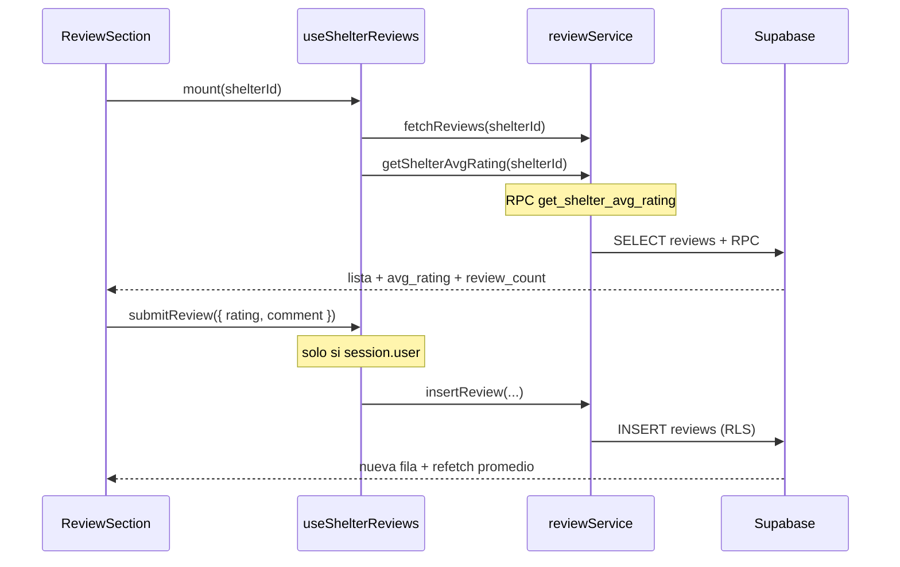

# Artefacto de propuesta — FEAT-010

| Campo | Valor |
|-------|-------|
| **ID** | FEAT-010 |
| **Título** | Valoraciones y comentarios de refugios |
| **Estado** | `propuesta` |
| **Actor** | Adoptante potencial |
| **Depende de** | FEAT-001–004 (archivados), tablas `refugios`, `adoption_applications`, `applicants`, `profiles` |
| **Creado** | 2026-06-04 |
| **Actualizado** | 2026-06-04 |
| **Estándares** | `.openspec/standards.md` |

---

## 1. Historia de usuario

> **Como** Adoptante Potencial, **quiero** poder ver las valoraciones y comentarios de otros usuarios sobre los refugios o propietarios, **para** tener más confianza en el proceso.

### Alcance

- **Incluye:** tabla **`reviews`**, RPC **`get_shelter_avg_rating`**, RLS (lectura pública + INSERT restringido), perfil público del refugio con sección **`ReviewSection`**, servicio/hook de reseñas, estrellas Lucide con color de marca **#E07A5F**, formulario de reseña visible solo para usuarios autenticados (no dueños del refugio).
- **Excluye:** moderación admin de reseñas, edición/eliminación de reseñas publicadas, valoraciones en tarjetas del catálogo de búsqueda, notificaciones al recibir una reseña.

### Delta respecto a FEAT-004

- Expone reputación del refugio/propietario en un **perfil público** accesible desde el flujo de exploración.
- Cualquier usuario autenticado que **no sea el refugio reseñado** puede dejar una valoración (una por refugio).

### Glosario

| Término en spec | Entidad en código / BD |
|-----------------|------------------------|
| `shelter_id` | `refugios.id` |
| Refugio / Propietario | Cuenta con fila en `refugios` (`refugios.user_id = auth.uid()`) |
| Adoptante potencial | Visitante o usuario con sesión; no requiere adopción completada para **ver** reseñas |

---

## 2. Decisiones de arquitectura

| # | Decisión | Justificación |
|---|----------|---------------|
| D1 | Tabla canónica **`reviews`** N:1 con `refugios` vía **`shelter_id`** | Nombre de dominio claro; desacoplado de detalle de mascota. |
| D2 | Columna **`rating_1_to_5`** (smallint, CHECK 1–5) | Contrato explícito del rango de valoración. |
| D3 | RLS **SELECT público** (`anon`, `authenticated`) | Adoptantes potenciales consultan reseñas sin iniciar sesión. |
| D4 | RLS **INSERT**: `reviewer_id = auth.uid()` **y** el revisor **no es** el dueño del refugio | Impide auto-reseñas; refuerzo en BD, no solo en UI. |
| D5 | RPC **`get_shelter_avg_rating(p_shelter_id)`** | Agregación eficiente en PostgreSQL; un round-trip para promedio + conteo. |
| D6 | Índice único **`(shelter_id, reviewer_id)`** | Una reseña por usuario por refugio. |
| D7 | UI en **perfil público del refugio** (`ShelterProfilePage` / `ReviewSection`) | Punto focal de confianza; enlazable desde `PetDetail` y catálogo. |
| D8 | Estrellas **Lucide `Star`** rellenas con **`#E07A5F`** (Naranja Terracota / `primary`) | Coherencia visual con la paleta del proyecto. |
| D9 | Formulario de reseña **solo si hay sesión** (`session?.user`) | RN-UI-02; visitantes anónimos solo leen. |

### Flujo de datos



---

## 3. Base de datos

### 3.1 Tabla `reviews`

Migración propuesta: `supabase/migrations/028_reviews.sql` (o renombrar/evolucionar `028_refugio_reviews.sql`).

| Columna | Tipo | Restricciones | Descripción |
|---------|------|---------------|-------------|
| `id` | `uuid` | PK, `default gen_random_uuid()` | Identificador de la reseña |
| `reviewer_id` | `uuid` | NOT NULL, FK → `auth.users(id)` ON DELETE CASCADE | Usuario que escribe la reseña (= `auth.uid()` en INSERT) |
| `shelter_id` | `uuid` | NOT NULL, FK → `refugios(id)` ON DELETE CASCADE | Refugio/propietario valorado |
| `rating_1_to_5` | `smallint` | NOT NULL, CHECK (`rating_1_to_5` BETWEEN 1 AND 5) | Puntuación de 1 a 5 estrellas |
| `comment` | `text` | NOT NULL, CHECK (`char_length(trim(comment))` BETWEEN 10 AND 2000) | Comentario público |
| `created_at` | `timestamptz` | NOT NULL, `default now()` | Fecha de publicación |

Índices y unicidad:

```sql
create table if not exists public.reviews (
  id uuid primary key default gen_random_uuid(),
  reviewer_id uuid not null
    references auth.users (id) on delete cascade,
  shelter_id uuid not null
    references public.refugios (id) on delete cascade,
  rating_1_to_5 smallint not null
    check (rating_1_to_5 between 1 and 5),
  comment text not null
    check (char_length(trim(comment)) between 10 and 2000),
  created_at timestamptz not null default now(),
  constraint reviews_one_per_user_per_shelter unique (shelter_id, reviewer_id)
);

create index if not exists reviews_shelter_created_idx
  on public.reviews (shelter_id, created_at desc);

create index if not exists reviews_reviewer_idx
  on public.reviews (reviewer_id);
```

> **Nota de implementación:** si ya existe `refugio_reviews`, migrar con `ALTER TABLE … RENAME` / vista de compatibilidad, o crear `reviews` como tabla nueva y deprecar la anterior en una migración de transición.

---

## 4. Políticas RLS

`alter table public.reviews enable row level security;`

### 4.1 Matriz de permisos

| Política | Rol | Operación | Condición |
|----------|-----|-----------|-----------|
| `reviews_select_public` | `anon`, `authenticated` | **SELECT** | `true` (lectura pública) |
| `reviews_insert_authenticated_not_owner` | `authenticated` | **INSERT** | Ver § 4.2 |

No se definen UPDATE ni DELETE en MVP (reseñas inmutables una vez publicadas).

### 4.2 INSERT — usuario autenticado que no es el refugio reseñado

El revisor debe ser el usuario de la sesión **y** no ser el propietario (`refugios.user_id`) del `shelter_id` indicado:

```sql
-- Helper: ¿auth.uid() es dueño del refugio?
create or replace function public.is_shelter_owner(p_shelter_id uuid)
returns boolean
language sql
stable
security definer
set search_path = public
as $$
  select exists (
    select 1
    from public.refugios r
    where r.id = p_shelter_id
      and r.user_id = auth.uid()
  );
$$;

grant execute on function public.is_shelter_owner(uuid) to authenticated;

-- Políticas
drop policy if exists "reviews_select_public" on public.reviews;
create policy "reviews_select_public"
  on public.reviews for select
  to anon, authenticated
  using (true);

drop policy if exists "reviews_insert_authenticated_not_owner" on public.reviews;
create policy "reviews_insert_authenticated_not_owner"
  on public.reviews for insert
  to authenticated
  with check (
    reviewer_id = auth.uid()
    and not public.is_shelter_owner(shelter_id)
  );

grant select on public.reviews to anon, authenticated;
grant insert on public.reviews to authenticated;
```

### 4.3 Reglas de negocio (RLS)

| ID | Regla |
|----|-------|
| RN-RLS-01 | Cualquier visitante (anon) puede **leer** todas las reseñas. |
| RN-RLS-02 | Solo usuarios **authenticated** pueden **insertar**. |
| RN-RLS-03 | El **`reviewer_id`** del INSERT debe ser **`auth.uid()`**. |
| RN-RLS-04 | Un usuario **no puede reseñar un refugio del que es dueño** (`is_shelter_owner(shelter_id) = false`). |
| RN-RLS-05 | Máximo **una reseña** por par `(shelter_id, reviewer_id)` (unique constraint). |

---

## 5. RPC — promedio de calificación

Función expuesta vía PostgREST como **`get_shelter_avg_rating`**.

### 5.1 Contrato

| Parámetro | Tipo | Descripción |
|-----------|------|-------------|
| `p_shelter_id` | `uuid` | ID del refugio (`refugios.id`) |

**Retorno:** `json` con:

| Campo | Tipo | Descripción |
|-------|------|-------------|
| `avg_rating` | `numeric \| null` | Promedio redondeado a 1 decimal; `null` si no hay reseñas |
| `review_count` | `integer` | Número total de reseñas |

### 5.2 Implementación SQL

```sql
create or replace function public.get_shelter_avg_rating(p_shelter_id uuid)
returns json
language sql
stable
security definer
set search_path = public
as $$
  select coalesce(
    json_build_object(
      'avg_rating', round(avg(r.rating_1_to_5)::numeric, 1),
      'review_count', count(*)::int
    ),
    json_build_object('avg_rating', null, 'review_count', 0)
  )
  from public.reviews r
  where r.shelter_id = p_shelter_id;
$$;

grant execute on function public.get_shelter_avg_rating(uuid) to anon, authenticated;
```

### 5.3 Uso desde el cliente

```javascript
const { data, error } = await supabase.rpc('get_shelter_avg_rating', {
  p_shelter_id: shelterId,
})
// data = { avg_rating: 4.3, review_count: 12 }
```

El promedio se calcula **dinámicamente** en cada llamada (sin cache en cliente); PostgreSQL agrega sobre el índice `reviews_shelter_created_idx`.

---

## 6. Contrato UI

### 6.1 Ubicación — perfil público del refugio

| Elemento | Descripción |
|----------|-------------|
| **`ShelterProfilePage`** | Vista pública con nombre, ubicación (`ciudad`, `estado`) y mascotas disponibles del refugio. |
| **`ReviewSection`** | Bloque embebido en el perfil (también reutilizable desde `PetDetail` como atajo). |
| Navegación | Enlace «Ver refugio» / nombre del refugio en `PetDetail` → perfil público. |

### 6.2 `ReviewSection` — estructura visual (Tailwind)

```
┌─────────────────────────────────────────────────────────┐
│  ★ Valoraciones del refugio          ★★★★☆  4.2 (12)   │
│  Opiniones de otros adoptantes sobre [Nombre Refugio]   │
├─────────────────────────────────────────────────────────┤
│  [Lista de reseñas]                                     │
│  ┌───────────────────────────────────────────────────┐  │
│  │ María · ★★★★★ · 3 jun 2026                        │  │
│  │ "Excelente acompañamiento durante todo el..."     │  │
│  └───────────────────────────────────────────────────┘  │
├─────────────────────────────────────────────────────────┤
│  [Formulario — SOLO si session?.user]                   │
│  Tu valoración: ☆☆☆☆☆ (clicables)                       │
│  Comentario: [ textarea ]                               │
│  [ Publicar valoración ]                                │
└─────────────────────────────────────────────────────────┘
```

### 6.3 Estrellas Lucide — Naranja Terracota `#E07A5F`

| Estado | Clase Tailwind / estilo |
|--------|-------------------------|
| Estrella activa / rellena | `fill-[#E07A5F] text-[#E07A5F]` o `fill-primary text-primary` (token `primary` = `#E07A5F`) |
| Estrella vacía | `text-gray-300` sin fill |
| Icono | `Star` de **`lucide-react`**, tamaño `w-5 h-5` (listado) / `w-6 h-6` (promedio) |
| Promedio dinámico | Renderizar N estrellas completas + media estrella opcional según `avg_rating` del RPC |

Ejemplo de render (promedio):

```jsx
import { Star } from 'lucide-react'

function ShelterStarRating({ rating, max = 5 }) {
  return (
    <div className="inline-flex items-center gap-0.5" role="img" aria-label={`${rating} de ${max} estrellas`}>
      {Array.from({ length: max }, (_, i) => (
        <Star
          key={i}
          className={`w-5 h-5 ${
            i + 1 <= Math.round(rating)
              ? 'fill-[#E07A5F] text-[#E07A5F]'
              : 'text-gray-300'
          }`}
          aria-hidden
        />
      ))}
    </div>
  )
}
```

### 6.4 Visibilidad del formulario

| Condición | Formulario de reseña |
|-----------|----------------------|
| Visitante **anónimo** (`!session?.user`) | **Oculto** — mensaje opcional: «Inicia sesión para dejar tu valoración». |
| Usuario **autenticado** y **no** dueño del refugio | **Visible** (si aún no reseñó). |
| Usuario **autenticado** y **dueño** del refugio (`is_shelter_owner`) | **Oculto** — RLS bloquearía el INSERT de todas formas. |
| Usuario que **ya reseñó** | **Oculto** — unique `(shelter_id, reviewer_id)`. |

### 6.5 Estados de la sección

| Estado | Comportamiento |
|--------|----------------|
| `loading` | Skeleton Tailwind (`animate-pulse`) en promedio y 2–3 filas. |
| `empty` | Texto: «Aún no hay valoraciones para este refugio.» |
| `error` | Banner `bg-red-50 text-red-700 border-red-200`. |
| `success` (post-submit) | Insertar reseña en lista, refetch RPC, ocultar formulario. |

### 6.6 Servicios frontend (contrato)

| Función | Descripción |
|---------|-------------|
| `fetchReviewsByShelterId(shelterId)` | `SELECT * FROM reviews WHERE shelter_id = … ORDER BY created_at DESC` |
| `getShelterAvgRating(shelterId)` | RPC `get_shelter_avg_rating` |
| `submitReview({ shelterId, rating_1_to_5, comment })` | INSERT con `reviewer_id` implícito vía sesión |

### 6.7 Archivos UI previstos

| Archivo | Rol |
|---------|-----|
| `src/pages/ShelterProfilePage.jsx` | Perfil público del refugio |
| `src/components/reviews/ReviewSection.jsx` | Sección de reseñas (lista + formulario + promedio) |
| `src/components/reviews/StarRating.jsx` | Estrellas Lucide reutilizables |
| `src/hooks/useShelterReviews.js` | Carga lista + RPC + submit |
| `src/services/reviewService.js` | Queries Supabase |

---

## 7. Tareas atómicas

Cada tarea es independiente, verificable y entregable en un PR pequeño.

### Tarea 1 — Crear tabla SQL y RLS

| Campo | Valor |
|-------|-------|
| **Entregable** | `supabase/migrations/028_reviews.sql` |
| **Pasos** | 1) Crear tabla `reviews` con columnas del § 3.1. 2) Crear índices y unique constraint. 3) Crear función `is_shelter_owner`. 4) Habilitar RLS y políticas `reviews_select_public` + `reviews_insert_authenticated_not_owner`. 5) Grants a `anon` / `authenticated`. |
| **Verificación** | `SELECT` como anon devuelve filas; INSERT como dueño del refugio falla con `42501`; INSERT como otro usuario autenticado succeed. |

### Tarea 2 — Crear RPC `get_shelter_avg_rating`

| Campo | Valor |
|-------|-------|
| **Entregable** | Función en la misma migración o `029_reviews_rpc.sql` |
| **Pasos** | 1) Implementar función JSON según § 5.2. 2) `GRANT EXECUTE` a `anon`, `authenticated`. 3) Exponer en `reviewService.getShelterAvgRating`. |
| **Verificación** | RPC con refugio sin reseñas → `{ avg_rating: null, review_count: 0 }`; con 2 reseñas (4 y 5) → `{ avg_rating: 4.5, review_count: 2 }`. |

### Tarea 3 — Diseñar componente `ReviewSection` con Tailwind

| Campo | Valor |
|-------|-------|
| **Entregable** | `src/components/reviews/ReviewSection.jsx` + `StarRating.jsx` + `useShelterReviews.js` |
| **Pasos** | 1) Layout según wireframe § 6.2. 2) Estrellas Lucide `#E07A5F` § 6.3. 3) Promedio vía RPC al montar. 4) Lista de comentarios con fecha localizada (`es-MX`). 5) Formulario condicionado a `session?.user` § 6.4. 6) Estados loading / empty / error. |
| **Verificación** | Perfil de refugio muestra promedio y lista; anónimo no ve formulario; usuario logueado (no dueño) sí lo ve; submit refresca promedio. |

### Tarea 4 — Integrar en perfil público del refugio

| Campo | Valor |
|-------|-------|
| **Entregable** | `ShelterProfilePage.jsx`, enlace desde `PetDetail` |
| **Pasos** | 1) Crear página con datos del refugio. 2) Embeber `ReviewSection`. 3) Pasar `session` / `userId` desde `App.jsx` o `BrowsePetsPage`. |
| **Verificación** | Flujo: catálogo → detalle mascota → «Ver refugio» → reseñas visibles. |

---

## 8. Criterios de aceptación

- [ ] Existe la tabla **`reviews`** con columnas `id`, `reviewer_id`, `shelter_id`, `rating_1_to_5`, `comment`, `created_at`.
- [ ] **SELECT** es público para roles `anon` y `authenticated`.
- [ ] **INSERT** solo permite usuarios autenticados cuyo `auth.uid()` **no** sea el dueño del refugio (`refugios.user_id`).
- [ ] El RPC **`get_shelter_avg_rating`** devuelve promedio y conteo correctos.
- [ ] El **perfil público del refugio** incluye **`ReviewSection`** con promedio de estrellas Lucide en **#E07A5F**.
- [ ] El **formulario de reseña** solo es visible si el usuario **está logueado** y no es dueño del refugio.
- [ ] Visitantes anónimos ven reseñas y promedio pero **no** el formulario.
- [ ] Errores de red/RLS se muestran con mensajes en español.

---

## 9. Archivos (referencia)

| Área | Ruta |
|------|------|
| Migración tabla + RLS | `supabase/migrations/028_reviews.sql` |
| RPC (opcional separado) | `supabase/migrations/029_reviews_rpc.sql` |
| Servicio | `src/services/reviewService.js` |
| Hook | `src/hooks/useShelterReviews.js` |
| UI | `src/components/reviews/ReviewSection.jsx`, `StarRating.jsx` |
| Página | `src/pages/ShelterProfilePage.jsx` |
| Integración | `src/components/pets/PetDetail.jsx`, `src/routes/AppRoutes.jsx` o tabs en `App.jsx` |
| Spec | `specs/features/feat-010-valoraciones-refugio.md` |

---

## 10. Implementación parcial existente (nota)

En el repositorio puede existir una primera iteración con tabla **`refugio_reviews`**, vista **`v_refugio_review_summary`**, componente **`RefugioReviewsSection`** embebido en **`PetDetail`**, y RLS basada en adopción aprobada. Esta propuesta **refina** el diseño hacia:

- Tabla **`reviews`** con nomenclatura `shelter_id` / `rating_1_to_5`.
- RLS por **no auto-reseña** (no ser dueño del refugio).
- RPC dedicado en lugar de (o además de) vista agregada.
- **Perfil público del refugio** como ubicación principal de la UI.
- Formulario visible por **sesión autenticada**, no solo por adopción aprobada.

La migración de transición debe alinear código y BD con este contrato antes de cerrar FEAT-010.
