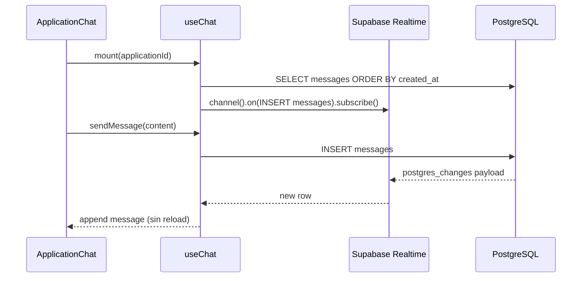

# Artefacto de propuesta — FEAT-008

| Campo | Valor |
|-------|-------|
| **ID** | FEAT-008 |
| **Título** | Mensajería in-app entre refugio y adoptantes (chat en solicitud) |
| **Estado** | `implementado` |
| **Actor** | Refugio / Propietario (primario); Adoptante potencial (secundario) |
| **Depende de** | FEAT-004 (`adoption_applications`), FEAT-005 (drawer solicitudes), `auth.users`, `pets`, `refugios` |
| **Creado** | 2026-06-03 |
| **Actualizado** | 2026-06-03 |
| **Estándares** | `.openspec/standards.md` |

> **Nota:** FEAT-005 introdujo **`adoption_messages`** (`body`, `sender_role`).  
> **FEAT-008** unifica el contrato en la tabla **`messages`** (`content`, `sender_id`, `receiver_id`) con **Supabase Realtime** y UI de chat en el **detalle de la solicitud**. En `/apply`, migrar datos legacy y sustituir `ApplicationMessageThread` por **`ApplicationChat`**.

---

## 1. Historia de usuario

> **Como** Refugio/Propietario, **quiero** poder comunicarme con los adoptantes potenciales a través de un sistema de mensajería dentro de la plataforma **para** responder preguntas y coordinar visitas o entregas sin depender solo del teléfono o el correo externo.

### Alcance

- **Incluye:** tabla **`messages`** (`id`, `application_id`, `sender_id`, `receiver_id`, `content`, `created_at`), RLS (remitente **INSERT**; remitente y destinatario **SELECT** vía `application_id`), publicación Realtime, hook **`useChat`** con `supabase.channel().on('postgres_changes', …).subscribe()`, componente **`ApplicationChat`** (chat responsivo anidado en detalle de solicitud — refugio y adoptante), servicio **`messageService.js`**, validación de `content`, habilitar Realtime en migración SQL.
- **Excluye:** mensajería sin solicitud previa (pre-application), adjuntos, edición/borrado de mensajes, SMS/email, moderación IA, videollamadas.

### Delta respecto a FEAT-005

| Aspecto | FEAT-005 (`adoption_messages`) | FEAT-008 (`messages`) |
|---------|-------------------------------|------------------------|
| Destinatario | Implícito por `sender_role` | Explícito **`receiver_id`** |
| Cuerpo | `body` | **`content`** |
| Actualización UI | Refetch manual / efecto | **Realtime** `postgres_changes` |
| UI | `ApplicationMessageThread` | **`ApplicationChat`** (burbujas Salvia / gris) |
| Ubicación | Drawer + Mis Solicitudes | **Anidado en detalle de solicitud** (mismo contexto, componente nuevo) |

---

## 2. Decisiones de arquitectura

| # | Decisión | Justificación |
|---|----------|---------------|
| D1 | Tabla única **`messages`** ligada a **`application_id`** | Contrato pedido; hilo = solicitud de adopción. |
| D2 | **`sender_id`** + **`receiver_id`** en cada fila | RLS y UI sin inferir destinatario por rol. |
| D3 | Participantes resueltos desde `adoption_applications` + `refugios.user_id` | Adoptante = `applicant_id`; refugio = dueño del `pet_id`. |
| D4 | RLS: **INSERT** solo remitente; **SELECT** remitente **o** destinatario si acceden a la solicitud | Contrato pedido. |
| D5 | **`useChat`** + `postgres_changes` en `messages` | Mensajes instantáneos sin recargar página. |
| D6 | **`ApplicationChat`** dentro de `ApplicationDetailDrawer` y **`MyApplicationsPage`** | Chat responsivo en contexto de solicitud. |
| D7 | Estilos burbuja: propio **`#81B29A`** derecha; ajeno **gris claro** izquierda | Contrato visual pedido. |
| D8 | Migración desde `adoption_messages` en `/apply` | No perder histórico FEAT-005. |
| D9 | `REPLICA IDENTITY FULL` + publicación supabase_realtime | Requisito para filtros Realtime por `application_id`. |
| D10 | Desuscribir canal en cleanup de `useChat` | Evitar fugas de memoria y duplicados. |

### Flujo de datos (Realtime)



---

## 3. Contrato de datos (Supabase)

### 3.1 Tabla `messages` (`021`)

| Columna | Tipo | Descripción |
|---------|------|-------------|
| `id` | `uuid` PK | `gen_random_uuid()` |
| `application_id` | `uuid` NOT NULL | FK → `adoption_applications(id)` ON DELETE CASCADE |
| `sender_id` | `uuid` NOT NULL | FK → `auth.users(id)` — remitente |
| `receiver_id` | `uuid` NOT NULL | FK → `auth.users(id)` — destinatario |
| `content` | `text` NOT NULL | 2–2000 caracteres |
| `created_at` | `timestamptz` NOT NULL | Default `now()` |

```sql
-- FEAT-008: mensajería por solicitud de adopción

create table if not exists public.messages (
  id uuid primary key default gen_random_uuid(),
  application_id uuid not null
    references public.adoption_applications (id) on delete cascade,
  sender_id uuid not null references auth.users (id) on delete cascade,
  receiver_id uuid not null references auth.users (id) on delete cascade,
  content text not null
    check (char_length(trim(content)) >= 2 and char_length(content) <= 2000),
  created_at timestamptz not null default now(),
  constraint messages_sender_not_receiver check (sender_id <> receiver_id)
);

create index if not exists messages_application_created_idx
  on public.messages (application_id, created_at);

create index if not exists messages_sender_idx on public.messages (sender_id);
create index if not exists messages_receiver_idx on public.messages (receiver_id);

alter table public.messages enable row level security;

comment on table public.messages is
  'Chat refugio ↔ adoptante por solicitud (FEAT-008)';
```

**Migración legacy (en la misma `021` o script aparte):**

```sql
-- Opcional: copiar adoption_messages → messages si existe la tabla anterior
insert into public.messages (application_id, sender_id, receiver_id, content, created_at)
select
  m.application_id,
  m.sender_id,
  case
    when m.sender_role = 'applicant' then r.user_id
    else a.applicant_id
  end as receiver_id,
  m.body as content,
  m.created_at
from public.adoption_messages m
join public.adoption_applications a on a.id = m.application_id
join public.pets p on p.id = a.pet_id
join public.refugios r on r.id = p.refugio_id;
```

> Tras migrar y validar, deprecar lectura/escritura en `adoption_messages` (DROP en iteración posterior o dejar solo lectura legacy).

### 3.2 Función auxiliar — participación en solicitud (`021`)

Reutilizar **`user_can_access_application(application_id)`** (FEAT-005) para acotar lectura al par refugio/adoptante de esa solicitud.

```sql
create or replace function public.user_is_application_participant(p_application_id uuid)
returns boolean
language sql stable security definer set search_path = public as $$
  select public.user_can_access_application(p_application_id);
$$;
```

**Resolver `receiver_id` al enviar (servicio cliente o función RPC opcional):**

| Remitente | `receiver_id` |
|-----------|----------------|
| `applicant_id` | `refugios.user_id` del `pet_id` de la solicitud |
| Dueño refugio | `adoption_applications.applicant_id` |

### 3.3 Políticas RLS (`022`)

**Principio pedido:**

| Operación | Quién | Condición |
|-----------|-------|-----------|
| **INSERT** | Remitente | `sender_id = auth.uid()` y es participante de `application_id`; `receiver_id` es la contraparte válida |
| **SELECT** | Remitente **o** destinatario | `auth.uid() in (sender_id, receiver_id)` **y** acceso a la solicitud vía `application_id` |

```sql
-- FEAT-008: RLS messages

drop policy if exists "messages_select_participant" on public.messages;
create policy "messages_select_participant"
  on public.messages for select to authenticated
  using (
    (sender_id = auth.uid() or receiver_id = auth.uid())
    and public.user_can_access_application(application_id)
  );

drop policy if exists "messages_insert_sender" on public.messages;
create policy "messages_insert_sender"
  on public.messages for insert to authenticated
  with check (
    sender_id = auth.uid()
    and public.user_can_access_application(application_id)
    and exists (
      select 1
      from public.adoption_applications a
      join public.pets p on p.id = a.pet_id
      join public.refugios r on r.id = p.refugio_id
      where a.id = application_id
        and (
          (a.applicant_id = auth.uid() and receiver_id = r.user_id)
          or (r.user_id = auth.uid() and receiver_id = a.applicant_id)
        )
    )
  );

grant select, insert on public.messages to authenticated;
```

| Operación | MVP |
|-----------|-----|
| UPDATE | Denegado |
| DELETE | Denegado |

### 3.4 Supabase Realtime (`021` / dashboard)

Habilitar replicación de la tabla para el cliente:

```sql
alter publication supabase_realtime add table public.messages;
-- o, en proyectos nuevos:
-- alter table public.messages replica identity full;
```

En **Supabase Dashboard → Database → Replication**: activar **`messages`** para Realtime si la publicación no se gestiona solo por SQL.

### 3.5 Servicios y hook

**`messageService.js`**

| Función | Descripción |
|---------|-------------|
| `fetchMessages(applicationId)` | `SELECT *` WHERE `application_id` ORDER `created_at ASC` |
| `sendMessage({ applicationId, receiverId, content })` | `INSERT` con `sender_id = auth.uid()` |
| `resolveReceiverId(applicationId)` | Devuelve UUID contraparte para el usuario actual |

**`useChat(applicationId, currentUserId)`**

Contrato del hook:

```ts
{
  messages: {
    id: string;
    application_id: string;
    sender_id: string;
    receiver_id: string;
    content: string;
    created_at: string;
  }[];
  isLoading: boolean;
  error: string | null;
  sendMessage: (content: string) => Promise<void>;
  isSending: boolean;
}
```

**Implementación Realtime (referencia obligatoria para `/apply`):**

```js
import { useEffect, useState, useCallback } from 'react'
import { supabase } from '../lib/supabase.js'
import { fetchMessages, sendMessage as sendMessageApi } from '../services/messageService.js'

export function useChat(applicationId, currentUserId) {
  const [messages, setMessages] = useState([])
  const [isLoading, setIsLoading] = useState(true)
  const [error, setError] = useState(null)
  const [isSending, setIsSending] = useState(false)

  const load = useCallback(async () => {
    if (!applicationId) return
    setIsLoading(true)
    try {
      const rows = await fetchMessages(applicationId)
      setMessages(rows)
      setError(null)
    } catch (e) {
      setError(e.message)
    } finally {
      setIsLoading(false)
    }
  }, [applicationId])

  useEffect(() => {
    if (!applicationId || !supabase) return undefined

    void load()

    const channel = supabase
      .channel(`messages:${applicationId}`)
      .on(
        'postgres_changes',
        {
          event: 'INSERT',
          schema: 'public',
          table: 'messages',
          filter: `application_id=eq.${applicationId}`,
        },
        (payload) => {
          const row = payload.new
          setMessages((prev) => {
            if (prev.some((m) => m.id === row.id)) return prev
            return [...prev, row]
          })
        },
      )
      .subscribe()

    return () => {
      supabase.removeChannel(channel)
    }
  }, [applicationId, load])

  const sendMessage = useCallback(
    async (content) => {
      if (!applicationId || !currentUserId) return
      setIsSending(true)
      try {
        await sendMessageApi({ applicationId, content })
        // El INSERT también llegará por Realtime; opcional optimista local
      } finally {
        setIsSending(false)
      }
    },
    [applicationId, currentUserId],
  )

  return { messages, isLoading, error, sendMessage, isSending }
}
```

> **Optimistic UI (opcional):** añadir mensaje local con `id` temporal y reconciliar al recibir el evento Realtime.

### 3.6 Reglas de negocio

| ID | Regla |
|----|-------|
| RN-01 | Solo participantes de la solicitud pueden leer/escribir. |
| RN-02 | `sender_id` debe ser `auth.uid()` en INSERT. |
| RN-03 | `receiver_id` debe ser la contraparte (adoptante ↔ usuario refugio). |
| RN-04 | `content` entre 2 y 2000 caracteres. |
| RN-05 | No mensajes si el usuario no tiene acceso RLS a `application_id`. |
| RN-06 | Canal Realtime filtrado por `application_id` actual. |
| RN-07 | Al desmontar el chat, `removeChannel` obligatorio. |

### 3.7 Validación (`messageValidators.js`)

| Campo | Regla | Mensaje |
|-------|-------|---------|
| `content` | `trim().length >= 2`, `<= 2000` | Igual que `validateMessageBody` en FEAT-005 |
| `applicationId` | UUID válido | "Solicitud no válida." |
| `receiverId` | UUID válido, ≠ `sender_id` | "Destinatario no válido." |

---

## 4. Contrato UI (React)

### 4.1 `ApplicationChat.jsx` — chat responsivo en detalle de solicitud

**Ubicación:** anidado en:

- `ApplicationDetailDrawer.jsx` (refugio — FEAT-005)
- `MyApplicationsPage.jsx` (adoptante — sección expandida o panel de detalle de cada solicitud)

| Elemento | Especificación |
|----------|----------------|
| Contenedor | `flex flex-col` altura mínima ~`min-h-[280px]` `max-h-[50vh]` en móvil, `max-h-[420px]` en desktop; borde `border-gray-100`, `rounded-xl`, fondo blanco |
| Lista mensajes | `flex-1 overflow-y-auto` `px-3 py-4` `space-y-3`; scroll al último mensaje en cada INSERT |
| **Mensaje propio** | Alineación **`justify-end`** / `ml-auto`; fondo **Verde Salvia `#81B29A`** (`bg-secondary`); texto blanco o `text-gray-900` según contraste WCAG; `max-w-[85%]` `rounded-2xl rounded-br-md px-3 py-2 text-sm` |
| **Mensaje ajeno** | Alineación **`justify-start`** / `mr-auto`; fondo **gris claro** `bg-gray-100` `text-gray-800`; `max-w-[85%]` `rounded-2xl rounded-bl-md px-3 py-2 text-sm` |
| Metadatos | Hora relativa `text-[10px] opacity-70` bajo la burbuja |
| Input | Fila inferior fija: `textarea` o `input` + botón enviar (`Send` Lucide); deshabilitado si `isSending` |
| Vacío | «Aún no hay mensajes. Escribe para coordinar con el refugio/adoptante.» |
| Loading | Skeleton o spinner en área de lista |

**Estructura JSX (referencia):**

```jsx
<section className="flex flex-col min-h-[280px] max-h-[50vh] md:max-h-[420px] border border-gray-100 rounded-xl overflow-hidden">
  <header className="px-3 py-2 border-b border-gray-100 bg-gray-50/80">
    <h4 className="font-heading text-sm font-semibold text-gray-900">Mensajes</h4>
  </header>

  <div ref={listRef} className="flex-1 overflow-y-auto px-3 py-4 space-y-3">
    {messages.map((msg) => {
      const isOwn = msg.sender_id === currentUserId
      return (
        <div
          key={msg.id}
          className={`flex ${isOwn ? 'justify-end' : 'justify-start'}`}
        >
          <div
            className={
              isOwn
                ? 'max-w-[85%] rounded-2xl rounded-br-md px-3 py-2 text-sm bg-secondary text-white'
                : 'max-w-[85%] rounded-2xl rounded-bl-md px-3 py-2 text-sm bg-gray-100 text-gray-800'
            }
          >
            {msg.content}
          </div>
        </div>
      )
    })}
  </div>

  <form onSubmit={handleSend} className="flex gap-2 p-3 border-t border-gray-100">
    {/* input + botón Send */}
  </form>
</section>
```

### 4.2 Integración en detalle de solicitud

| Vista | Cambio |
|-------|--------|
| **Refugio** | Sustituir `ApplicationMessageThread` por `<ApplicationChat applicationId={application.id} currentUserId={session.user.id} />` en el drawer |
| **Adoptante** | Mismo componente en el acordeón/detalle de cada tarjeta en Mis Solicitudes |

### 4.3 Responsividad

- En pantallas `< md`, el chat ocupa **ancho completo** del drawer/panel.
- Input y botón enviar en **una fila**; en pantallas muy estrechas, botón solo icono.
- Área de mensajes con **scroll interno**; el drawer no crece indefinidamente.

### 4.4 Tokens de marca

| Token | Valor |
|-------|-------|
| Burbuja propia | `bg-secondary` → `#81B29A` |
| Burbuja ajena | `bg-gray-100` |
| CTA / errores | `text-primary` `#E07A5F` (Swal login si no hay sesión) |
| Título sección | `font-heading` (Nunito) |

---

## 5. Criterios de aceptación

| ID | Escenario | Resultado esperado |
|----|-----------|-------------------|
| CA-01 | Refugio envía mensaje en drawer | INSERT en `messages`; burbuja derecha verde salvia |
| CA-02 | Adoptante ve mensaje sin recargar | Realtime añade burbuja izquierda gris |
| CA-03 | Adoptante responde | Refugio recibe por Realtime |
| CA-04 | Usuario ajeno a la solicitud | SELECT/INSERT denegados por RLS |
| CA-05 | `receiver_id` incorrecto en INSERT | RLS `with check` rechaza |
| CA-06 | `content` vacío o > 2000 | Validación cliente; CHECK SQL rechaza |
| CA-07 | Cerrar drawer y reabrir | Historial cargado; nueva suscripción Realtime |
| CA-08 | Desmontar componente | `removeChannel` sin errores en consola |
| CA-09 | `npm run lint` | Sin errores |
| CA-10 | Migraciones 021–022 + Realtime activo | Tabla, RLS, eventos INSERT en vivo |

---

## 6. Tareas atómicas (para `/apply`)

### Tarea 1 — Crear tabla SQL y Realtime (`021_messages.sql`)

1. Crear tabla **`messages`** (`id`, `application_id`, `sender_id`, `receiver_id`, `content`, `created_at`).
2. Índices y `enable row level security`.
3. Script migración `adoption_messages` → `messages` (si aplica).
4. Añadir **`messages`** a publicación **`supabase_realtime`** (o `replica identity full`).

### Tarea 2 — Políticas RLS (`022_messages_rls.sql`)

5. Política **`messages_insert_sender`**: solo remitente autenticado participante.
6. Política **`messages_select_participant`**: remitente **o** destinatario con acceso a `application_id`.
7. `grant select, insert` a `authenticated`.

### Tarea 3 — Hook `useChat` con Supabase Realtime

8. Crear **`src/services/messageService.js`** (`fetchMessages`, `sendMessage`, `resolveReceiverId`).
9. Crear **`src/lib/validators/messageValidators.js`**.
10. Crear **`src/hooks/useChat.js`**:
    - Carga inicial `fetchMessages`.
    - `supabase.channel(\`messages:${applicationId}\`).on('postgres_changes', { event: 'INSERT', schema: 'public', table: 'messages', filter: \`application_id=eq.${applicationId}\` }, handler).subscribe()`.
    - Cleanup `removeChannel` en `useEffect` return.
    - `sendMessage(content)` vía servicio.

### Tarea 4 — UI del chat

11. Crear **`src/components/messaging/ApplicationChat.jsx`** (burbujas Salvia / gris, layout responsivo).
12. Integrar en **`ApplicationDetailDrawer.jsx`** (reemplazar `ApplicationMessageThread`).
13. Integrar en **`MyApplicationsPage.jsx`** (detalle de solicitud adoptante).
14. Auto-scroll al último mensaje en envío y en evento Realtime.

### Tarea 5 — Documentación y verificación

15. Actualizar **`README.md`** (migraciones 021–022, nota Realtime).
16. Verificar CA-01 a CA-10; `npm run lint`.

**Orden:** 1 → 2 → 3 → 4 → 5 → 6 → 7 → 8 → 9 → 10 → 11 → 12 → 13 → 14 → 15 → 16.

---

## 7. Definición de hecho (DoD)

- [ ] Tabla **`messages`** con columnas contractuales.
- [ ] RLS: remitente INSERT; remitente y destinatario SELECT por `application_id`.
- [ ] Realtime activo en `messages` y **`useChat`** operativo.
- [ ] **`ApplicationChat`** anidado en detalle de solicitud (refugio + adoptante).
- [ ] Burbujas propias `#81B29A` derecha; ajenas gris izquierda.
- [ ] Migraciones 021–022 aplicadas en Supabase.
- [ ] CA-01 a CA-10 verificados (`/verify`).
- [ ] Spec archivada (`/archive`).

---

## 8. Notas OpenSpec / Delta

- **`messages` vs `adoption_messages`:** mismo dominio; FEAT-008 es el contrato canónico con `receiver_id` y Realtime.
- **Dashboard Supabase:** confirmar Replication ON para `messages` si los eventos no llegan en desarrollo.
- **Filtro Realtime:** `application_id=eq.<uuid>` reduce ruido entre solicitudes.
- **Iteración futura:** buzón global, notificaciones FEAT-007 al INSERT, mensajes pre-solicitud.
